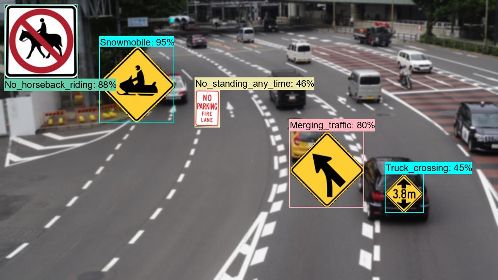

<h2>
Tensorflow-EfficientDet-Finetuning-Model (Updated: 2023/12/31)
</h2>
<h3>
1. Development Environment
</h3>
<h3>1.1 OS and Python</h3>
We use the following OS, Python, Tensorflow
<li>
Windows11
</li>
<li>
Python 3.10.11
</li>

<li>
tensorflow 2.10.1
</li>
This is the last tensorflow 2 version to support GPU on Windows OS. If you would like to use the latest tensorflow (2.14.1 or later version) 
which supports GPU, you have to use Windows11/WSL2 or Linux.    

<h3>1.2 Create a python virtualenv </h3>
Please run the following command to create a python virtualenv of name <b>py38-efficientdet</b>.
<pre>
>cd c:\
>python -m venv py310-efficientdet
>cd c:\py310-efficientdet
>./scripts/activate
</pre>
 
<h3>
2. Install Tensorflow-EfficientDet-Finetuning-Model
</h3>
<h3>2.1 Create a working folder </h3>
Please create a working folder "c:\efficientdet_finetuning" for your repository, and install the python packages. 
<pre>
>mkdir c:\efficientdet_finetuning
>cd    c:\efficientdet_finetuning
</pre>
<h3>2.2 Clone repository</h3>
Please clone Tensorflow-EfficientDet-Finetuning-Model.git in the working folder <b>c:\finetuning</b>. 
<pre>
>git clone https://github.com/sarah-antillia/Tensorflow-EfficientDet-Finetuing-Model.git 
</pre>
You can see the following two top folder <b>efficientdet</b> and <b>projects</b> in  Tensorflow-EfficientDet-Finetuning-Model 
of your working folder. 

<pre>
Tensorflow-EfficientDet-Finetuning-Model
├─efficientdet
└─projects
    ├─medical_diagnosis
    │  ├─Brain-Tumor
    │  ├─Breast-Cancer
    │  ├─MultipleMyeloma
    │  └─Ovarian-Tumor
    └─realistic_roadsings
        ├─CA_RoadSigns_78classes
        ├─DE-RoadSigns-108classes
        ├─FR_RoadSigns_152classes
        ├─IT_RoadSigns_120classes
        ├─JP_RoadSigns_90classes
        ├─UK_RoadSigns_94classes
        └─US_RoadSigns_160classes
</pre>

<h3>2.3 effficientdet folder</h3>

The original python scripts in this folder have been taken from the github 
repository <a href="https://github.com/google/automl/tree/master/efficientdet">google/automl/efficientdet</a> 
We have added the following python scripts to use Tensorflow-EfficientDet-Finetuning-Model. 

<li>
<a href="./efficientdet/CategorizedAPWriter.py">CategorizedAPWriter.py</a>
</li>
<li>
<a href="./efficientdet/CategorizedCOCOEvaluator.py">CategorizedCOCOEvaluator.py</a>
</li>
<li>
<a href="./efficientdet/COCOMetricsWriter.py">COCOMetricsWriter.py</a>
</li>
<li>
<a href="./efficientdet/ModelInspector.py">ModelInspector.py</a>
</li>
<li>
<a href="./efficientdet/ModelTrainer.py">ModelTrainer.py</a>
</li>
<li>
<a href="./efficientdet/SavedModelCreator.py">SavedModelCreator.py</a>
</li>
<li>
<a href="./efficientdet/SavedModelInferencer.py">SavedModelInferencer.py</a>
</li>
<li>
<a href="./efficientdet/TFRecordInspector.py">TFRecordInspector.py</a>
</li>
<li>
<a href="./efficientdet/TrainingLossesWriter.py">TrainingLossesWriter.py</a>
</li>

<h3>2.4 projects folder</h3>
This contains a lot of experimental projects to apply Tensorflow-EfficientDet-Finetuning-Model
to the real medical image-datasets in <b>medical_diagnosis</b>, and the virtual roadsigns image-datasets
 in <b>realistic_roadsings</b>. 
 
<li>
<a href="./projects/medical_diagnosis/Brain-Tumor">Brain-Tumor</a>
</li> 

<li>
<a href="./projects/medical_diagnosis/Breast-Cancer">Breast-Cancer</a>
</li> 
<li>
<a href="./projects/medical_diagnosis/MultipleMyeloma">MultipleMyeloma</a>
</li> 
<li>
<a href="./projects/medical_diagnosis/Ovarian-Tumor">Ovarian-Tumor</a>
</li> 

<li>
<a href="./projects/realistic_roadsings/CA_RoadSigns_78classes">CA_RoadSigns_78classes</a>
</li> 

<li>
<a href="./projects/realistic_roadsings/DE-RoadSigns-108classes">DE-RoadSigns-108classes</a>
</li> 
<li>
<a href="./projects/realistic_roadsings/FR_RoadSigns_152classes">FR_RoadSigns_152classes</a>
</li> 
<li>
<a href="./projects/realistic_roadsings/IT_RoadSigns_120classes">IT_RoadSigns_120classes</a>
</li> 
<li>
<a href="./projects/realistic_roadsings/JP_RoadSigns_90classes">JP_RoadSigns_90classes</a>
</li> 
<li>
<a href="./projects/realistic_roadsings/UK_RoadSigns_94classes">UK_RoadSigns_94classes</a>
</li> 
<li>
<a href="./projects/realistic_roadsings/US_RoadSigns_160classes">US_RoadSigns_160classes</a>
</li> 

 
<h3>2.2 Install python packages</h3>

Please run the following command to install python packages for this project. 
<pre>
>cd ./Tensorflow-EfficientDet-Finetuning-Model
>pip install -r requirments_tensorflow2.10.txt
</pre>

 
<h3>
3. Download a sample TFRecord dataset
</h3>
As a slightly complicated example, we will try to improve object detection accuracy of <b>EfficientDet US_RoadSigns_160classes Model</b>.
Please refer to the previous experiment <a href="https://github.com/atlan-antillia/EfficientDet-Slightly-Realistic-USA-RoadSigns-160classes">EfficientDet-Slightly-Realistic-USA-RoadSigns-160classes</a>.   
    
<h3>3.1 Download TFRecord dataset</h3>
 If you would like to train Tensorflow-EfficientDet-Finetuning-Model by US_RoadSigns_160classes dataset,
please download <b>TRecord_USA_RoadSigns_160classes</b> dataset from google drive<a href="https://drive.google.com/drive/folders/1Uq0kw1-Y72Lrwu07ddNuQ3LgOa0J6Whh?usp=sharing">
TRecord_USA_RoadSigns 160classes_V7.1, and expand it in <b>US_RoadSigns_160classes</b>. </a>
 
The train and valid folders of that dataset contain the following tfrecord files respectively:
 
<pre>
└─projects
    └─realistic_roadsings
        └─US_RoadSigns_160classes
               ├─train
               │    └─mixed_size_train.tfrecord
               │    └─train.tfrecord
               └─valid
                     └─mixed_size_valid.tfrecord
                     └─valid.tfrecord
</pre>
 
<h3>3.2 Inspect tfrecord</h3>
 To inspect the images and annotations included in the tfrecord files,
 please move to <b>./projects/realistic_roadsings/US_RoadSigns_160classes</b> directory, and run the following bat file: 
<pre>
./tfrecord_inspect.bat
</pre>
<pre>
python ../../../efficientdet/TFRecordInspector.py ^
  ./train/*.tfrecord ^
  ./label_map.pbtxt ^
  ./Inspector/train
</pre>
 
This will generate annotated images with bboxes and labels from the tfrecords in <b>train</b> folder, and cout the number of 
annotated objects in it. 
 
<b>TFRecordInspecotr: annotated images in train.tfrecord</b> 

 
 
<b>TFRecordInspecotr: objects_count train.tfrecord</b> 

 
This bar graph shows that the number of the objects contained in train.tfrecord.
 

<h3>4. Download the pretrained-model efficientdet-d1</h3>
Please download the efficientdet model chekcpoint file <b>efficientdet-d1.tar.gz</b>, and expand it under
 <b>Tensorflow-EfficientDet-Finetuning-Model/efficientdet</b> folder. 
 
https://storage.googleapis.com/cloud-tpu-checkpoints/efficientdet/coco2/efficientdet-d0.tar.gz
 
You may aslo run the following python script in <b>efficientdet</b>. 
<pre>
python DownloadCkpt_d1.py
</pre>

<h3>5. Train US RoadSigns Model by using pretrained-model</h3>

Please move to <b>./projects/realistic_roadsings/US_RoadSigns_160classes</b>,
and run the following bat file to train US-Roadsigns Efficientdet Model by using the train and valid tfrecords. 

<pre>
./1_train.bat
</pre>

<pre>
rem 1_train.bat
rem 2023/12/30 (C) antillia.com
python ../../../efficientdet/ModelTrainer.py ^
  --mode=train_and_eval ^
  --train_file_pattern=./train/*.tfrecord  ^
  --val_file_pattern=./valid/*.tfrecord ^
  --model_name=efficientdet-d0 ^
  --hparams="autoaugment_policy=v1,input_rand_hflip=False,image_size=512x512,num_classes=160,label_map=./label_map.yaml" ^
  --model_dir=./models ^
  --label_map_pbtxt=./label_map.pbtxt ^
  --eval_dir=./eval ^
  --ckpt=../../../efficientdet/efficientdet-d0  ^
  --train_batch_size=3 ^
  --early_stopping=map ^
  --patience=10 ^
  --eval_batch_size=3 ^
  --eval_samples=800  ^
  --num_examples_per_epoch=2000 ^
  --num_epochs=250
</pre>
If more GPU memory were available, you could increase the train and eval batch_size parameters to improve 
the training and evaluation speed. 
Please note that we have used <b>autoaugment_policy=v1</b>, which may help to improve the mean average precision.
 
<b>label_map.yaml:</b>
<pre>
1: '270_degree_loop'
2: 'Added_lane'
3: 'Added_lane_from_entering_roadway'
4: 'All_way'
5: 'Be_prepared_to_stop'
6: 'Bicycle_wrong_way'
7: 'Bicycles'
8: 'Bicycles_and_pedestrians'
9: 'Bicycles_left_pedestrians_right'
10: 'Bike_lane'
11: 'Bike_lane_slippery_when_wet'
12: 'Bump'
13: 'Bus_lane'
14: 'Center_lane'
15: 'Chevron_alignment'
16: 'Circular_intersection_warning'
17: 'Cross_roads'
18: 'Curve'
19: 'Dead_end'
20: 'Deer_crossing'
21: 'Detour'
22: 'Detour_right'
23: 'Dip'
24: 'Do_not_drive_on_tracks'
25: 'Do_not_enter'
26: 'Do_not_pass_stopped_trains'
27: 'Double_side_roads'
28: 'Emergency_signal'
29: 'End_detour'
30: 'Except_right_turn'
31: 'Fallen_rocks'
32: 'Flagger_present'
33: 'Fog_area'
34: 'Go_on_slow'
35: 'Golf_cart_crossing'
36: 'Gusty_winds_area'
37: 'Hairpin_curve'
38: 'Hazardous_material_prohibited'
39: 'Hazardous_material_route'
40: 'Hidden_driveway'
41: 'Hill_bicycle'
42: 'Horizontal_alignment_intersection'
43: 'Horse_drawn_vehicle_ahead'
44: 'Keep_left'
45: 'Keep_left_2'
46: 'Keep_right'
47: 'Keep_right_2'
48: 'Lane_ends'
49: 'Left_lane'
50: 'Left_turn_only'
51: 'Left_turn_or_straight'
52: 'Left_turn_yield_on_green'
53: 'Loading_zone'
54: 'Low_clearance'
55: 'Low_ground_clearance_railroad_crossing'
56: 'Merge'
57: 'Merging_traffic'
58: 'Metric_low_clearance'
59: 'Minimum_speed_limit_40'
60: 'Minimum_speed_limit_60km'
61: 'Narrow_bridge'
62: 'National_network_prohibited'
63: 'National_network_route'
64: 'Night_speed_limit_45'
65: 'Night_speed_limit_70km'
66: 'No_bicycles'
67: 'No_entre'
68: 'No_hitch_hiking'
69: 'No_horseback_riding'
70: 'No_large_trucks'
71: 'No_left_or_u_turn'
72: 'No_left_turn'
73: 'No_left_turn_across_tracks'
74: 'No_outlet'
75: 'No_parking'
76: 'No_parking_any_time'
77: 'No_parking_bus_stop'
78: 'No_parking_from_830am_to_530pm'
79: 'No_parking_from_830am_to_530pm_2'
80: 'No_parking_in_fire_lane'
81: 'No_parking_loading_zone'
82: 'No_parking_on_pavement'
83: 'No_pedestrian_crossing'
84: 'No_pedestrians'
85: 'No_right_turn'
86: 'No_rollerblading'
87: 'No_standing_any_time'
88: 'No_stopping_on_pavement'
89: 'No_straight_through'
90: 'No_train_horn_warning'
91: 'No_turns'
92: 'No_u_turn'
93: 'No_unauthorized_vehicles'
94: 'Offset_roads'
95: 'One_direction'
96: 'One_way'
97: 'Parking_with_time_restrictions'
98: 'Pass_on_either_side'
99: 'Pass_road'
100: 'Path_narrows'
101: 'Pedestrian_crossing'
102: 'Railroad_crossing'
103: 'Railroad_crossing_ahead'
104: 'Railroad_intersection_warning'
105: 'Ramp_narrows'
106: 'Reserved_parking_wheelchair'
107: 'Reverse_curve'
108: 'Reverse_turn'
109: 'Right_lane'
110: 'Right_turn_only'
111: 'Right_turn_or_straight'
112: 'Road_closed'
113: 'Road_closed_ahead'
114: 'Road_narrows'
115: 'Road_slippery_when_wet'
116: 'Rough_road'
117: 'Runaway_vehicles_only'
118: 'School'
119: 'School_advance'
120: 'School_bus_stop_ahead'
121: 'School_bus_turn_ahead'
122: 'School_speed_limit_ahead'
123: 'Sharp_turn'
124: 'Side_road_at_a_perpendicular_angle'
125: 'Side_road_at_an_acute_angle'
126: 'Single_lane_shift_left'
127: 'Skewed_railroad_crossing'
128: 'Snowmobile'
129: 'Speed_limit_50'
130: 'Speed_limit_80km'
131: 'Stay_in_lane'
132: 'Steep_grade'
133: 'Steep_grade_percentage'
134: 'Stop'
135: 'Stop_here_for_pedestrians'
136: 'Stop_here_for_peds'
137: 'Stop_here_when_flashing'
138: 'Straight_ahead_only'
139: 'T_roads'
140: 'Tractor_farm_vehicle_crossing'
141: 'Tractor_farm_vehicle_crossing_2'
142: 'Truck crossing_2'
143: 'Truck_crossing'
144: 'Truck_rollover_warning'
145: 'Truck_route_sign'
146: 'Truck_speed_limit_40'
147: 'Turn_only_lanes'
148: 'Turning_vehicles_yield_to_pedestrians'
149: 'Two_direction'
150: 'Two_way_traffic'
151: 'Wait_on_stop'
152: 'Weight_limit_10t'
153: 'Winding_road'
154: 'Work_zone_for_speed_limit'
155: 'Workers_on_road'
156: 'Wrong_way'
157: 'Y_roads'
158: 'Yield'
159: 'Yield_here_to_pedestrians'
160: 'Yield_here_to_peds'
</pre>

 
<b>Train console output at epoch 232</b> 

 
As shown in the figure above, the average precision and recall for small objects are both -1, which is a so-called 
small-object problem.
To improve this small-objects problem, we probably need to add a lot of small object images (road signs) to the training and validation datasets.    
 
 
The some average precisons and recalls above have been improved than that of 
the previous experiment without autoaugment_policy hyperparameter:

<a href="https://github.com/atlan-antillia/EfficientDet-Slightly-Realistic-USA-RoadSigns-160classes">EfficientDet-Slightly-Realistic-USA-RoadSigns-160classes</a> without .   
 
<!--

 -->

  
 
 
<b><a href="./projects/realistic_roadsings/US_RoadSigns_160classes/eval/coco_metrics.csv">COCO meticss f and map at epoch232</a></b> 

 
 
<b><a href="./projects/realistic_roadsings/US_RoadSigns_160classes/eval/train_losses.csv">Train losses at epoch232</a></b> 

 
 

<b><a href="./projects/realistic_roadsings/US_RoadSigns_160classes/eval/train_losses.csv">COCO ap per class at epoch232</a></b> 

 
 

<h3>
6. Create a saved_model from the checkpoint
</h3>
  Please run the following bat file to create a saved_model from the checkpoint files in <b>./models</b> folder.  
<pre>
2_create_saved_model.bat
</pre>
<pre>
rem 2_create_saved_model.bat
python ../../../efficientdet/SavedModelCreator.py ^
  --runmode=saved_model ^
  --model_name=efficientdet-d0 ^
  --ckpt_path=./models  ^
  --hparams="image_size=512x512,num_classes=160" ^
  --saved_model_dir=./saved_model
</pre>
 
 
<h3>
7. Inference IT_road_signs by using the saved_model
</h3>
 Please run the following bat file to infer the roadsigns in images of test_dataset:
<pre>
3_inference.bat
</pre>
<pre>
rem 3_inference.bat
rem 2023/12/30 (C) antillia.com
python ../../../efficientdet/SavedModelInferencer.py ^
  --runmode=saved_model_infer ^
  --model_name=efficientdet-d0 ^
  --saved_model_dir=./saved_model ^
  --min_score_thresh=0.4 ^
  --hparams="num_classes=160,label_map=./label_map.yaml" ^
  --input_image=./realistic_test_dataset/*.jpg ^
  --classes_file=./classes.txt ^
  --ground_truth_json=./realistic_test_dataset/annotation.json ^
  --output_image_dir=./realistic_test_dataset_outputs
</pre>

 
<h3>
8. Some Inference results of US RoadSigns
</h3>

 
<a href="./projects/realistic_roadsings/US_RoadSigns_160classes/realistic_test_dataset_outputs/usa_roadsigns_1001.jpg_objects.csv">roadsigns1001.jpg_objects.csv</a> 
 
 
<a  href="./projects/realistic_roadsings/US_RoadSigns_160classes/realistic_test_dataset_outputs/usa_roadsigns_1012.jpg_objects.csv">roadsigns1002.jpg_objects.csv</a> 
 
 
<a  href="./projects/realistic_roadsings/US_RoadSigns_160classes/realistic_test_dataset_outputs/usa_roadsigns_1023.jpg_objects.csv">roadsigns1003.jpg_objects.csv</a> 
 
 
<a  href="./projects/realistic_roadsings/US_RoadSigns_160classes/realistic_test_dataset_outputs/usa_roadsigns_1034.jpg_objects.csv">roadsigns1004.jpg_objects.csv</a> 
 
 
<a  href="./projects/realistic_roadsings/US_RoadSigns_160classes/realistic_test_dataset_outputs/usa_roadsigns_1045.jpg_objects.csv">roadsigns1005.jpg_objects.csv</a> 
 
 
<a  href="./projects/realistic_roadsings/US_RoadSigns_160classes/realistic_test_dataset_outputs/usa_roadsigns_1056.jpg_objects.csv">roadsigns1006.jpg_objects.csv</a> 
 
 
<a  href="./projects/realistic_roadsings/US_RoadSigns_160classes/realistic_test_dataset_outputs/usa_roadsigns_1067.jpg_objects.csv">roadsigns1007.jpg_objects.csv</a> 
 
 
<a  href="./projects/realistic_roadsings/US_RoadSigns_160classes/realistic_test_dataset_outputs/usa_roadsigns_1078.jpg_objects.csv">roadsigns1008.jpg_objects.csv</a> 
 
 
<a  href="./projects/realistic_roadsings/US_RoadSigns_160classes/realistic_test_dataset_outputs/usa_roadsigns_1089.jpg_objects.csv">roadsigns1009.jpg_objects.csv</a> 
 
 
<a  href="./projects/realistic_roadsings/US_RoadSigns_160classes/realistic_test_dataset_outputs/usa_roadsigns_1099.jpg_objects.csv">roadsigns1010.jpg_objects.csv</a> 
 

<h3>9. COCO metrics of inference result</h3>
The 3_inference.bat computes also the COCO metrics(f, map, mar) to the <b>realistic_test_dataset</b> as shown below: 
 
 
 
 COCO metrics above have been improved than that of the previous experiment without autoaugment_policy hyperparameter:
<a href="https://github.com/atlan-antillia/EfficientDet-Slightly-Realistic-USA-RoadSigns-160classes">EfficientDet-Slightly-Realistic-USA-RoadSigns-160classes</a>.   
 

 

<h3>10. Further Improvement of Object Detection Accuracy </h3>
<h3>10.1 Test actual road signs</h3>
As shown our repository <a href="https://github.com/sarah-antillia/Realistic-AutoAnnotation-Tool/tree/main/projects/US_RoadSigns_160classes">Realistic-AutoAnnotation-Tool/US_RoadSigns_160classes</a>,
the datasets used here are not actual road signs in real world in United States. they are pseudo image datasets by generated by
 <a href="https://github.com/sarah-antillia/Realistic-AutoAnnotation-Tool/tree/main/projects/US_RoadSigns_160classes">Realistic-AutoAnnotation-Tool/US_RoadSigns_160classes</a>
, which is an image synthesis and autoannotation tool. 
 We need to test detection accuray of this EfficientDet-US_RoadSigns_160classes Model by using actual road signs in US. 

Please see also our experiment
<a href="">https://github.com/atlan-antillia/EfficientDet-Slightly-Realistic-Japanese-RoadSigns-90classes">EfficientDet-Slightly-Realistic-Japanese-RoadSigns-90classes</a>
 to detect actual road signs in <b>real world</b> by using EfficientDet JP RoadSigns Model which trained by
the pseudo image datasets generated by <b>Realistic-AutoAnnotation-Tool</b>.
 

<h3>10.2 Improve detection accuracy for small objects</h3>
As already mentioned, the average precision and recall for small objects of <b>train_and_eval</b> process are both -1,
 we need to add a lot of small object images (road signs) to the training and validation datasets. 
     
<h3>10.3 Use OCR</h3>
As shown in our repository <a href="https://github.com/atlan-antillia/Tesseract-RoadSigns-Recognizer">Tesseract-RoadSigns-Recognizer</a>.
we probably need to use OCR tool to detect textbased roadsigns not only object-detection tool.  

Please refer to: <a href="https://www.ijirst.org/articles/IJIRSTV3I4117.pdf">Automatic Detection and Recognition of Text in
Traffic Sign Boards based on Word Recognizer</a>
 

 

 

