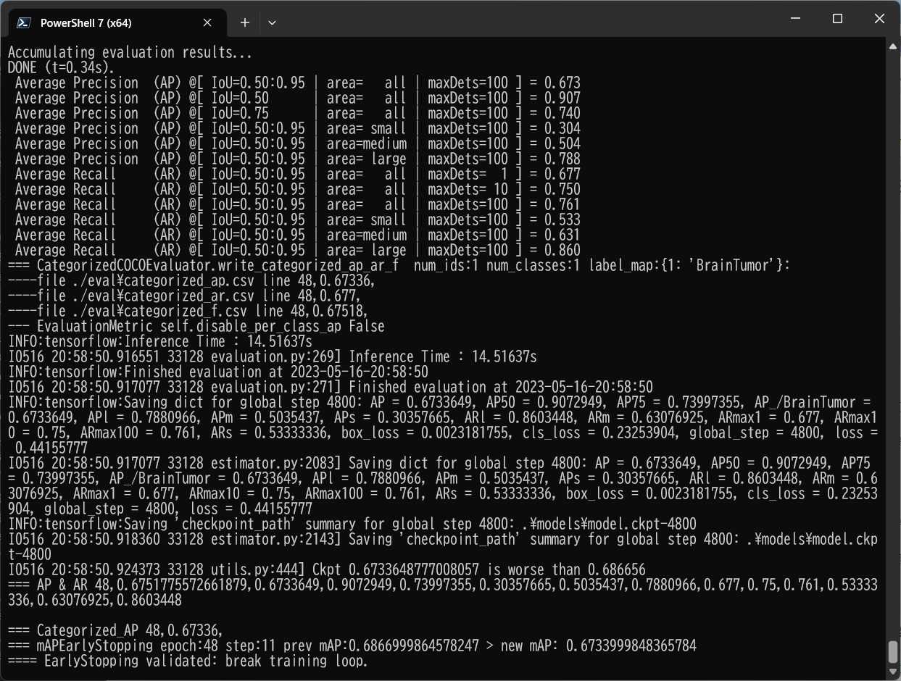
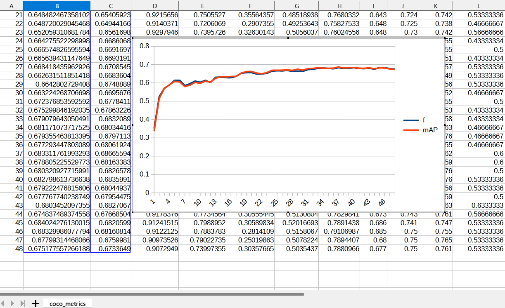
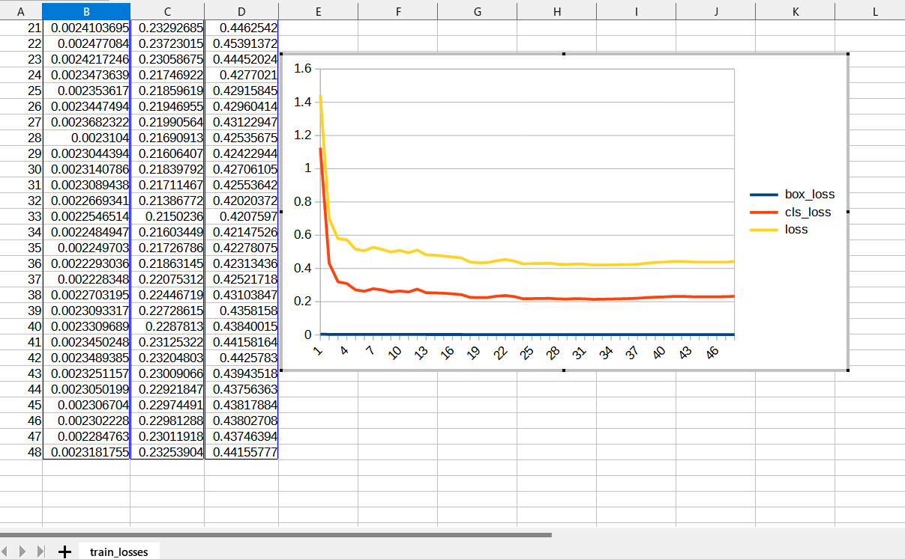
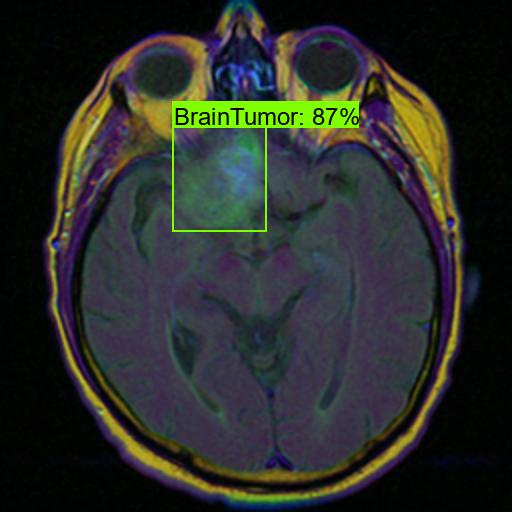
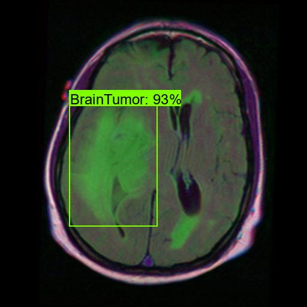
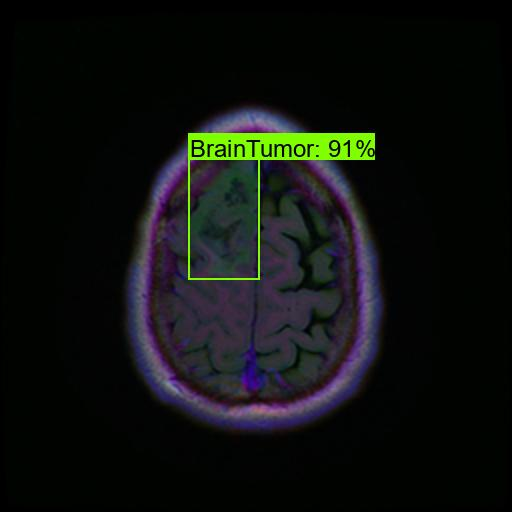
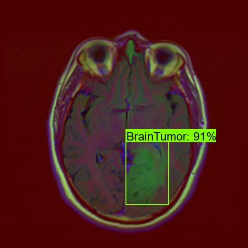

<h2>
EfficientDet-Brain-Tumor
</h2>
Pleae see also our first experiment:<a href="https://github.com/sarah-antillia/EfficientDet-MRI-Brain-Tumor">EfficientDet-MRI-Brain-Tumor</a>

<h3>
1. Dataset Citation
</h3>
The segmentation image dataset used here has been taken from the following  web site: 

<b>Brain MRI segmentation</b> 
<pre>
https://www.kaggle.com/datasets/mateuszbuda/lgg-mri-segmentation
</pre>

About Dataset 
LGG Segmentation Dataset 
Dataset used in: 

Mateusz Buda, AshirbaniSaha, Maciej A. Mazurowski "Association of genomic subtypes of 
lower-grade gliomas with shape features automatically extracted by a deep learning 
algorithm." Computers in Biology and Medicine, 2019.
and
Maciej A. Mazurowski, Kal Clark, Nicholas M. Czarnek, Parisa Shamsesfandabadi, 
Katherine B. Peters, Ashirbani Saha "Radiogenomics of lower-grade glioma: 
algorithmically-assessed tumor shape is associated with tumor genomic subtypes 
and patient outcomes in a multi-institutional study with 
The Cancer Genome Atlas data." Journal of Neuro-Oncology, 2017.

This dataset contains brain MR images together with manual FLAIR abnormality 
segmentation masks.
The images were obtained from The Cancer Imaging Archive (TCIA).
They correspond to 110 patients included in The Cancer Genome Atlas (TCGA) 
lower-grade glioma collection with at least fluid-attenuated inversion recovery (FLAIR) 
sequence and genomic cluster data available.
Tumor genomic clusters and patient data is provided in data.csv file.

 
<h2>2. Download Dataset</h2>
If you would like to train and evaluate BrainTumor EfficientDet Model by yourself,
please download <b>TFRecord</b> dataset <b>BrainTumor</b> train and valid dataset 
from the following Google drive. 

<a href="https://drive.google.com/file/d/1ZhsGyTnczYQUggG4ZQ48jxAH_czmiKLW/view?usp=sharing">TFRecord_BrainTumor.zip</a>.
 

<h3>3. Training Brain-Tumor Model</h3>
Please move to <b>./projects/medial_diagnosis/Brain-Tumor</b>,
and run the following bat file to train Brain-Tumor EfficientDet Model by using the train and valid tfrecords.
<pre>
1_train.bat
</pre>

<pre>
rem 1_train.bat
python ../../../efficientdet/ModelTrainer.py ^
  --mode=train_and_eval ^
  --train_file_pattern=./train/*.tfrecord  ^
  --val_file_pattern=./valid/*.tfrecord ^
  --model_name=efficientdet-d0 ^
  --hparams="autoaugment_policy=v2,image_size=512x512,num_classes=1,label_map=./label_map.yaml" ^
  --model_dir=./models ^
  --label_map_pbtxt=./label_map.pbtxt ^
  --eval_dir=./eval ^
  --ckpt=../../../efficientdet/efficientdet-d0  ^
  --train_batch_size=4 ^
  --early_stopping=map ^
  --patience=10 ^
  --eval_batch_size=4 ^
  --eval_samples=100  ^
  --num_examples_per_epoch=400 ^
  --num_epochs=100
</pre>

If Linux or Windows11/WSL2, please run the following shell script. 
<pre>
1_train.sh
</pre>

<b>label_map.yaml:</b>
<pre>
1: 'BrainTumor'
</pre>
The console output from the training process is the following, from which you can see that 
Average Precision [IoU=0.50:0.95] is not so high against expectations. 
 
<b><a href="./eval/coco_metrics.csv">COCO metrics at epoch 28</a></b> 

 

 
<b><a href="./eval/coco_metrics.csv">COCO metrics f and map</a></b> 

 
 
<b><a href="./eval/train_losses.csv">Train losses</a></b> 

 
 

<h3>4. Create a saved_model from the checkpoint</h3>
  Please run the following bat file to create a saved_model from the checkpoint files in <b>./models</b> folder.  
<pre>
2_create_saved_model.bat
</pre>
<pre>
rem 2_create_saved_model.bat
python ../../../efficientdet/SavedModelCreator.py ^
  --runmode=saved_model ^
  --model_name=efficientdet-d0 ^
  --ckpt_path=./models  ^
  --hparams="image_size=512x512,num_classes=1" ^
  --saved_model_dir=./saved_model
</pre>

If Linux or Windows11/WSL2, please run the following shell script. 
<pre>
2_create_saved_model.sh
</pre>

 

<h3>
5. Inference Brain-Tumor by using the saved_model
</h3>
 Please run the following bat file to infer Brain-Tumor of <b>test</b> dataset:
<pre>
3_inference.bat
</pre>
<pre>
rem 3_inference.bat
python ../../../efficientdet/SavedModelInferencer.py ^
  --runmode=saved_model_infer ^
  --model_name=efficientdet-d0 ^
  --saved_model_dir=./saved_model ^
  --min_score_thresh=0.4 ^
  --hparams="num_classes=1,label_map=./label_map.yaml" ^
  --input_image=./test/*.jpg ^
  --classes_file=./classes.txt ^
  --ground_truth_json=./test/annotation.json ^
  --output_image_dir=./test_outputs

</pre>
If Linux or Windows11/WSL2, please run the following shell script. 
<pre>
3_inference.sh
</pre>

 
<h3>
7. Some Inference results of MRI-Brain-Tumor
</h3>
 
<a href="./test_outputs/TCGA_CS_4941_19960909_11.jpg.csv">TCGA_CS_4941_19960909_11.jpg_objects.csv</a> 
 

 
<a href="./test_outputs/TCGA_CS_4944_20010208_12.jpg.csv">TCGA_CS_4944_20010208_12.jpg_objects.csv</a> 
 

 
<a href="./test_outputs/TCGA_DU_5872_19950223_36.jpg_objects.csv">TCGA_DU_5872_19950223_36.jpg_objects.csv</a> 
 

 
<a href="./test_outputs/TCGA_DU_8164_19970111_30.jpg_objects.csv">TCGA_DU_8164_19970111_30.jpg_objects.csv</a> 
 

 
<a href="./test_outputs/TCGA_FG_5962_20000626_24.jpg_objects.csv">TCGA_FG_5962_20000626_24.jpg_objects.csv</a> 
 

<h3>
References
</h3>
<b>1. Brain tumor segmentation based on deep learning and an attention mechanism using MRI multi-modalities brain images</b> 
Ramin Ranjbarzadeh, Abbas Bagherian Kasgari, Saeid Jafarzadeh Ghoushchi,  
Shokofeh Anari, Maryam Naseri & Malika Bendechache  
<pre>
https://www.nature.com/articles/s41598-021-90428-8
</pre>
<b>2. Deep learning based brain tumor segmentation: a survey</b> 
Zhihua Liu, Lei Tong, Long Chen, Zheheng Jiang, Feixiang Zhou, 
Qianni Zhang, Xiangrong Zhang, Yaochu Jin & Huiyu Zhou
 
<pre>
https://link.springer.com/article/10.1007/s40747-022-00815-5
</pre>
<b>3. MRI-based brain tumor detection using convolutional deep learning methods 
and chosen machine learning techniques</b> 
Soheila Saeedi, Sorayya Rezayi, Hamidreza Keshavarz, and Sharareh R. Niakan Kalhori
 
<pre>
https://www.ncbi.nlm.nih.gov/pmc/articles/PMC9872362/
</pre>

<b>4. Efficient framework for brain tumor detection using different deep learning techniques</b> 
Fatma Taher, Mohamed R. Shoaib, Heba M. Emara, Khaled M. Abdelwahab, Fathi E. Abd El-Samie,  
and Mohammad T. Haweel
 
<pre>
https://www.ncbi.nlm.nih.gov/pmc/articles/PMC9752904/
</pre>

<b>5. Image-Segmentation-Brain-Tumor</b> 
Toshiyki Arai @antillia.com 
<pre>
https://github.com/atlan-antillia/Image-Segmentation-Brain-Tumor
</pre>