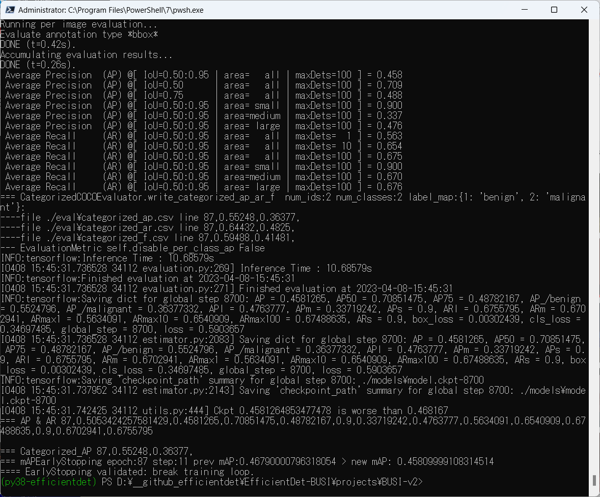
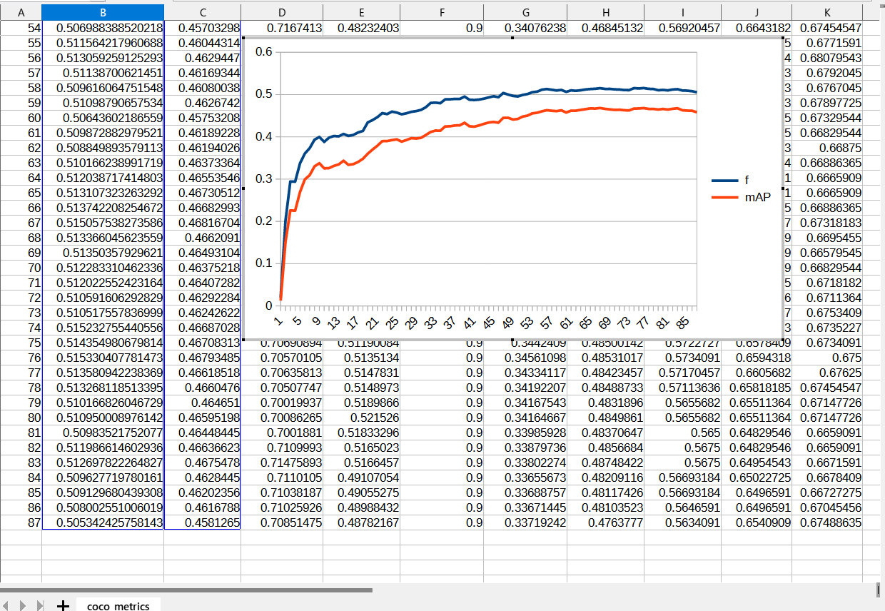
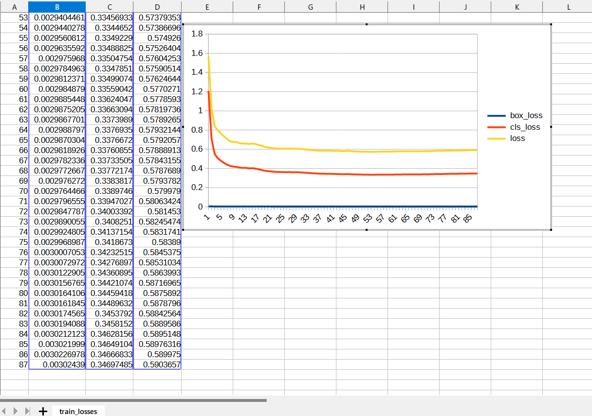
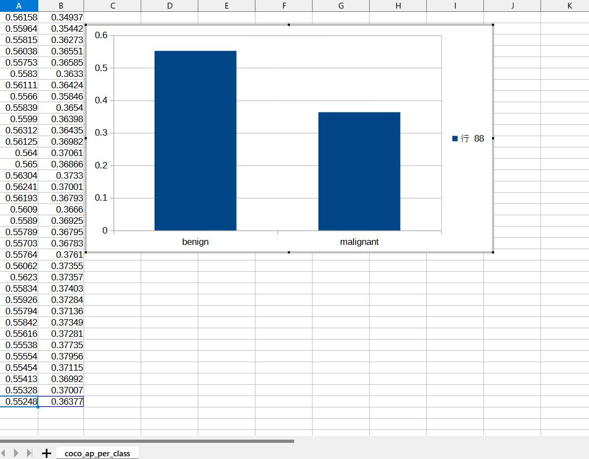
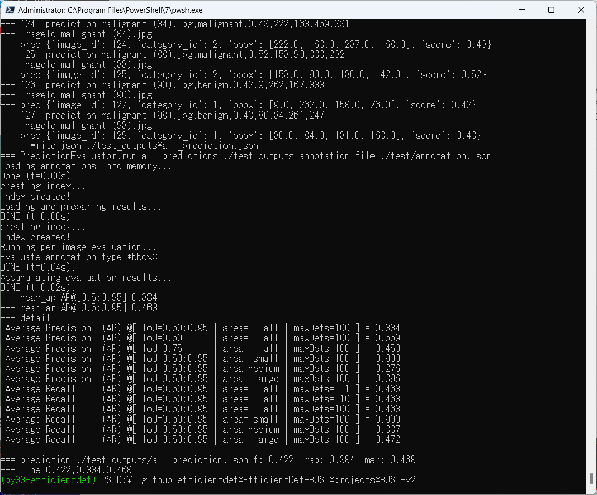

<h2>
EfficientDet-Breast-Cancer
</h2>
Please see also our first experiment: 
<a href=" https://github.com/sarah-antillia/EfficientDet-Breast-Cancer">EfficientDet-Breast-Cancer</a>
 

<h2>
1. Dataset Citation
</h2>
The original dataset <b>Breast Ultrasound Images Dataset (BUSI)</b> has been taken
from the following website. 
<pre>
https://www.kaggle.com/datasets/aryashah2k/breast-ultrasound-images-dataset
</pre>
Citation: 
<pre>
Al-Dhabyani W, Gomaa M, Khaled H, Fahmy A. 
Dataset of breast ultrasound images. Data in Brief. 
2020 Feb;28:104863. 
DOI: 10.1016/j.dib.2019.104863.
</pre>

<h2>2. Download Dataset</h2>
If you would like to train and evaluate Breast-Cancer EfficientDet Model by yourself,
please download <b>TFRecord</b> dataset <b>Break-Cancer(BUSI)</b> train and valid dataset 
from the following Google drive. 

<a href="https://drive.google.com/file/d/1XaqPnH90ZQ9_FuwaUZSvwcUPWS7BdRvE/view?usp=sharing">TFRecord-BUSI-20230414.zip</a>.
 

<h3>3. Train Breast-Cancer Model by using the pretrained-model</h3>
Please move to <b>./projects/medical_diagnosis/Breast-Cancer</b>,
and run the following bat file to train Breast-Cancer EfficientDet Model by using the train and valid tfrecords.
<pre>
1_train.bat
</pre>

<pre>
rem 1_train.bat
python ../../ModelTrainer.py ^
  --mode=train_and_eval ^
  --train_file_pattern=./train/*.tfrecord  ^
  --val_file_pattern=./valid/*.tfrecord ^
  --model_name=efficientdet-d0 ^
  --hparams="autoaugment_policy=v2,learning_rate=0.01,image_size=512x512,num_classes=2,label_map=./label_map.yaml" ^
  --model_dir=./models ^
  --label_map_pbtxt=./label_map.pbtxt ^
  --eval_dir=./eval ^
  --ckpt=../../efficientdet-d0  ^
  --train_batch_size=4 ^
  --early_stopping=map ^
  --patience=10 ^
  --eval_batch_size=4 ^
  --eval_samples=200  ^
  --num_examples_per_epoch=400 ^
  --num_epochs=100
</pre>
If Linux or Windows11/WSL2, please run the following shell script. 
<pre>
1_train.sh
</pre>

 
<b>label_map.yaml:</b>
<pre>
1: 'benign'
2: 'malignant'
</pre>
The console output from the training process is the following, from which you can see that 
mAP [IoU=0.50:0.95] is very low. 
 
<b><a href="./eval/coco_metrics.csv">COCO metrics at epoch 87</a></b> 

 

 
<b><a href="./eval/coco_metrics.csv">COCO metrics f and map</a></b> 

 
 
<b><a href="./eval/train_losses.csv">Train losses</a></b> 

 
 

<b><a href="./eval/coco_ap_per_class.csv">COCO ap per class</a></b> 

 

<h3>
4. Create a saved_model from the checkpoint
</h3>
  Please run the following bat file to create a saved_model from the checkpoint files in <b>./models</b> folder.  
<pre>
2_create_saved_model.bat
</pre>
<pre>
rem 2_create_saved_model.bat  
python ../../SavedModelCreator.py ^
  --runmode=saved_model ^
  --model_name=efficientdet-d0 ^
  --ckpt_path=./models  ^
  --hparams="image_size=512x512,num_classes=2" ^
  --saved_model_dir=./saved_model
</pre>
If Linux or Windows11/WSL2, please run the following shell script. 
<pre>
2_create_saved_model.sh
</pre>

 

<h3>
5. Inference Breast-Cancer by using the saved_model
</h3>
 Please run the following bat file to infer Breast Cancer mages of test dataset:
<pre>
3_inference.bat
</pre>
<pre>
rem 3_inference.bat
python ../../SavedModelInferencer.py ^
  --runmode=saved_model_infer ^
  --model_name=efficientdet-d0 ^
  --saved_model_dir=./saved_model ^
  --min_score_thresh=0.4 ^
  --hparams="num_classes=2,label_map=./label_map.yaml" ^
  --input_image=./test/*.jpg ^
  --classes_file=./classes.txt ^
  --ground_truth_json=./test/annotation.json ^
  --output_image_dir=./test_outputs
</pre>

If Linux or Windows11/WSL2, please run the following shell script. 
<pre>
3_inference.sh
</pre>

 
<h3>6. Some Inference results of Breast-Cancer</h3>
 
<a href="./test_outputs//benign (1).jpg_objects.csv">benign (1).jpg_objects.csv</a> 
 

 
<a href="./test_outputs//benign (7).jpg_objects.csv">benign (7).jpg_objects.csv</a> 
 

 
<a href="./test_outputs//benign (19).jpg_objects.csv">benign (19).jpg_objects.csv</a> 
 

 
<a href="./test_outputs//benign (33).jpg_objects.csv">benign (33).jpg_objects.csv</a> 
 

 
<a href="./test_outputs//benign (54).jpg_objects.csv">benign (54).jpg_objects.csv</a> 
 

 
<a href="./test_outputs//malignant (34).jpg_objects.csv">malignant (34).jpg_objects.csv</a> 
 

 
<a href="./test_outputs//malignant (71).jpg_objects.csv">malignant (71).jpg_objects.csv</a> 
 

 
<a href="./test_outputs//malignant (128).jpg_objects.csv">malignant (1).jpg_objects.csv</a> 
 

 
<a href="./test_outputs//malignant (196).jpg_objects.csv">malignant (196).jpg_objects.csv</a> 
 

 
<a href="./test_outputs//malignant (202).jpg_objects.csv">malignant (202).jpg_objects.csv</a> 
 

<h3>7. COCO metrics of inference result</h3>

The 3_inference.bat computes also the COCO metrics(f, map, mar) to the <b>test</b> dataset as shown below.

<a href="./test_outputs/prediction_f_map_mar.csv">prediction_f_map_mar.csv</a>

 
<b><a href="./eval/coco_metrics.csv">COCO metrics at epoch 87</a></b> 

 

