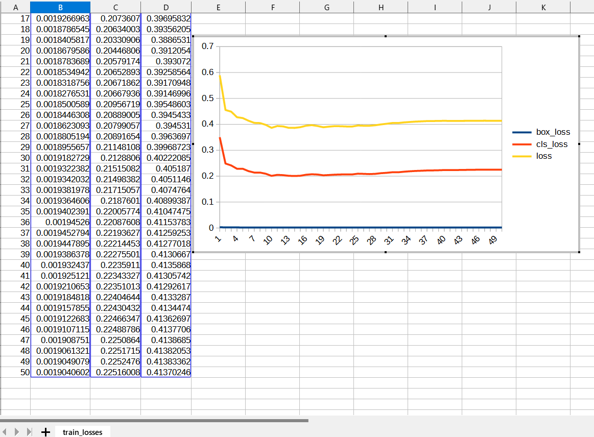

<h2>
EfficientDet-GastrointestinalPolyp
</h2>
This an experiment to dectet GastrointestinalPolyp by EfficientDet-GastrointestinalPolyp Model based on <a href="https://github.com/google/automl/tree/master/efficientdet">
goole/automl/efficientdet</a>.
 

<h3>1. Dataset Citation</h3>

The image dataset used here has been taken from the following web site.

<pre>
Kvasir-SEG Data (Polyp segmentation & detection)
https://www.kaggle.com/datasets/debeshjha1/kvasirseg
</pre>

 
<h2>2. Download Dataset</h2>
If you would like to train and evaluate GastrointestinalPolyp EfficientDet Model by yourself,
please download <b>GastrointestinalPolyp </b> dataset 
from the following Google drive. 
<a href="https://drive.google.com/file/d/1ilftnvULiFV8V1kjozJRNxvBpDe2pOE0/view?usp=sharing">
GastrointestinalPolyp-EfficientDet-Dataset.zip</a>
,and expand it under this GastrointestinalPolyp. 
It contains the following datasets  
<pre>
GastrointestinalPolyp-EfficientDet-Dataset
├─classes.txt
├─label_map.pbtxt
├─label_map.yaml
├─test
├─train
└─valid
</pre>

<h3>3. Training GastrointestinalPolyp Model</h3>
Please move to <b>./projects/medial_diagnosis/GastrointestinalPolyp</b>,
and run the following bat file to train GastrointestinalPolyp EfficientDet Model by using the train and valid tfrecords.
<pre>
1_train.bat
</pre>

<pre>
rem 1_train.bat
rem 2024/01/21 (C) antillia.com
python ../../../efficientdet/ModelTrainer.py ^
  --mode=train_and_eval ^
  --train_file_pattern=./train/*.tfrecord  ^
  --val_file_pattern=./valid/*.tfrecord ^
  --model_name=efficientdet-d0 ^
  --hparams="autoaugment_policy=v1,image_size=512x512,num_classes=1,label_map=./label_map.yaml" ^
  --model_dir=./models ^
  --label_map_pbtxt=./label_map.pbtxt ^
  --eval_dir=./eval ^
  --ckpt=../../../efficientdet/efficientdet-d0  ^
  --train_batch_size=4 ^
  --early_stopping=map ^
  --patience=10 ^
  --eval_batch_size=4 ^
  --eval_samples=200  ^
  --num_examples_per_epoch=1000 ^
  --num_epochs=50
</pre>

If Linux or Windows11/WSL2, please run the following shell script. 
<pre>
1_train.sh
</pre>

<b>label_map.yaml:</b>
<pre>
1: 'GastrointestinalPolyp'
</pre>
The console output from the training process is the following, from which you can see that 
Average Precision [IoU=0.50:0.95] is not so high against expectations. 
 
<b><a href="./eval/coco_metrics.csv">COCO metrics at epoch 50</a></b> 

 

 
<b><a href="./eval/coco_metrics.csv">COCO metrics f and map</a></b> 

 
 
<b><a href="./eval/train_losses.csv">Train losses</a></b> 

 
 

<h3>4. Create a saved_model from the checkpoint</h3>
  Please run the following bat file to create a saved_model from the checkpoint files in <b>./models</b> folder.  
<pre>
2_create_saved_model.bat
</pre>
<pre>
rem 2_create_saved_model.bat
rem 2024/01/21 (C) antillia.com
python ../../../efficientdet/SavedModelCreator.py ^
  --runmode=saved_model ^
  --model_name=efficientdet-d0 ^
  --ckpt_path=./models  ^
  --hparams="image_size=512x512,num_classes=1" ^
  --saved_model_dir=./saved_model
</pre>

If Linux or Windows11/WSL2, please run the following shell script. 
<pre>
2_create_saved_model.sh
</pre>

 

<h3>
5. Inference GastrointestinalPolyp by using the saved_model
</h3>
 Please run the following bat file to infer GastrointestinalPolyp of <b>test</b> dataset:
<pre>
3_inference.bat
</pre>
<pre>
rem 3_inference.bat
rem 2024/01/21 (C) antillia.com
python ../../../efficientdet/SavedModelInferencer.py ^
  --runmode=saved_model_infer ^
  --model_name=efficientdet-d0 ^
  --saved_model_dir=./saved_model ^
  --min_score_thresh=0.4 ^
  --hparams="num_classes=1,label_map=./label_map.yaml" ^
  --input_image=./test/*.jpg ^
  --classes_file=./classes.txt ^
  --ground_truth_json=./test/annotation.json ^
  --output_image_dir=./test_outputs
</pre>
If Linux or Windows11/WSL2, please run the following shell script. 
<pre>
3_inference.sh
</pre>
Inference console output 

 
 

 
<b><a href="./test_outputs/all_prediction.csv.csv">all_prediction.csv</a></b> 
 

 
<h3>
7. Some Inference results of MRI-GastrointestinalPolyp
</h3>
 
<a href="./test_outputs/flipped_cju0u2g7pmnux0801vkk47ivj.jpg_objects.csv">flipped_cju0u2g7pmnux0801vkk47ivj.jpg_objects.csv</a> 
 

 
<a href="./test_outputs/rotated_0_cju7dff9529h208503w60lbil.jpg_objects.csv">rotated_0_cju7dff9529h208503w60lbil.jpg_objects.csv</a> 
 

 
<a href="./test_outputs/rotated_90_cju7b9vcs1luz0987ta60j1dy.jpg_objects.csv">rotated_90_cju7b9vcs1luz0987ta60j1dy.jpg_objects.csv</a> 
 

 
<a href="./test_outputs/rotated_180_cju89y9h0puti0818i5yw29e6.jpg_objects.csv">rotated_180_cju89y9h0puti0818i5yw29e6.jpg_objects.csv</a> 
 

 
<a href="./test_outputs/rotated_270_ck2bxw18mmz1k0725litqq2mc.jpg_objects.csv">rotated_270_ck2bxw18mmz1k0725litqq2mc.jpg_objects.jpg_objects.csv</a> 
 

<h3>
References
</h3>
