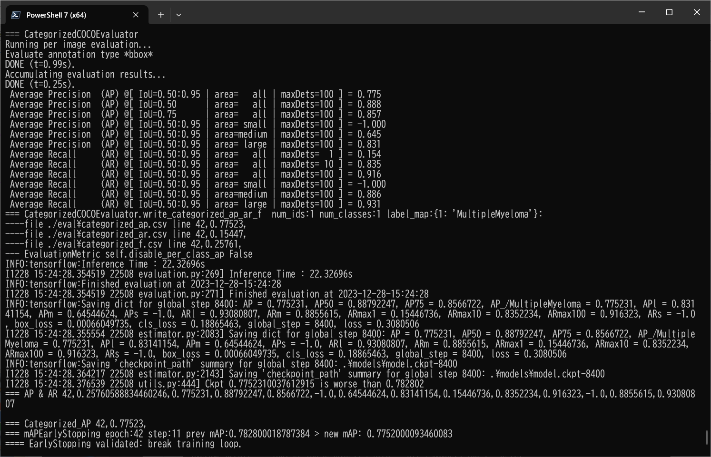
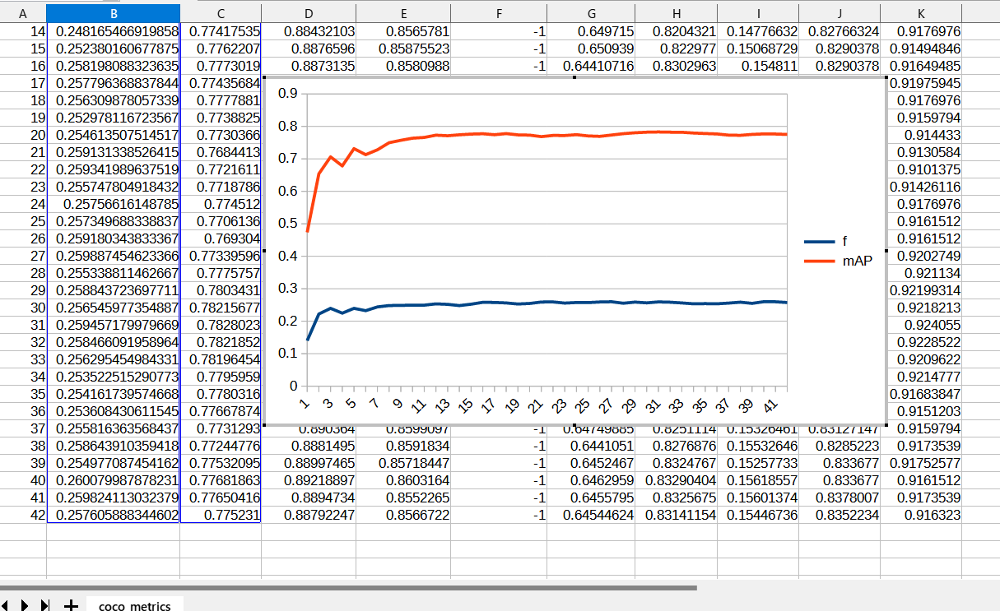
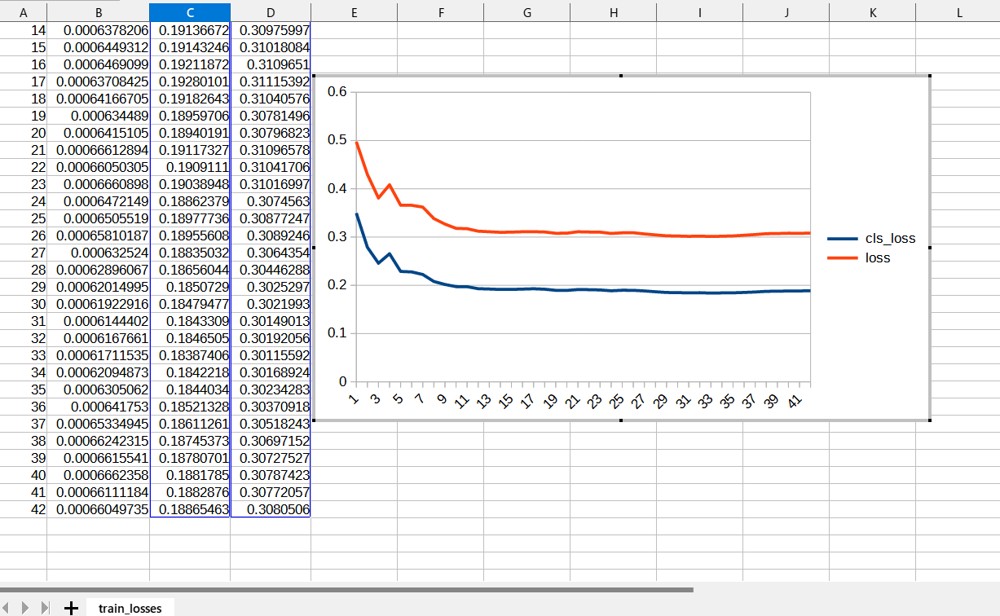

<h2>
EfficientDet-Multiple-Myeloma
</h2>
Please see also our first experiment:<a href="https://github.com/sarah-antillia/EfficientDet-Multiple-Myeloma">EfficientDet-Multiple-Myeloma</a>

<h2>1. Dataset Citation</h2>
The original MultipleMyeloma dataset used here has been take from the following  web site: 
<b>SegPC-2021-dataset</b> 
SegPC-2021: Segmentation of Multiple Myeloma Plasma Cells in Microscopic Images 
<pre>
https://www.kaggle.com/datasets/sbilab/segpc2021dataset
</pre>

Citation: 
<pre>
Anubha Gupta, Ritu Gupta, Shiv Gehlot, Shubham Goswami, April 29, 2021, 
"SegPC-2021: Segmentation of Multiple Myeloma Plasma Cells in Microscopic Images", IEEE Dataport, doi: https://dx.doi.org/10.21227/7np1-2q42.

BibTex
@data{segpc2021,
doi = {10.21227/7np1-2q42},
url = {https://dx.doi.org/10.21227/7np1-2q42},
author = {Anubha Gupta; Ritu Gupta; Shiv Gehlot; Shubham Goswami },
publisher = {IEEE Dataport},
title = {SegPC-2021: Segmentation of Multiple Myeloma Plasma Cells in Microscopic Images},
year = {2021} }

IMPORTANT:
If you use this dataset, please cite below publications-

1. Anubha Gupta, Rahul Duggal, Shiv Gehlot, Ritu Gupta, Anvit Mangal, Lalit Kumar, Nisarg Thakkar, and Devprakash Satpathy, 
 "GCTI-SN: Geometry-Inspired Chemical and Tissue Invariant Stain Normalization of Microscopic Medical Images," 
 Medical Image Analysis, vol. 65, Oct 2020. DOI: 
 (2020 IF: 11.148)
2. Shiv Gehlot, Anubha Gupta and Ritu Gupta, 
 "EDNFC-Net: Convolutional Neural Network with Nested Feature Concatenation for Nuclei-Instance Segmentation,"
 ICASSP 2020 - 2020 IEEE International Conference on Acoustics, Speech and Signal Processing (ICASSP), 
 Barcelona, Spain, 2020, pp. 1389-1393.
3. Anubha Gupta, Pramit Mallick, Ojaswa Sharma, Ritu Gupta, and Rahul Duggal, 
 "PCSeg: Color model driven probabilistic multiphase level set based tool for plasma cell segmentation in multiple myeloma," 
 PLoS ONE 13(12): e0207908, Dec 2018. DOI: 10.1371/journal.pone.0207908

License
CC BY-NC-SA 4.0

</pre>

<h2>2. Download Dataset</h2>
If you would like to train and evaluate Multiple-Myeloma EfficientDet Model by yourself,
please download <b>TFRecord</b> dataset <b>Multiple-Myeloma</b> train and valid dataset 
from the following Google drive. 

<a href="https://drive.google.com/file/d/1qFm5YIGD3DARHZGV8UVjjESZfrFuN3OP/view?usp=sharing">TFRecord_MultipleMyeloma_640x640.zip</a>.
 
This TFRecord has been generated from the original<b>SegPC-2021-dataset</b> 
SegPC-2021: Segmentation of Multiple Myeloma Plasma Cells in Microscopic Images 
<pre>
https://www.kaggle.com/datasets/sbilab/segpc2021dataset
</pre>
 
<h3>
3. Train Multiple-Myeloma Model by using the pretrained-model
</h3>
<h3>
3.1 Download pretrained model
</h3>
 We use <b>efficientdet-d1</b> pretrained of <b>image_size=640x640</b> rather than 
 <b>efficientdet-d0 </b>to improve object detection accuracy,
  so please run the following command, to download that pretrained model.  
<pre>
python DownloadCkpt_d1.py
</pre>

3.2 Train Multiple-Myeloma Model
Please move to <b>./projects/medical_diagnosis/Multiple-Myeloma</b>,
and run the following bat file to train Multiple-Myeloma EfficientDet Model by using the train and valid tfrecords.
<pre>
1_train.bat
</pre>

<pre>
rem 1_train.bat
rem 2023/12/30
rem Modified to use
rem efficientdet-d1
rem autoaugment_policy=v1 
rem and image_size=640x640
python ../../../efficientdet/ModelTrainer.py ^
  --mode=train_and_eval ^
  --train_file_pattern=./train/*.tfrecord  ^
  --val_file_pattern=./valid/*.tfrecord ^
  --model_name=efficientdet-d1 ^
  --hparams="autoaugment_policy=v1,image_size=640x640,num_classes=1,label_map=./label_map.yaml" ^
  --model_dir=./models ^
  --label_map_pbtxt=./label_map.pbtxt ^
  --eval_dir=./eval ^
  --ckpt=../../../efficientdet/efficientdet-d1  ^
  --train_batch_size=2 ^
  --early_stopping=map ^
  --patience=10 ^
  --eval_batch_size=1 ^
  --eval_samples=100  ^
  --num_examples_per_epoch=400 ^
  --num_epochs=200
</pre>
If Linux or Windows11/WSL2, please run the following shell script. 
<pre>
1_train.sh
</pre>

<b>label_map.yaml:</b>
<pre>
1: 'MultipleMyeloma'
</pre>

The console output from the training process is the following, from which you can see that 
Average Precision [IoU=0.50:0.95] is slightly improved than the previous experiment
<a href="https://github.com/sarah-antillia/EfficientDet-Multiple-Myeloma">EfficientDet-Multiple-Myeloma</a>
  

 
 
<b><a href="./eval/coco_metrics.csv">COCO metrics f and map</a></b> 

 
 
<b><a href="./eval/train_losses.csv">Train losses</a></b> 

 
 

<h3>
4. Create a saved_model from the checkpoint
</h3>
  Please run the following bat file to create a saved_model from the checkpoint files in <b>./models</b> folder.  
<pre>
2_create_saved_model.bat
</pre>
<pre>
rem 2_create_saved_model.bat  
rem 2023/12/30
rem Modified to use
rem efficientdet-d1
rem and image_size=640x640
python ../../../efficientdet/SavedModelCreator.py ^
  --runmode=saved_model ^
  --model_name=efficientdet-d1 ^
  --ckpt_path=./models  ^
  --hparams="image_size=640x640,num_classes=1" ^
  --saved_model_dir=./saved_model
</pre>

If Linux or Windows11/WSL2, please run the following shell script. 
<pre>
2_create_saved_model.sh
</pre>

 

<h3>
5. Inference Multiple-Myeloma by using the saved_model
</h3>

Please run the following bat file to infer Multiple-Myeloma of <b>mini_test</b> dataset:
<pre>
3_inference.bat
</pre>
<pre>
rem 3_inference.bat
python ../../efficientdet/SavedModelInferencer.py ^
  --runmode=saved_model_infer ^
  --model_name=efficientdet-d1 ^
  --saved_model_dir=./saved_model ^
  --min_score_thresh=0.4 ^
  --hparams="num_classes=1,label_map=./label_map.yaml" ^
  --input_image=./mini_test/*.bmp ^
  --classes_file=./classes.txt ^
  --ground_truth_json=./test/annotation.json ^
  --output_image_dir=./mini_test_outputs

</pre>
If Linux or Windows11/WSL2, please run the following shell script. 
<pre>
3_inference.sh
</pre>

We cannot compute Average-Precision scores on this evaluation process for the images in <b>mini_test</b> folder, 
because that we have no <b>annotation.json</b> file specified by parameter <b>--ground_truth_json</b>.
 
 
<h3>
6. Some Inference results of Multiple-Myeloma
</h3>
 
<a href="./mini_test_outputs/1735.bmp_objects.csv">1735.bmp_objects.csv</a> 
 

 
<a href="./mini_test_outputs/1884.bmp_objects.csv">1884.bmp_objects.csv</a> 
 

 
<a href="./mini_test_outputs/1923.bmp_objects.csv">1923.bmp_objects.csv</a> 
 

 
<a href="./mini_test_outputs/2028.bmp_objects.csv">2028.bmp_objects.csv</a> 
 

 
<a href="./mini_test_outputs/2123.bmp_objects.csv">2123.bmp_objects.csv</a> 
 

 
<a href="./mini_test_outputs/2219.bmp_objects.csv">2219.bmp_objects.csv</a> 
 

 
<a href="./mini_test_outputs/2235.bmp_objects.csv">2235.bmp_objects.csv</a> 
 

 
<a href="./mini_test_outputs/2405.bmp_objects.csv">2405.bmp_objects.csv</a> 
 

 
<a href="./mini_test_outputs/405.bmp_objects.csv">405.bmp_objects.csv</a> 
 

 
<a href="./mini_test_outputs/605.bmp_objects.csv">605.bmpobjects.csv</a> 
 

