<h2>
EfficientDet-Ovarian-Tumor
</h2>
Please see also our first experiment:<a href="https://github.com/sarah-antillia/EfficientDet-Augmented-Ovarian-Ultrasound-Images">
EfficientDet-Augmented-Ovarian-Ultrasound-Images</a>
 

<h3>1. Dataset Citation</h3>
The original dataset used here has been take from the following web site: 
<b>Multi-Modality Ovarian Tumor Ultrasound (MMOTU) image dataset</b> 
<pre>
https://github.com/cv516buaa/mmotu_ds2net
</pre>
Citation: 
<pre>
@article{DBLP:journals/corr/abs-2207-06799,
  author    = {Qi Zhao and
               Shuchang Lyu and
               Wenpei Bai and
               Linghan Cai and
               Binghao Liu and
               Meijing Wu and
               Xiubo Sang and
               Min Yang and
               Lijiang Chen},
  title     = {A Multi-Modality Ovarian Tumor Ultrasound Image Dataset for Unsupervised
               Cross-Domain Semantic Segmentation},
  journal   = {CoRR},
  volume    = {abs/2207.06799},
  year      = {2022},
}
</pre>

<b>See also:</b>

A Multi-Modality Ovarian Tumor Ultrasound
Image Dataset for Unsupervised Cross-Domain
Semantic Segmentation

<pre>
https://arxiv.org/pdf/2207.06799v3.pdf
</pre>

<h3>2. Download TFRecord Dataset</h3>

If you would like to train and evaluate Ovarian-Tumor EfficientDet Model by yourself, please download the <b>TFRecord-OTUSI-20230420.zip</b>
from <a href="https://drive.google.com/file/d/1OqG-aB7FfB0dZkKB0aTMmwcWsStNTsSu/view?usp=sharing"><b>here</b></a>

<h3>3. Train Ovarian-Tumor Model by using the pretrained-model</h3>

Please move to <b>.</b>,
and run the following bat file to train Ovarian-Tumor EfficientDet Model by using the train and valid tfrecords.
<pre>
1_train.bat
</pre>

<pre>
rem 1_train.bat
python ../../../efficientdet/ModelTrainer.py ^
  --mode=train_and_eval ^
  --train_file_pattern=./train/*.tfrecord  ^
  --val_file_pattern=./valid/*.tfrecord ^
  --model_name=efficientdet-d0 ^
  --hparams="autoaugment_policy=v1,image_size=512x512,num_classes=8,label_map=./label_map.yaml" ^
  --model_dir=./models ^
  --label_map_pbtxt=./label_map.pbtxt ^
  --eval_dir=./eval ^
  --ckpt=../../../efficientdet/efficientdet-d0  ^
  --train_batch_size=4 ^
  --early_stopping=map ^
  --patience=10 ^
  --eval_batch_size=4 ^
  --eval_samples=300  ^
  --num_examples_per_epoch=1200 ^
  --num_epochs=100
</pre>
In case of Linux or Windows/WSL2, please run the following shell script instead of the above bat file. 
<pre>
1_train.sh
</pre>

 
<b>label_map.yaml:</b>
<pre>
1: '0'
2: '1'
3: '2'
4: '3'
5: '4'
6: '5'
7: '6'
8: '7'
</pre>
The console output from the training process is the following, from which you can see that 
<b>Average Precision [IoU=0.50:0.95]</b> is very low. 
 
<b><a href="./eval/coco_metrics.csv">COCO metrics at epoch 54</a></b> 
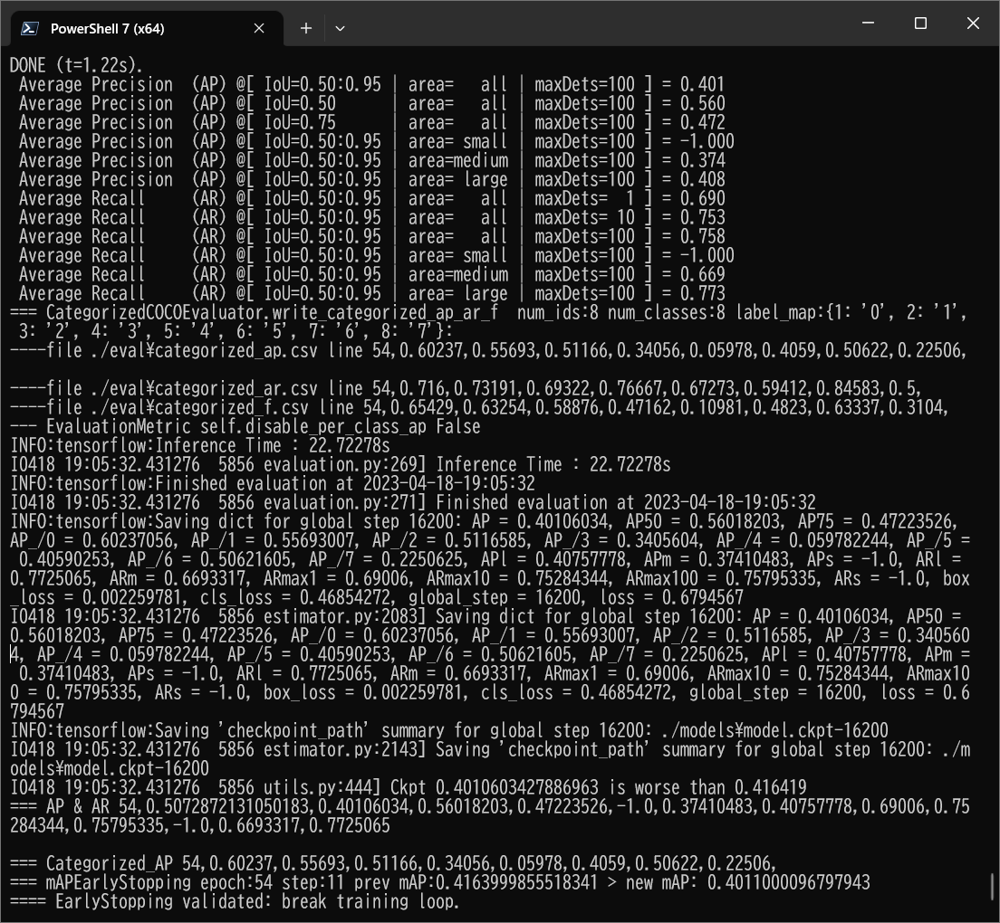
 

 
<b><a href="./eval/coco_metrics.csv">COCO metrics f and map</a></b> 
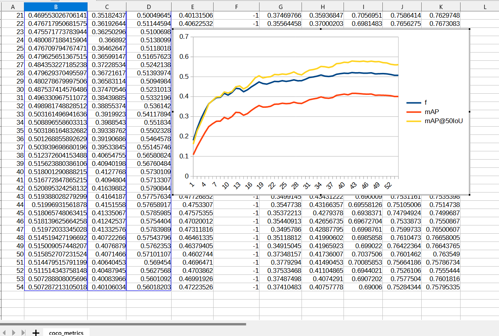
 
 
<b><a href=".projects/medical_diagnosis/Ovarian-Tumor/eval/train_losses.csv">Train losses</a></b> 
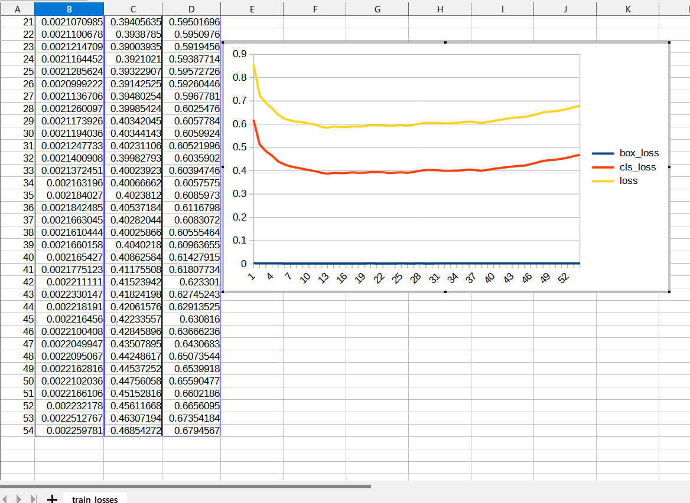
 
 

<b><a href="./eval/coco_ap_per_class.csv">COCO ap per class</a></b> 
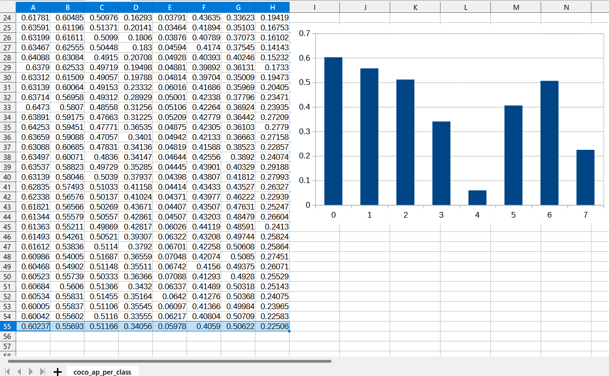
 

<h3>
4. Create a saved_model from the checkpoint
</h3>
  Please run the following bat file to create a saved_model from the checkpoint files in <b>./models</b> folder.  
<pre>
2_create_saved_model.bat
</pre>
<pre>
rem 2_create_saved_model.bat
python ../../../efficientdet/SavedModelCreator.py ^
  --runmode=saved_model ^
  --model_name=efficientdet-d0 ^
  --ckpt_path=./models  ^
  --hparams="image_size=512x512,num_classes=8" ^
  --saved_model_dir=./saved_model
</pre>
In case of Linux or Windows/WSL2, please run the following shell script instead of the above bat file. 
<pre>
2_create_saved_model.sh
</pre>

 
<h3>
5. Inference Ovarian Tumor by using the saved_model
</h3>
 Please run the following bat file to infer Ovarian Tumor images in <b>test</b> dataset:
<pre>
3_inference.bat
</pre>
<pre>
rem 3_inference.bat
python ../../../efficientdet/SavedModelInferencer.py ^
  --runmode=saved_model_infer ^
  --model_name=efficientdet-d0 ^
  --saved_model_dir=./saved_model ^
  --min_score_thresh=0.4 ^
  --hparams="num_classes=8,label_map=./label_map.yaml" ^
  --input_image=./test/*.jpg ^
  --classes_file=./classes.txt ^
  --ground_truth_json=./test/annotation.json ^
  --output_image_dir=./test_outputs
</pre>

In case of Linux or Windows/WSL2, please run the following shell script instead of the above bat file. 
<pre>
3_inference.sh
</pre>

 

 
<h3>

7.2. Some Inference results of Ovarian-Tumor
</h3>
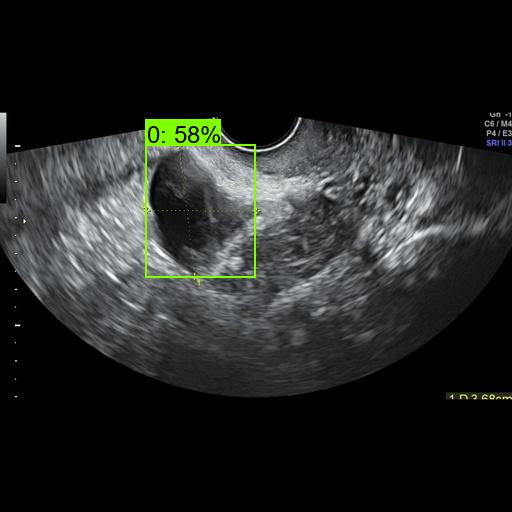 
<a href="./test_outputs/rotated-0--1.jpg_objects.csv">rotated-0--1.jpg_objects.csv</a> 
 

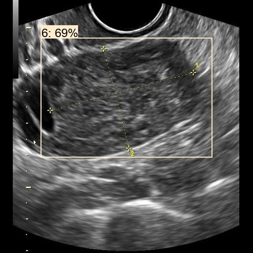 
<a href="./test_outputs/rotated-0--22.jpg_objects.csv">rotated-0--22.jpg_objects.csv</a> 
 

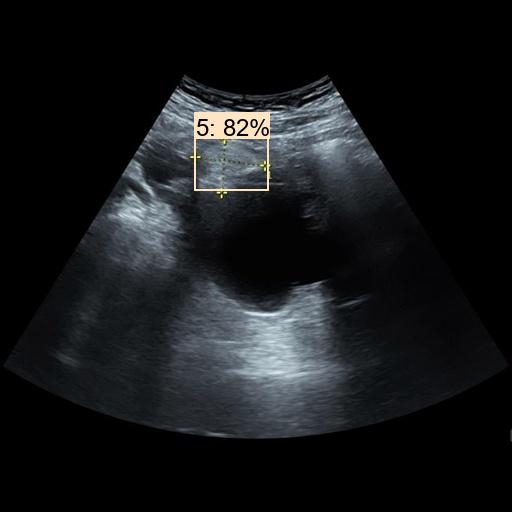 
<a href="./test_outputs/rotated-0--51.jpg_objects.csv">rotated-0--51.jpg_objects.csv</a> 
 

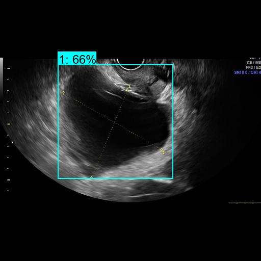 
<a href="./test_outputs/rotated-0--101.jpg_objects.csv">rotated-0--101.jpg_objects.csv</a> 
 

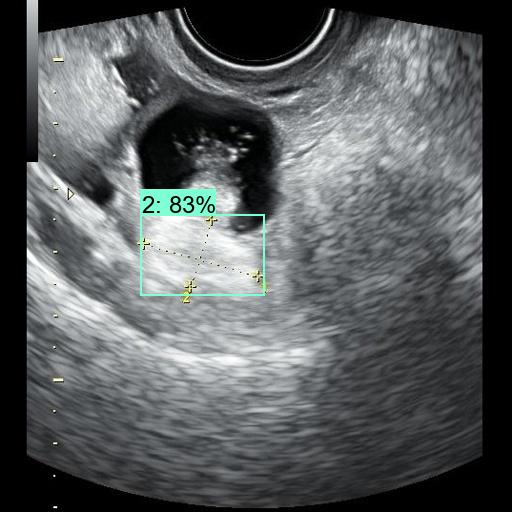 
<a href="./test_outputs/rotated-0--166.jpg_objects.csv">rotated-0--166.jpg_objects.csv</a> 
 

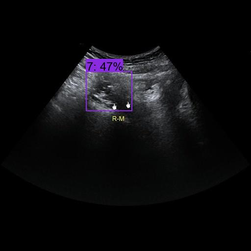 
<a href="./test_outputs/rotated-0--238.jpg_objects.csv">rotated-0--238.jpg_objects.csv</a> 
 

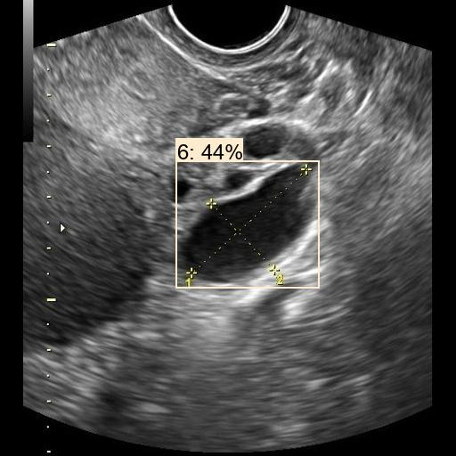 
<a href="./test_outputs/rotated-0--311.jpg_objects.csv">rotated-0--311.jpg_objects.csv</a> 
 

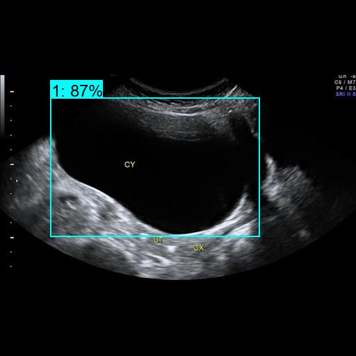 
<a href="./test_outputs/rotated-0--365.jpg_objects.csv">rotated-0--365.jpg_objects.csv</a> 
 

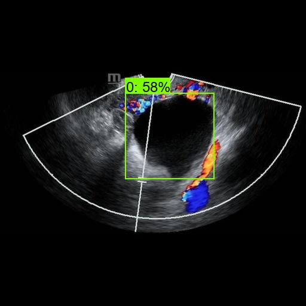 
<a href="./test_outputs/rotated-0--401.jpg_objects.csv">rotated-0--401.jpg_objects.csv</a> 
 

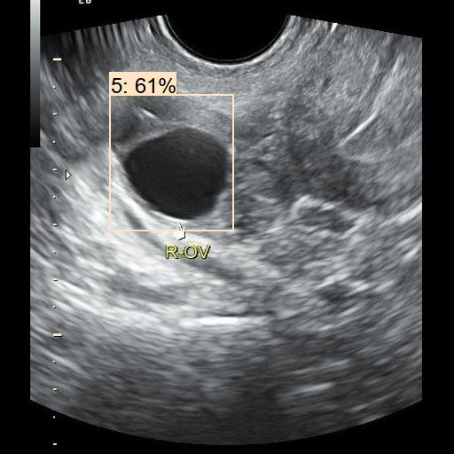 
<a href="./test_outputs/rotated-0--542.jpg_objects.csv">rotated-0--542.jpg_objects.csv</a> 
 

<h3>7.3. COCO metrics of inference result</h3>
The 3_inference.bat computes also the COCO metrics(f, map, mar) to the <b>realistic_test_dataset</b> as shown below: 
<a href="./test_outputs/prediction_f_map_mar.csv">prediction_f_map_mar.csv</a>

 
<b><a href="./eval/coco_metrics.csv">COCO metrics at epoch 54</a></b> 
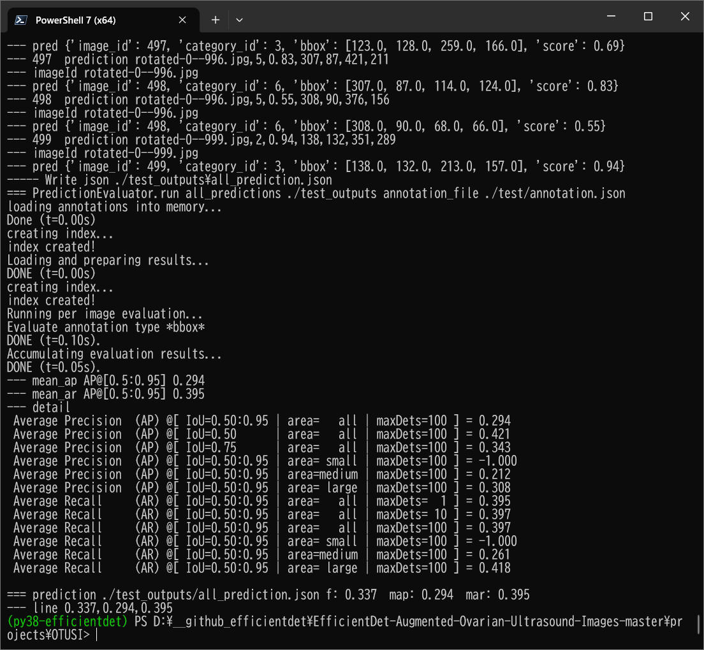
 

From the picture above, you can see that <b>Average Precision @[IoU=0.50:0.05]</b> is very low.

 
<h3>
References
</h3>
<b>1. A Multi-Modality Ovarian Tumor Ultrasound Image Dataset for Unsupervised Cross-Domain Semantic Segmentation</b> 
Qi Zhao*, Member, IEEE, Shuchang Lyu*, Graduate Student Member, IEEE, Wenpei Bai*, Linghan Cai*, 
Binghao Liu, Meijing Wu, Xiubo Sang, Min Yang, Lijiang Chen, Member, IEEE 

<pre>
https://arxiv.org/pdf/2207.06799v3.pdf
</pre>

<b>2. Ovarian tumor diagnosis using deep convolutional neural networks and a denoising convolutional autoencoder</b> 
Yuyeon Jung, Taewan Kim, Mi-Ryung Han, Sejin Kim, Geunyoung Kim, Seungchul Lee & Youn Jin Choi  
<pre>
https://www.nature.com/articles/s41598-022-20653-2

</pre>
