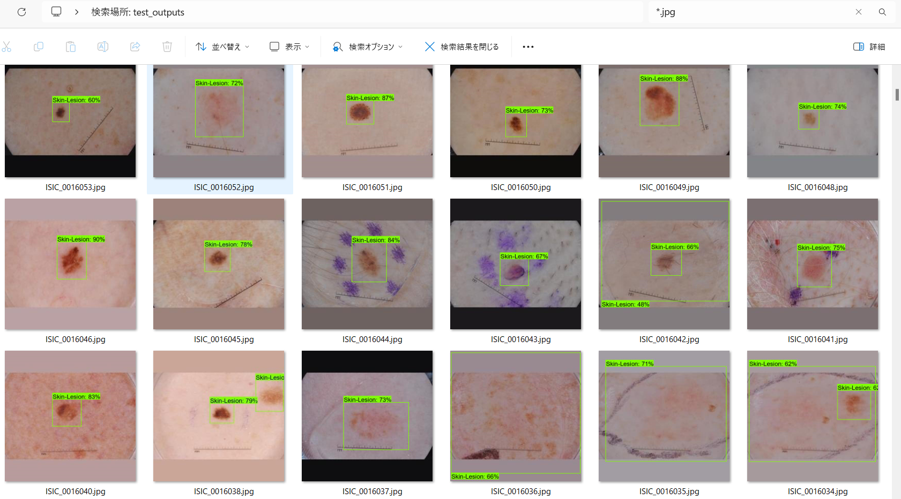
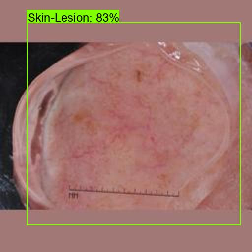

<h2>
EfficientDet-Skin-Lesion (2024/01/22)
</h2>
This an experiment to dectet Skin-Lesion by EfficientDet-Ski-Lesion Model based on <a href="https://github.com/google/automl/tree/master/efficientdet">
goole/automl/efficientdet</a>.
 
<h3>1. Dataset Citation</h3>

The image dataset used here has been taken from the following web site. 

<pre>
ISIC Challenge Datasets 2017
https://challenge.isic-archive.com/data/
</pre>

<b>Citing 2017 datasets:</b>
<pre>
Codella N, Gutman D, Celebi ME, Helba B, Marchetti MA, Dusza S, Kalloo A, Liopyris K, Mishra N, Kittler H, Halpern A.
 "Skin Lesion Analysis Toward Melanoma Detection: A Challenge at the 2017 International Symposium on Biomedical Imaging (ISBI),
  Hosted by the International Skin Imaging Collaboration (ISIC)". arXiv: 1710.05006 [cs.CV]
</pre>
<b>License: CC-0</b> 
 
See also: 

<a href="https://paperswithcode.com/dataset/isic-2017-task-1">ISIC 2017 Task 1</a> 
<pre>
Introduced by Codella et al. in Skin Lesion Analysis Toward Melanoma Detection: 
A Challenge at the 2017 International Symposium on Biomedical Imaging (ISBI), 
Hosted by the International Skin Imaging Collaboration (ISIC)
</pre>
<pre>
The ISIC 2017 dataset was published by the International Skin Imaging Collaboration (ISIC) as a large-scale dataset 
of dermoscopy images. The Task 1 challenge dataset for lesion segmentation contains 2,000 images for training with 
ground truth segmentations (2000 binary mask images).
</pre>
 

 
<h3>2. Download Dataset</h3>
If you would like to train and evaluate Skin-Lesion EfficientDet Model by yourself,
please download <b></b> dataset <b>Skin-Lesion</b>
from the following Google drive. 

<a href="https://drive.google.com/file/d/19OHk0N7FhkNvR7j60RX-qYMtzbkfTTUy/view?usp=sharing">
Skin-Lesion-EfficientDet-Dataset.zip</a>
,and expand it under this SKin-Lesion direcoty. 
It contains the following datasets  

<pre>
Skin-Lesion-EfficientDet-Dataset
├─classes.txt
├─label_map.pbtxt
├─label_map.yaml
├─test
├─train
└─valid
</pre>

<h3>3. Training Skin-Lesion Model</h3>
Please move to <b>./projects/medial_diagnosis/Skin-Lesion</b>,
and run the following bat file to train Skin-Lesion EfficientDet Model by using the train and valid tfrecords.
<pre>
1_train.bat
</pre>

<pre>
rem 1_train.bat
rem 2024/01/21 (C) antillia.com
python ../../../efficientdet/ModelTrainer.py ^
  --mode=train_and_eval ^
  --train_file_pattern=./train/*.tfrecord  ^
  --val_file_pattern=./valid/*.tfrecord ^
  --model_name=efficientdet-d0 ^
  --hparams="autoaugment_policy=v1,image_size=512x512,num_classes=1,label_map=./label_map.yaml" ^
  --model_dir=./models ^
  --label_map_pbtxt=./label_map.pbtxt ^
  --eval_dir=./eval ^
  --ckpt=../../../efficientdet/efficientdet-d0  ^
  --train_batch_size=4 ^
  --early_stopping=map ^
  --patience=10 ^
  --eval_batch_size=4 ^
  --eval_samples=200  ^
  --num_examples_per_epoch=1000 ^
  --num_epochs=50
</pre>

If Linux or Windows11/WSL2, please run the following shell script. 
<pre>
1_train.sh
</pre>

<b>label_map.yaml:</b>
<pre>
1: 'Skin-Lesion'
</pre>
The console output from the training process is the following, from which you can see that 
Average Precision [IoU=0.50:0.95] is not so high against expectations. 
 
<b><a href="./eval/coco_metrics.csv">COCO metrics at epoch 38</a></b> 

 

 
<b><a href="./eval/coco_metrics.csv">COCO metrics f and map</a></b> 

 
 
<b><a href="./eval/train_losses.csv">Train losses</a></b> 

 
 

<h3>4. Create a saved_model from the checkpoint</h3>
  Please run the following bat file to create a saved_model from the checkpoint files in <b>./models</b> folder.  
<pre>
2_create_saved_model.bat
</pre>
<pre>
rem 2_create_saved_model.bat
rem 2024/01/21 (C) antillia.com
python ../../../efficientdet/SavedModelCreator.py ^
  --runmode=saved_model ^
  --model_name=efficientdet-d0 ^
  --ckpt_path=./models  ^
  --hparams="image_size=512x512,num_classes=1" ^
  --saved_model_dir=./saved_model
</pre>

If Linux or Windows11/WSL2, please run the following shell script. 
<pre>
2_create_saved_model.sh
</pre>
 

<h3>
5. Inference Skin-Lesion by using the saved_model
</h3>
 Please run the following bat file to infer Skin-Lesion of <b>test</b> dataset:
<pre>
3_inference.bat
</pre>
<pre>
rem 3_inference.bat
rem 2024/01/21 (C) antillia.com
python ../../../efficientdet/SavedModelInferencer.py ^
  --runmode=saved_model_infer ^
  --model_name=efficientdet-d0 ^
  --saved_model_dir=./saved_model ^
  --min_score_thresh=0.4 ^
  --hparams="num_classes=1,label_map=./label_map.yaml" ^
  --input_image=./test/*.jpg ^
  --classes_file=./classes.txt ^
  --ground_truth_json=./test/annotation.json ^
  --output_image_dir=./test_outputs
</pre>
If Linux or Windows11/WSL2, please run the following shell script. 
<pre>
3_inference.sh
</pre>
Inference console output 

 
 

 
<b><a href="./test_outputs/all_prediction.csv.csv">all_prediction.csv</a></b> 
 

<h3>
7. Some Inference results of Skin-Lesion
</h3>
 
<a href="./test_outputs/ISIC_0012086.jpg_objects.csv.jpg.csv">ISIC_0012086.jpg_objects.csv.jpg.csv</a> 
 

 
<a href="./test_outputs/ISIC_0012092.jpg_objects.jpg.csv">ISIC_0012092.jpg_objects.jpg.csv</a> 
 

 
<a href="./test_outputs/ISIC_0012199.jpg_objects.jpg_objects.csv">ISIC_0012199.jpg_objects.jpg_objects.csv</a> 
 

 
<a href="./test_outputs/ISIC_0012323.jpg_objects.jpg_objects.csv">ISIC_0012323.jpg_objects.jpg_objects.csv</a> 
 

 
<a href="./test_outputs/ISIC_0013073.jpg_objects.jpg_objects.csv">ISIC_0013073.jpg_objects.jpg_objects.csv</a> 
 

<h3>
References
</h3>
