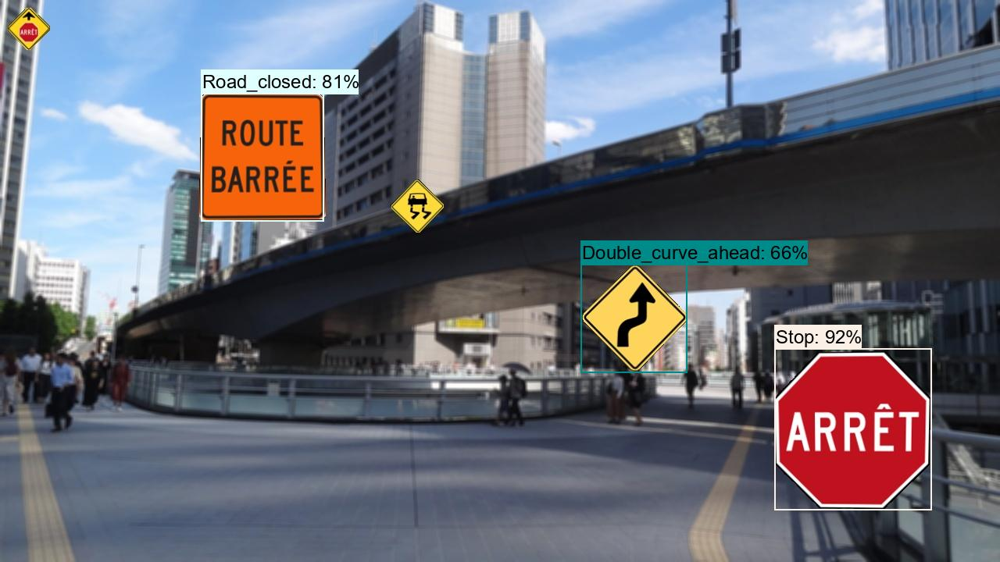
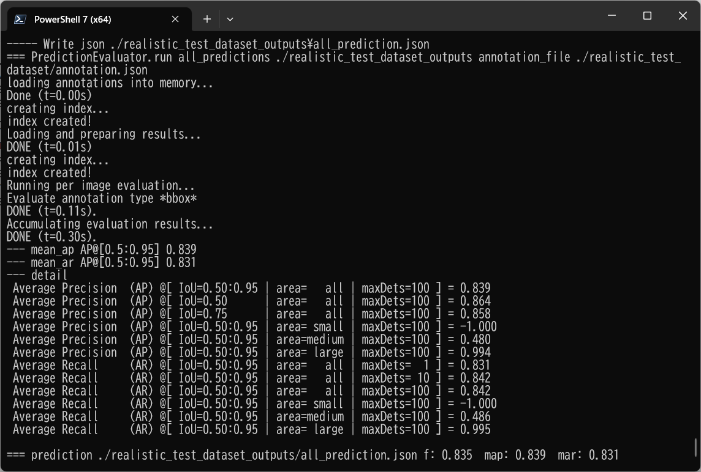

<h2>
EfficientDet-CA-RoadSigns-78classes 
</h2>
Please see also our first experiment:<a href="https://github.com/sarah-antillia/EfficientDet-Slightly-Realistic-CA-RoadSigns-78classes">EfficientDet-Slightly-Realistic-CA-RoadSigns-78classes</a>
 
 
<h3>1. Download dataset</h3>
If you would like to train and evalute CA_RoadSigns EfficientDet Model by yourself,
please download <b>TFRecord_CA-RoadSigns-78classes</b> dataset from 
<a href="https://drive.google.com/file/d/1OC8b0fmc7cUe8JzHW3TVRdG3hD50F-aX/view?usp=sharing">
CA-RoadSigns-78classes</a>
 
Please put the train and valid dataset in the downloaded zip file  
in <b>./projects/slightly_realistic_roadsigns/CA_RoadSigns_78classes</b> folder.

<h3>2. Training RoadSigns Model by using pretrained-model</h3>
Please Move to <b>CA RoadSigns_78classes</b> directory,
and run the following bat file to train Roadsigns Model by using the train and valid tfrecords.
<pre>
1_train.bat
</pre>
<pre>
rem 1_train.bat
python ../../../efficientdet/ModelTrainer.py ^
  --mode=train_and_eval ^
  --train_file_pattern=./train/*.tfrecord  ^
  --val_file_pattern=./valid/*.tfrecord ^
  --model_name=efficientdet-d0 ^
  --hparams="input_rand_hflip=False,image_size=512x512,num_classes=78,label_map=./label_map.yaml" ^
  --model_dir=./models ^
  --label_map_pbtxt=./label_map.pbtxt ^
  --eval_dir=./eval ^
  --ckpt=../../../efficientdet/efficientdet-d0  ^
  --train_batch_size=4 ^
  --early_stopping=map ^
  --patience=10 ^
  --eval_batch_size=1 ^
  --eval_samples=1000  ^
  --num_examples_per_epoch=2000 ^
  --num_epochs=80
</pre>
In case of Linux or Windows/WSL2, please run the following shell script instead of the above bat file. 
<pre>
1_train.sh
</pre>
 
<b>label_map.yaml:</b>
<pre>
1: 'Advisory_speed_tab'
2: 'Approaching_an_intersection'
3: 'Bicycle_crossing_ahead'
4: 'Bicycle_parking'
5: 'Bicycle_route_marker'
6: 'Bike_lane'
7: 'Bump'
8: 'Bus_lane'
9: 'Chevron_marker'
10: 'Crosswalk_with_flashing_lights_ahead'
11: 'Cul_de_sac'
12: 'Cyclists_must_dismount_their_bikes_and_walk'
13: 'Dangerous_goods_vehicles_prohibited'
14: 'Deer_area'
15: 'Dip'
16: 'Disaster_response_route'
17: 'Do_not_proceed_straight_ahead'
18: 'Double_curve_ahead'
19: 'Drawbridge_ahead'
20: 'End_of_road'
21: 'Gentle_curve_ahead'
22: 'Hairpin_curve_ahead'
23: 'Height_restriction_ahead'
24: 'Keep_left'
25: 'Keep_right'
26: 'Left_turn_required'
27: 'Maximum_speed_limit'
28: 'Motorists_must_not_pass_cyclists'
29: 'Multiple_curves_ahead'
30: 'Must_proceed_straight'
31: 'Narrow_structure_ahead'
32: 'No_bicycles'
33: 'No_entry'
34: 'No_left_turn_or_straight_ahead'
35: 'No_left_turn'
36: 'No_littering'
37: 'No_overtaking'
38: 'No_parking'
39: 'No_pedestrians'
40: 'No_right_turn_on_red'
41: 'No_right_turn_or_straight_ahead'
42: 'No_right_turn'
43: 'No_stopping'
44: 'One_way'
45: 'Parking_permitted'
46: 'Parking'
47: 'Passing_lane'
48: 'Pedestrian_crosswalk_ahead'
49: 'Railway_crossing_ahead'
50: 'Railway_crossing'
51: 'Right_turn_required'
52: 'Road_closed'
53: 'Road_narrows_ahead'
54: 'Road_surface_slippery_when_wet'
55: 'Rough_pavement_ahead'
56: 'Roundabout_ahead'
57: 'Route_for_dangerous_goods_vehicles'
58: 'School_bus_stop_ahead'
59: 'School_crosswalk_ahead'
60: 'School_zone'
61: 'Shared_path_for_pedestrians_and_cyclists'
62: 'Sharp_curve_ahead'
63: 'Skier_crossing'
64: 'Slow'
65: 'Snowmobile_trail'
66: 'Stop_ahead'
67: 'Stop'
68: 'Traffic_calmed_neighborhood'
69: 'Traffic_control_flagger_ahead'
70: 'Traffic_signal_ahead'
71: 'Truck_route'
72: 'Turn_left_or_right'
73: 'Two_way_bicycle_lane_crossing'
74: 'Two_way_traffic'
75: 'Uneven_surface'
76: 'Watch_for_fallen_or_falling_rocks'
77: 'Yield_sign_ahead'
78: 'Yield'
</pre>
 
 
<b><a href="./eval/coco_metrics.csv">COCO metrics at epoch 100</a></b> 

 

 
<b><a href="./eval/coco_metrics.csv">COCO meticss f and map</a></b> 

 
 
<b><a href="./eval/train_losses.csv">Train losses</a></b> 

 
 

<b><a href="./eval/coco_ap_per_class.csv">COCO ap per class</a></b> 

 

<h3>
3. Create a saved_model from the checkpoint
</h3>
  Please run the following bat file to create a saved_model from the checkpoint files in <b>./models</b> folder.  
<pre>
2_create_saved_model.bat
</pre>

<pre>
rem 2_create_saved_model.bat
python ../../../efficientdet/SavedModelCreator.py ^
  --runmode=saved_model ^
  --model_name=efficientdet-d0 ^
  --ckpt_path=./models  ^
  --hparams="image_size=512x512,num_classes=78" ^
  --saved_model_dir=./saved_model
</pre>

In case of Linux or Windows/WSL2, please run the following shell script instead of the above bat file. 
<pre>
2_create_saved_model.sh
</pre>

 
<h3>
4. Inference RoadSigns by using the saved_model
</h3>
 Please run the following bat file to infer the roadsigns in images of test_dataset:
<pre>
3_inference.bat
</pre>
<pre>
rem 3_inference.bat
python ../../../efficientdet/SavedModelInferencer.py  ^
  --runmode=saved_model_infer ^
  --model_name=efficientdet-d0 ^
  --saved_model_dir=./saved_model ^
  --min_score_thresh=0.4 ^
  --hparams="num_classes=78,label_map=./label_map.yaml" ^
  --input_image=./realistic_test_dataset/*.jpg ^
  --classes_file=./classes.txt ^
  --ground_truth_json=./realistic_test_dataset/annotation.json ^
  --output_image_dir=./realistic_test_dataset_outputs
</pre>

In case of Linux or Windows/WSL2, please run the following shell script instead of the above bat file. 
<pre>
3_inference.sh
</pre>
 
<h3>
5. Some inference results of CA RoadSigns
</h3>
 
<a href="./realistic_test_dataset_outputs/ca_roadsigns_1001.jpg_objects.csv">roadsigns1001.jpg_objects.csv</a> 
 
 
<a  href="./realistic_test_dataset_outputs/ca_roadsigns_1012.jpg_objects.csv">roadsigns1002.jpg_objects.csv</a> 
 
 
<a  href="./realistic_test_dataset_outputs/ca_roadsigns_1023.jpg_objects.csv">roadsigns1003.jpg_objects.csv</a> 
 
 
<a  href="./realistic_test_dataset_outputs/ca_roadsigns_1034.jpg_objects.csv">roadsigns1004.jpg_objects.csv</a> 
 
 
<a  href="./realistic_test_dataset_outputs/ca_roadsigns_1045.jpg_objects.csv">roadsigns1005.jpg_objects.csv</a> 
 
 
<a  href="./realistic_test_dataset_outputs/ca_roadsigns_1056.jpg_objects.csv">roadsigns1006.jpg_objects.csv</a> 
 
 
<a  href="./realistic_test_dataset_outputs/ca_roadsigns_1067.jpg_objects.csv">roadsigns1007.jpg_objects.csv</a> 
 
 
<a  href="./realistic_test_dataset_outputs/ca_roadsigns_1078.jpg_objects.csv">roadsigns1008.jpg_objects.csv</a> 
 
 
<a  href="./realistic_test_dataset_outputs/ca_roadsigns_1089.jpg_objects.csv">roadsigns1009.jpg_objects.csv</a> 
 
 
<a  href="./realistic_test_dataset_outputs/ca_roadsigns_1099.jpg_objects.csv">roadsigns1010.jpg_objects.csv</a> 
 

<h3>6. COCO metrics of inference result</h3>
The <b>3_inference.bat</b> computes also the COCO metrics(f, map, mar) to the <b>realistic_test_dataset</b> as shown below: 
<a href="./realistic_test_dataset_outputs/prediction_f_map_mar.csv">prediction_f_map_mar.csv</a>

 
 

