<h2>
EfficientDet-DE-RoadSigns-108classes
</h2>
Please see also our first experiment:<a href="https://github.com/atlan-antillia/EfficientDet-Slightly-Realistic-DE-RoadSigns-108classes">EfficientDet-Slightly-Realistic-DE-RoadSigns-108classess</a>
 
 
<h3>1. Download TFRecord dataset</h3>
If you would like to train and evalute DE-RoadSigns EfficientDet Model by yourself,
please download TFRecord_DE_RoadSigns 108classes dataset from 
<a href="https://drive.google.com/file/d/1OC8b0fmc7cUe8JzHW3TVRdG3hD50F-aX/view?usp=sharing">TFRecord_DE_RoadSigns_108classes_V7.1</a>
 
Please put the train and valid dataset in the downloaded zip file  
in ./projects/slightly_realistic_roadsigns/DE_RoadSigns 108classes folder.
 

<h3>2. Training RoadSigns Model by using pretrained-model</h3>
Move to the . directory, and run the following bat file to train roadsigns efficientdet model:
<pre>
1_train.bat
</pre> 
<pre>
rem 1_train.bat
python ../../../efficientdet/ModelTrainer.py ^
  --mode=train_and_eval ^
  --train_file_pattern=./train/*.tfrecord  ^
  --val_file_pattern=./valid/*.tfrecord ^
  --model_name=efficientdet-d0 ^
  --hparams="input_rand_hflip=False,image_size=512x512,num_classes=108,label_map=./label_map.yaml" ^
  --model_dir=./models ^
  --label_map_pbtxt=./label_map.pbtxt ^
  --eval_dir=./eval ^
  --ckpt=../../../efficientdet/efficientdet-d0  ^
  --train_batch_size=4 ^
  --early_stopping=map ^
  --patience=10 ^
  --eval_batch_size=1 ^
  --eval_samples=1000  ^
  --num_examples_per_epoch=2000 ^
  --num_epochs=80
</pre>
In case of Linux or Windows/WSL2, please run the following shell script. 
<pre>
1_train.sh
</pre>
 
<b>label_map.yaml</b>
<pre>
1: 'Advisory_speed'
2: 'Bridle_path'
3: 'Bus_lane'
4: 'Bus_stop'
5: 'Children'
6: 'Crossroads_with_a_minor_road'
7: 'Crossroads_with_priority_to_the_right'
8: 'Crosswinds'
9: 'Curve'
10: 'Cyclists'
11: 'Domestic_animals'
12: 'Emergency_lay_by'
13: 'End_of_all_previously_signed_restrictions'
14: 'End_of_minimum_speed_limit'
15: 'End_of_no_overtaking'
16: 'End_of_no_overtaking_by_heavy_goods_vehicles'
17: 'End_of_priority_road'
18: 'End_of_speed_limit'
19: 'End_of_speed_limit_zone'
20: 'Expressway'
21: 'Falling_rocks'
22: 'First_aid'
23: 'Fog'
24: 'Give_way'
25: 'Give_way_ahead'
26: 'Give_way_to_oncoming_traffic'
27: 'Go_straight'
28: 'Go_straight_or_turn_right'
29: 'Height_limit'
30: 'Ice_or_snow'
31: 'Keep_right'
32: 'Lane_configuration'
33: 'Length_limit'
34: 'Level_crossing'
35: 'Level_crossing_with_barriers_ahead'
36: 'Living_street'
37: 'Loose_surface_material'
38: 'Low_flying_aircraft'
39: 'Minimum_following_distance_between_vehicles'
40: 'Minimum_speed_limit'
41: 'Motorway'
42: 'National_border'
43: 'No_agricultural_vehicles'
44: 'No_animal_drawn_vehicles'
45: 'No_buses'
46: 'No_entry'
47: 'No_heavy_goods_vehicles'
48: 'No_mopeds'
49: 'No_motorcycles'
50: 'No_motor_vehicles'
51: 'No_motor_vehicles_except_motorcycles'
52: 'No_overtaking'
53: 'No_overtaking_by_heavy_goods_vehicles'
54: 'No_parking'
55: 'No_pedal_cycles'
56: 'No_pedestrians'
57: 'No_stopping'
58: 'No_through_road'
59: 'No_u_turn'
60: 'No_vehicles'
61: 'No_vehicles_carrying_dangerous_goods'
62: 'No_vehicles_carrying_inflammables_or_explosives'
63: 'No_vehicles_carrying_water_pollutants'
64: 'No_vehicles_pulling_a_trailer'
65: 'One_way_street'
66: 'Opening_bridge'
67: 'Other_danger'
68: 'Parking'
69: 'Parking_garage'
70: 'Pedal_cycles_only'
71: 'Pedestrians'
72: 'Pedestrians_only'
73: 'Pedestrian_crossing'
74: 'Pedestrian_crossing_ahead'
75: 'Pedestrian_zone'
76: 'Police'
77: 'Priority_over_oncoming_traffic'
78: 'Priority_road'
79: 'Restricted_parking_zone'
80: 'Roadworks'
81: 'Road_narrows'
82: 'Roundabout'
83: 'Route_for_vehicles_carrying_dangerous_goods'
84: 'Segregated_pedestrian_and_cycle_path'
85: 'Series_of_curves'
86: 'Shared_pedestrian_and_cycle_path'
87: 'Slippery_surface'
88: 'Soft_verges'
89: 'Speed_limit'
90: 'Speed_limit_zone'
91: 'Steep_ascent'
92: 'Steep_descent'
93: 'Stop'
94: 'Stop_ahead'
95: 'Taxi_stand'
96: 'Toll'
97: 'Traffic_queues'
98: 'Traffic_signals'
99: 'Trams'
100: 'Tunnel'
101: 'Turn_right'
102: 'Two_way_traffic'
103: 'Uneven_surface'
104: 'Unprotected_quayside_or_riverbank'
105: 'Weight_limit'
106: 'Weight_limit_per_axle'
107: 'Width_limit'
108: 'Wild_animals'
</pre>

 
<b>Training console output at epoch 80</b>
 
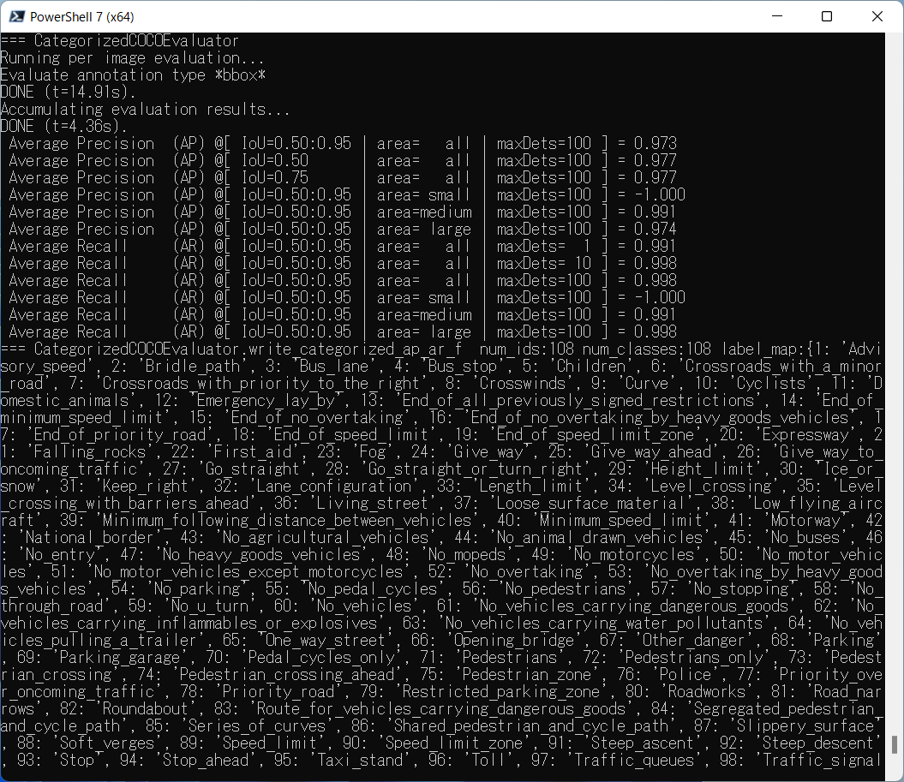
 
 
<b><a href="./eval/coco_metrics.csv">COCO meticss</a></b> 
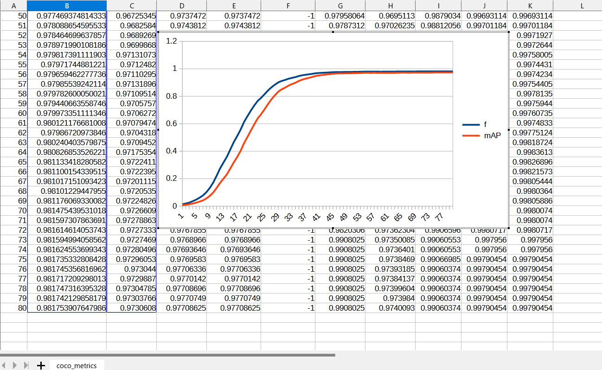
 
 
<b><a href="./eval/train_losses.csv">Train losses</a></b> 
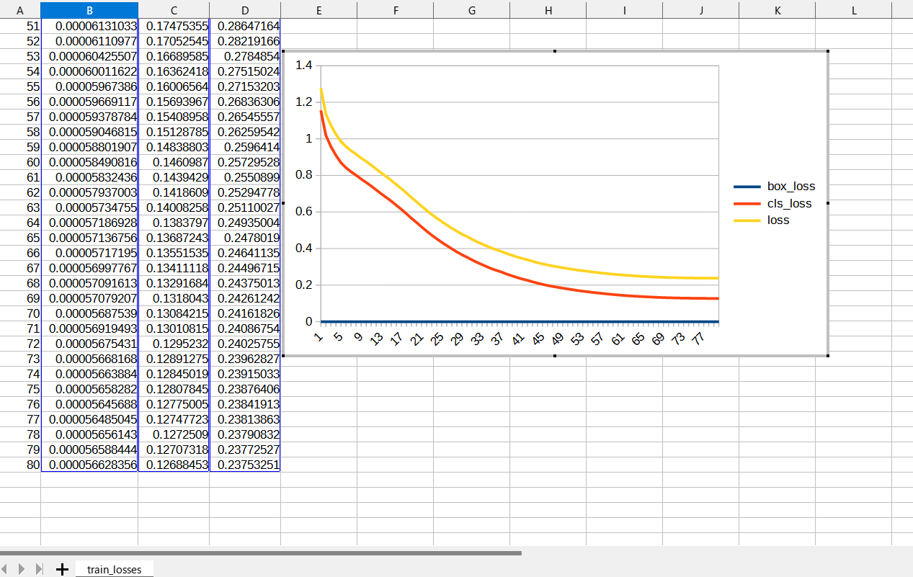
 
 

<b><a href="./eval/coco_ap_per_class.csv">COCO ap per class</a></b> 
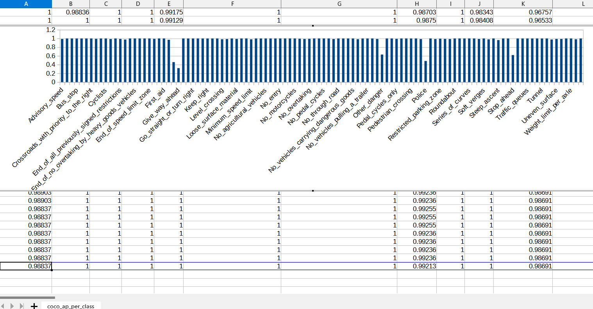
 
 
<h3>
2. Create a saved_model from the checkpoint
</h3>
 Please run the following bat file to create a saved model from a chekcpoint in models folder.
<pre>
2_create_saved_model.bat
</pre>
, which is the following:
<pre>
rem 2_create_saved_model.bat
python ../../../efficientdet/SavedModelCreator.py ^
  --runmode=saved_model ^
  --model_name=efficientdet-d0 ^
  --ckpt_path=./models  ^
  --hparams="image_size=512x512,num_classes=108" ^
  --saved_model_dir=./saved_model
</pre>
In case of Linux or Windows/WSL2, please run the following shell script. 
<pre>
2_create_saved_model.sh
</pre>

 
<h3>
5. Inference DE_RoadSigns by using the saved_model
</h3>
 Please run the following bat file to infer the roadsigns by using the saved_model:
<pre>
3_inference.bat
</pre>
rem 3_inference.bat
python ../../../efficientdet/SavedModelInferencer.py ^
  --runmode=saved_model_infer ^
  --model_name=efficientdet-d0 ^
  --saved_model_dir=./saved_model ^
  --min_score_thresh=0.4 ^
  --hparams="label_map=./label_map.yaml" ^
  --input_image=./realistic_test_dataset/*.jpg ^
  --classes_file=./classes.txt ^
  --ground_truth_json=./realistic_test_dataset/annotation.json ^
  --output_image_dir=./realistic_test_dataset_outputs
</pre>
In case of Linux or Windows/WSL2, please run the following shell script. 
<pre>
3_inference.sh
</pre>
 
<h3>
4. Some inference results of realistc_test_dataset DE RoadSigns
</h3>

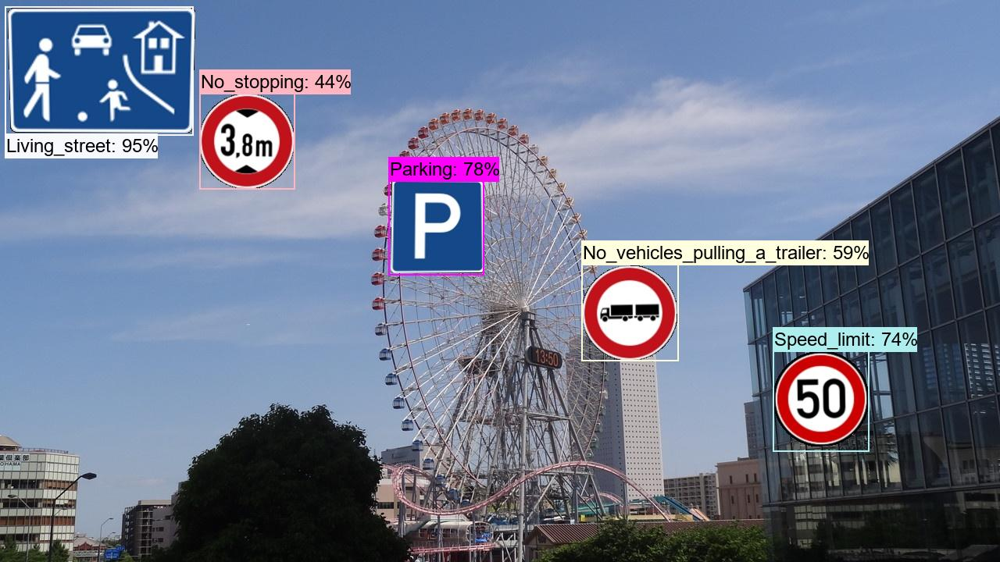 
<a href="./realistic_test_dataset_outputs/de_roadsigns_1000.jpg_objects.csv">roadsigns_1.jpg_objects.csv</a> 

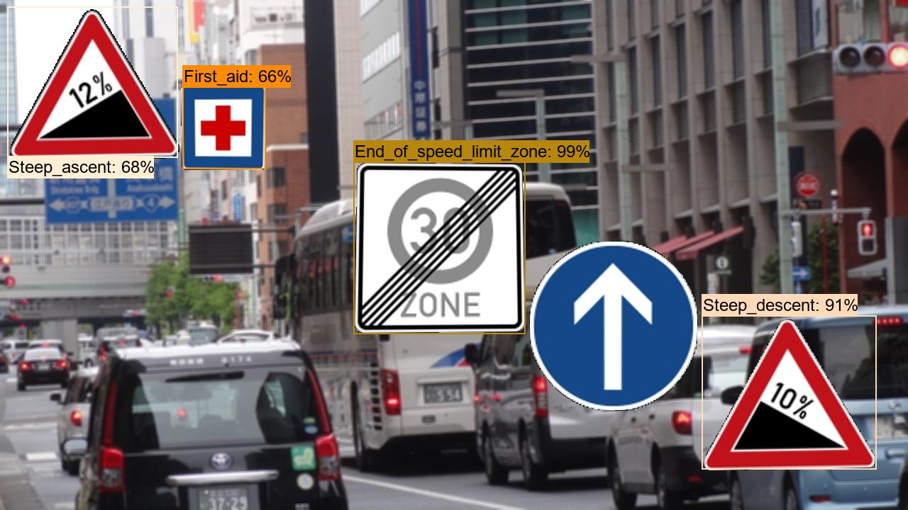 
<a  href="./realistic_test_dataset_outputs/de_roadsigns_1020.jpg_objects.csv">roadsigns_2.jpg_objects.csv</a> 

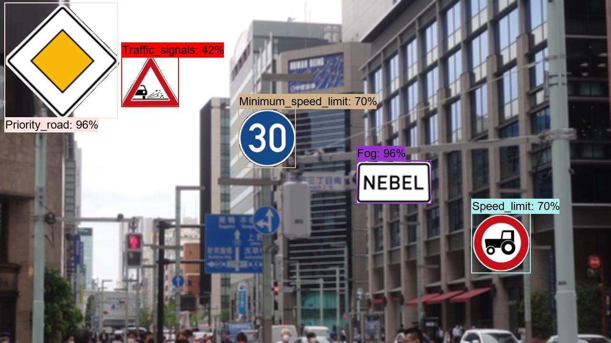 
<a  href="./realistic_test_dataset_outputs/de_roadsigns_1030.jpg_objects.csv">roadsigns_3.jpg_objects.csv</a> 

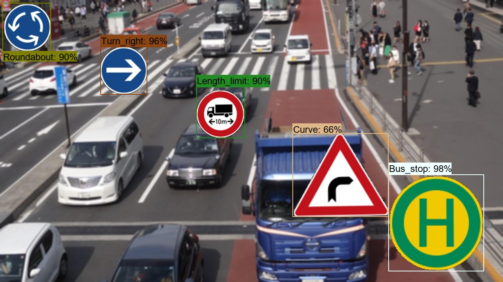 
<a  href="./realistic_test_dataset_outputs/de_roadsigns_1040.jpg_objects.csv">roadsigns_4.jpg_objects.csv</a> 

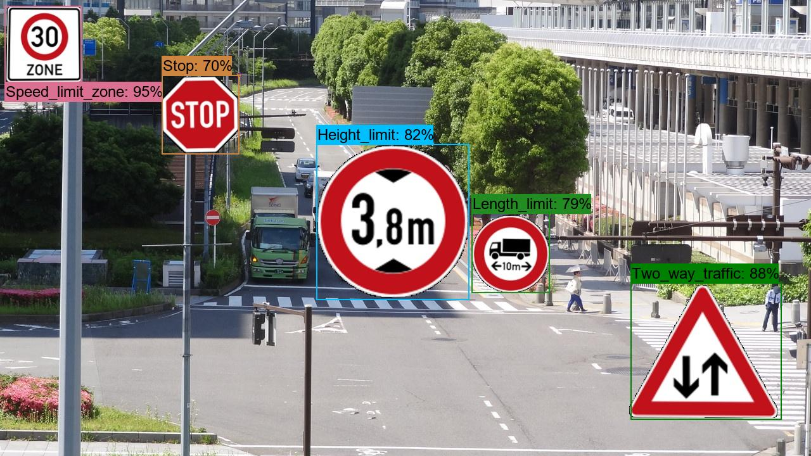 
<a  href="./realistic_test_dataset_outputs/de_roadsigns_1050.jpg_objects.csv">roadsigns_5.jpg_objects.csv</a> 

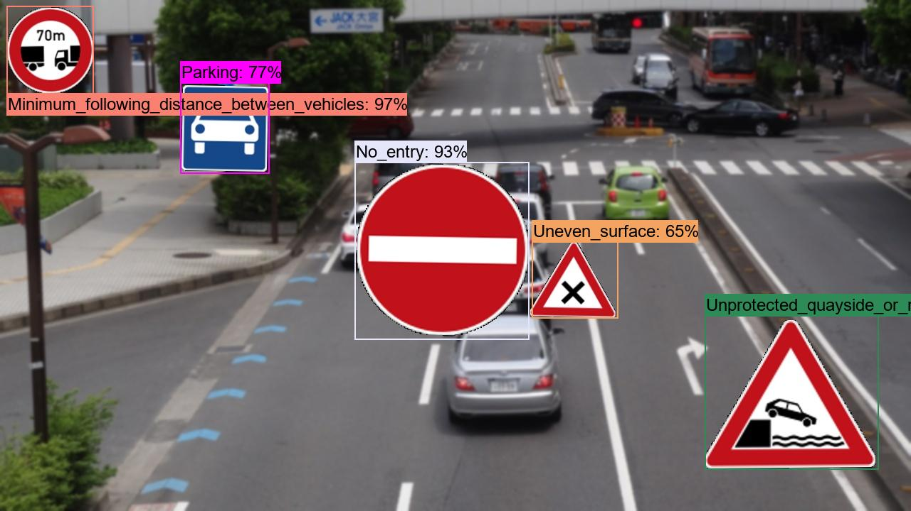 
<a  href="./realistic_test_dataset_outputs/de_roadsigns_1060.jpg_objects.csv">roadsigns_6.jpg_objects.csv</a> 

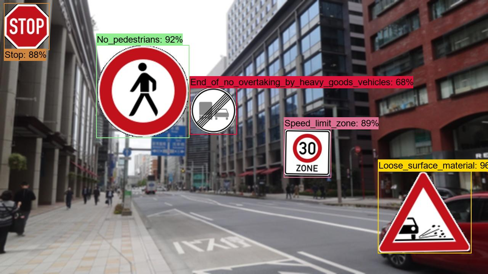 
<a  href="./realistic_test_dataset_outputs/de_roadsigns_1070.jpg_objects.csv">roadsigns_7.jpg_objects.csv</a> 

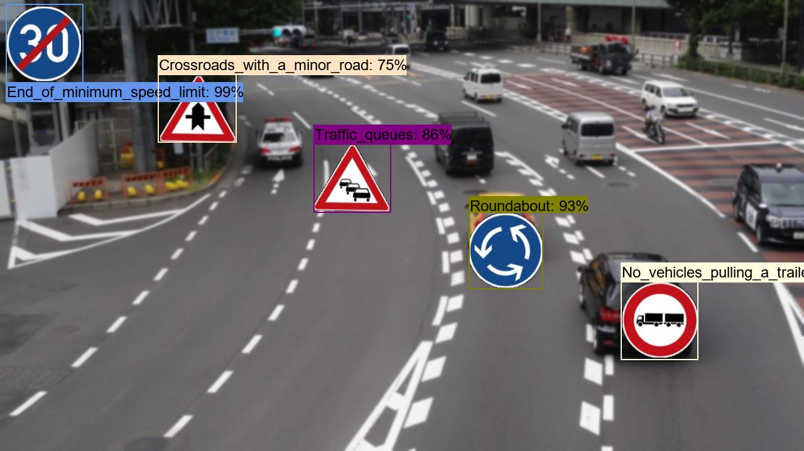 
<a  href="./realistic_test_dataset_outputs/de_roadsigns_1080.jpg_objects.csv">roadsigns_8.jpg_objects.csv</a> 

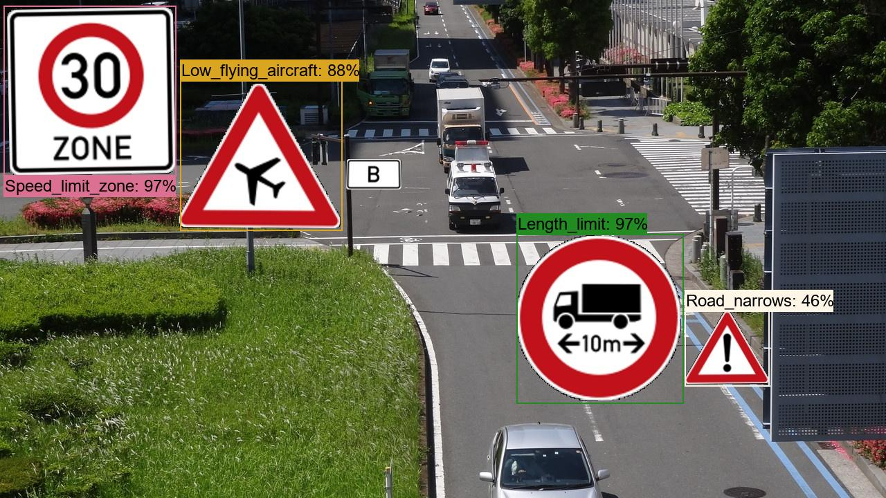 
<a  href="./realistic_test_dataset_outputs/de_roadsigns_1090.jpg_objects.csv">roadsigns_9.jpg_objects.csv</a> 

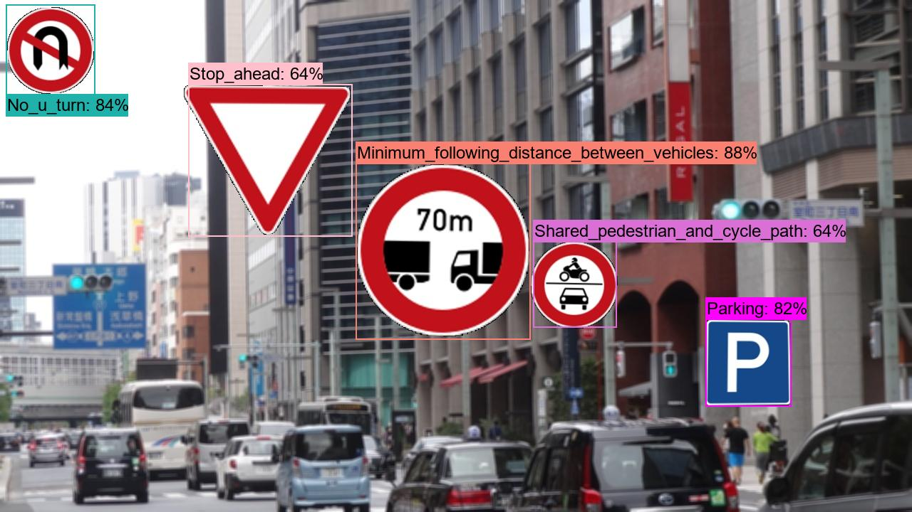 
<a  href="./realistic_test_dataset_outputs/de_roadsigns_1099.jpg_objects.csv">roadsigns_10.jpg_objects.csv</a> 

<h3>5. COCO metrics of inference result</h3>
The 3_inference.bat computes also the COCO metrics(f, map, mar) to the <b>realistic_test_dataset</b> as shown below: 

<a href="./realistic_test_dataset_outputs/prediction_f_map_mar.csv">prediction_f_map_mar.csv</a>

 
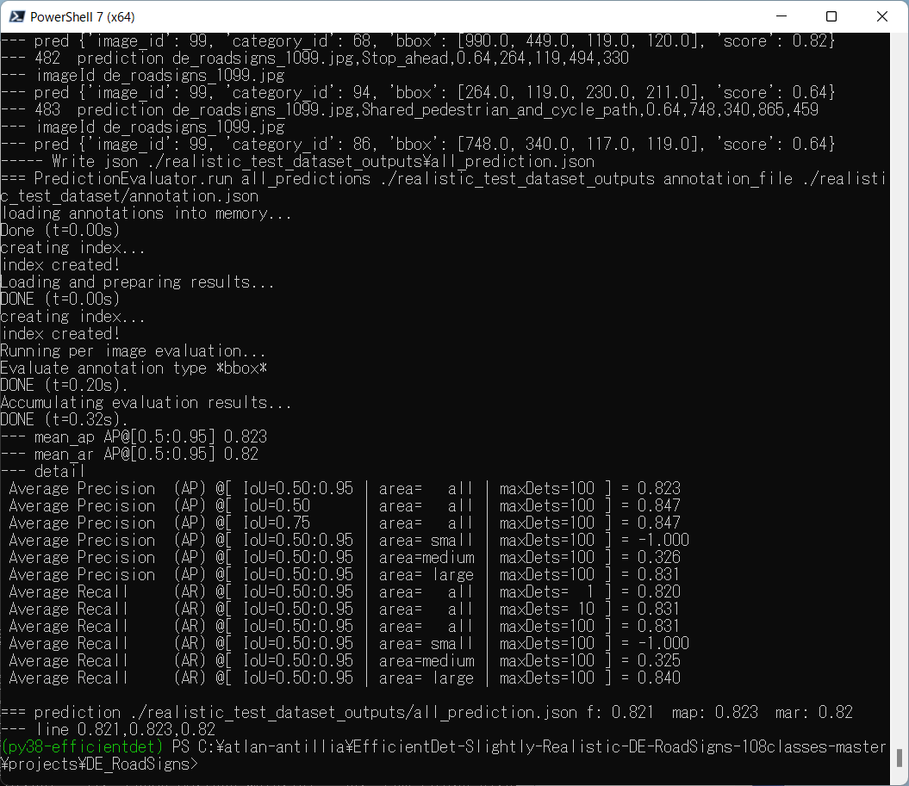 

