<h2>
EfficientDet-FR-RoadSigns-152classes
</h2>

Please see also our first experiment:
<a href="https://github.com/atlan-antillia/EfficientDet-Slightly-Realistic-FR-RoadSigns-152classes">EfficientDet-Slightly-Realistic-FR-RoadSigns-152classes</a>
 

<h3>1. Download TFRecord dataset</h3>
If you would like to train and evalute FR-RoadSigns EfficientDet Model by yourself,
please download TRecord_FR_RoadSigns 152classes dataset from 
<a href="https://drive.google.com/file/d/1bWmVEeIkULDxwQjGLS-ALlqOuAJcSarJ/view?usp=sharing">FR_RoadSigns_152classes</a>
 
Please put the train and valid dataset in the downloaded zip file  
in ./projects/slightly_realistic_roadsigns/FR_RoadSigns_152classes folder.

 
<h3>2. Train RoadSigns Model by using pretrained-model</h3>
Move to the FR_RoadSigns_152classes directory, and run the following bat file to train roadsigns efficientdet model:
<pre>
1_train.bat
</pre> 
<pre>
rem 1_train.bat
python ../../../efficientdet/ModelTrainer.py ^
  --mode=train_and_eval ^
  --train_file_pattern=./train/*.tfrecord  ^
  --val_file_pattern=./valid/*.tfrecord ^
  --model_name=efficientdet-d0 ^
  --hparams="input_rand_hflip=False,image_size=512x512,num_classes=152,label_map=./label_map.yaml" ^
  --model_dir=./models ^
  --label_map_pbtxt=./label_map.pbtxt ^
  --eval_dir=./eval ^
  --ckpt=../../../efficientdet/efficientdet-d0  ^
  --train_batch_size=4 ^
  --early_stopping=map ^
  --patience=10 ^
  --eval_batch_size=1 ^
  --eval_samples=1000  ^
  --num_examples_per_epoch=2000 ^
  --num_epochs=80
</pre>

In case of Linux or Windows/WSL2, please run the following shell script. 
<pre>
1_train.sh
</pre>

<b>label_map.yaml</b>
<pre>
1: '30_km_zone'
2: 'Accident'
3: 'Advisory_minimum_speed'
4: 'Ahead_only'
5: 'Axle_weight_limit_5_tonnes'
6: 'Bend_to_left'
7: 'Bend_to_right'
8: 'Bicycle_lane'
9: 'Breakdown_bay'
10: 'Bridleway'
11: 'Bumps_in_road'
12: 'Bus_lane'
13: 'Bus_stop'
14: 'Cattle'
15: 'Chevron_left'
16: 'Chevron_right'
17: 'Children_crossing'
18: 'Contra_flow_bus_lane'
19: 'Contra_flow_cycle_lane'
20: 'Crossroads_with_priority'
21: 'Crossroads_with_right_of_way_from_the_right'
22: 'Cycle_route'
23: 'Cyclists'
24: 'Disc_parking_zone'
25: 'Double_bend_first_to_left'
26: 'Double_bend_first_to_right'
27: 'End_of_50_km_zone'
28: 'End_of_advisory_minimum_speed'
29: 'End_of_bicycle_lane'
30: 'End_of_bridleway'
31: 'End_of_bus_lane'
32: 'End_of_cycle_route'
33: 'End_of_fast_traffic_highway'
34: 'End_of_home_zone'
35: 'End_of_minimum_speed'
36: 'End_of_motorway'
37: 'End_of_no_overtaking_by_lorries'
38: 'End_of_no_overtaking'
39: 'End_of_no_sounding_of_horns'
40: 'End_of_overtaking_lanes'
41: 'End_of_pedestrian_and_cycle_route'
42: 'End_of_pedestrian_lane'
43: 'End_of_pedestrian_precinct'
44: 'End_of_priority_road'
45: 'End_of_restriction'
46: 'End_of_snow_chains_zone'
47: 'End_of_tunnel'
48: 'Equestrians'
49: 'Escape_lane_on_left'
50: 'Escape_lane_on_right'
51: 'Fast_traffic_highway'
52: 'Give_priority_to_oncoming_vehicles'
53: 'Give_way_sign_150_metres_ahead'
54: 'Give_way'
55: 'Go_ahead_or_turn_left'
56: 'Go_ahead_or_turn_right'
57: 'Height_limit_3.5_metres'
58: 'Home_zone'
59: 'Keep_left'
60: 'Keep_right'
61: 'Lane_forbidden_for_use_by_lorries'
62: 'Lanes_merge'
63: 'Length_limit_10metres'
64: 'Level_crossing_with_gates_on_side_road'
65: 'Level_crossing_with_gates'
66: 'Level_crossing_without_gates_and_with_a_flashing_red_warning_light'
67: 'Level_crossing_without_gates_single_track'
68: 'Level_crossing_without_gates'
69: 'Loose_chippings'
70: 'Low_flying_aircraft'
71: 'Minimum_speed'
72: 'Motorway'
73: 'Multiplayer_chevron_left'
74: 'Multiplayer_chevron_right'
75: 'No_buses'
76: 'No_cycling'
77: 'No_entry'
78: 'No_handcarts'
79: 'No_horse_drawn_vehicles'
80: 'No_left_turn'
81: 'No_lorries'
82: 'No_mopeds'
83: 'No_motor_vehicles_except_mopeds'
84: 'No_motor_vehicles_including_mopeds'
85: 'No_motorcycles'
86: 'No_overtaking_by_lorries'
87: 'No_overtaking'
88: 'No_parking'
89: 'No_pedestrians'
90: 'No_right_turn'
91: 'No_sounding_of_horns'
92: 'No_stopping'
93: 'No_through_road'
94: 'No_tractors'
95: 'No_traffic_allowed_without_indicated_minimum_distance_between_vehicles'
96: 'No_u_turns'
97: 'No_vehicles_carrying_dangerous_goods'
98: 'No_vehicles_carrying_explosives'
99: 'No_vehicles_carrying_water_pollutants'
100: 'No_vehicles_towing_caravans'
101: 'No_vehicles'
102: 'One_way_traffic'
103: 'Opening_bridge_ahead'
104: 'Other_danger'
105: 'Overtaking_lanes'
106: 'Parking_restrictions'
107: 'Parking_zone'
108: 'Pedestrian_and_cycle_route'
109: 'Pedestrian_crossing'
110: 'Pedestrian_lane'
111: 'Pedestrian_precinct'
112: 'Priority_over_oncoming_vehicles'
113: 'Priority_road'
114: 'Quayside_or_river_bank'
115: 'Queues_likely'
116: 'Reduced_visibility'
117: 'Risk_of_fire'
118: 'Road_narrows'
119: 'Road_narrows_on_left'
120: 'Road_narrows_on_right'
121: 'Road_works'
122: 'Roundabout'
123: 'Side_winds'
124: 'Slip_road_to_left'
125: 'Slip_road_to_right'
126: 'Slippery_road'
127: 'Snow_chains_compulsory'
128: 'Speed_humps'
129: 'Speed_limit_50_km'
130: 'Steep_hill_downwards'
131: 'Stop_customs'
132: 'Stop_gendarmerie'
133: 'Stop_police'
134: 'Stop_sign_150_metres_ahead'
135: 'Stop_toll'
136: 'Stop'
137: 'Temporary_traffic_signals'
138: 'Traffic_light'
139: 'Tram_crossing'
140: 'Tram_lane'
141: 'Trams_crossing_ahead'
142: 'Tunnel'
143: 'Turn_left_ahead'
144: 'Turn_left_or_right'
145: 'Turn_left'
146: 'Turn_right_ahead'
147: 'Turn_right'
148: 'Two_way_traffic_ahead'
149: 'Uneven_road'
150: 'Weight_limit_5.5_tonnes'
151: 'Width_limit_2.5_metres'
152: 'Wild_animals'
</pre>

 
<b>Training console output at epoch 62</b>
 
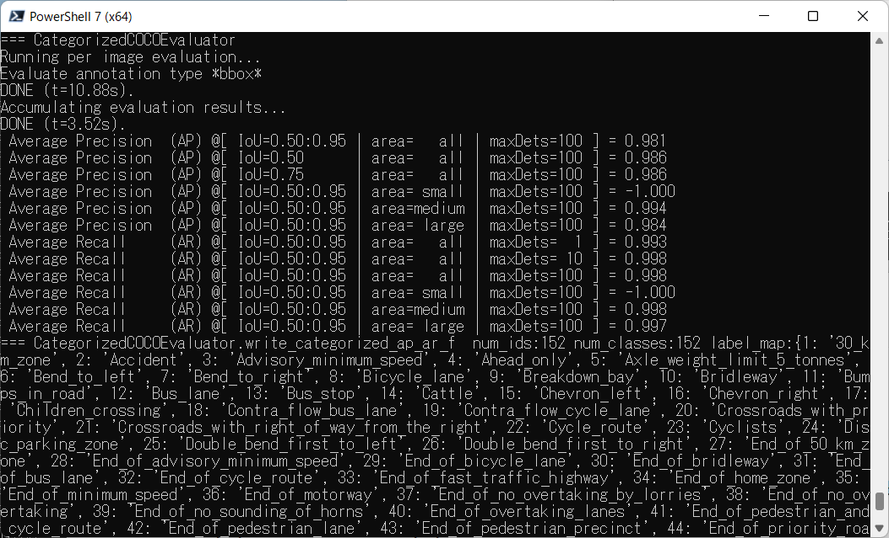
 
 
<b><a href="./projects/FR_RoadSigns/eval/coco_metrics.csv">COCO metrics</a></b> 
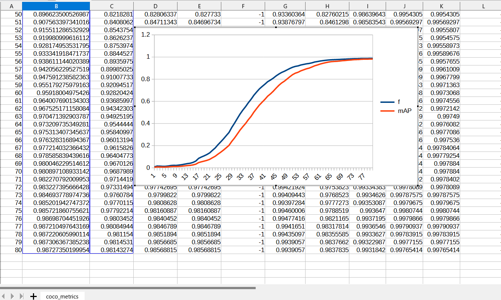
 
 
<b><a href="./projects/FR_RoadSigns/eval/train_losses.csv">Train losses</a></b> 
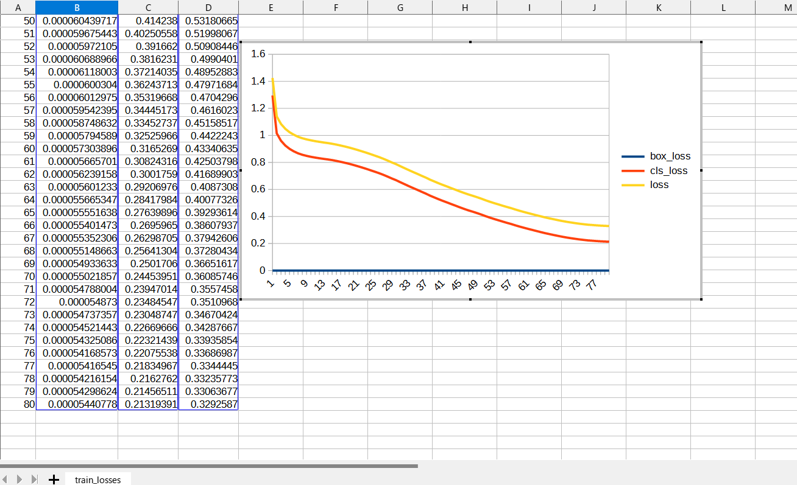
 
 

<b><a href="./projects/FR_RoadSigns/eval/coco_ap_per_class.csv">COCO ap per class</a></b> 
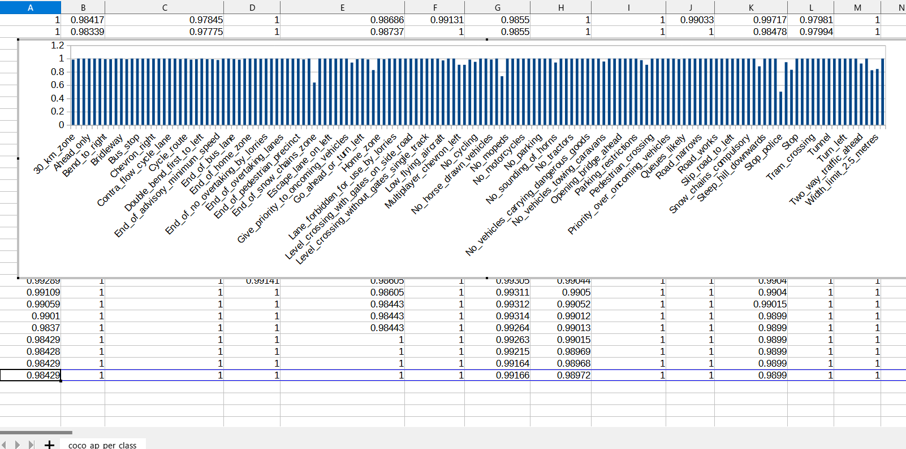
 
 
<h3>
3. Create a saved_model from the checkpoint
</h3>
 Please run the following bat file to create a saved model from a checkpoint in models folder.
<pre>
2_create_saved_model.bat
</pre>
<pre>
rem 2_create_saved_model.bat
python ../../../efficientdet/SavedModelCreator.py ^
  --runmode=saved_model ^
  --model_name=efficientdet-d0 ^
  --ckpt_path=./models  ^
  --hparams="image_size=512x512,num_classes=152" ^
  --saved_model_dir=./saved_model
</pre>
In case of Linux or Windows/WSL2, please run the following shell script. 
<pre>
2_create_saved_model.sh
</pre>

 
<h3>
4. Inference FR_RoadSigns by using the saved_model
</h3>
 Please run the following bat file to infer the roadsigns by using the saved_model:
<pre>
3_inference.bat
</pre>
<pre>
rem 3_inference.bat 
python ../../../efficientdet/SavedModelInferencer.py ^
  --runmode=saved_model_infer ^
  --model_name=efficientdet-d0 ^
  --saved_model_dir=./saved_model ^
  --min_score_thresh=0.4 ^
  --hparams="label_map=./label_map.yaml" ^
  --input_image=./realistic_test_dataset/*.jpg ^
  --classes_file=./classes.txt ^
  --ground_truth_json=./realistic_test_dataset/annotation.json ^
  --output_image_dir=./realistic_test_dataset_outputs
</pre>

<h3>
5. Some inference results of FR RoadSigns
</h3>

 
<a href="./realistic_test_dataset_outputs/fr_roadsigns_1000.jpg_objects.csv">roadsigns_1.jpg_objects.csv</a> 

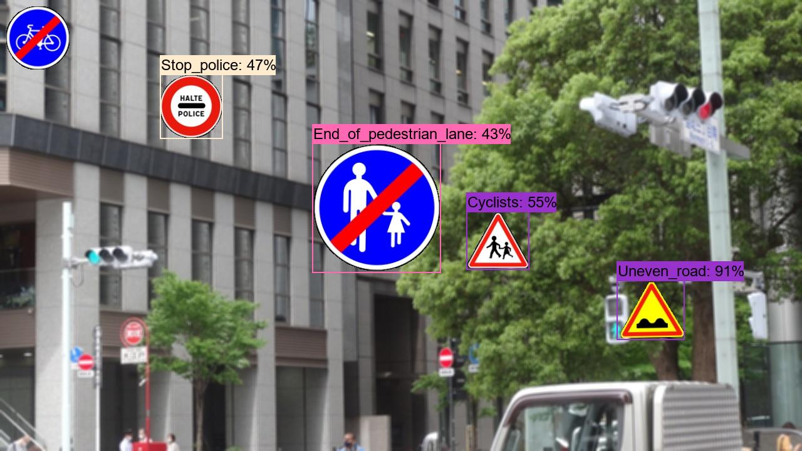 
<a  href="./realistic_test_dataset_outputs/fr_roadsigns_1020.jpg_objects.csv">roadsigns_2.jpg_objects.csv</a> 

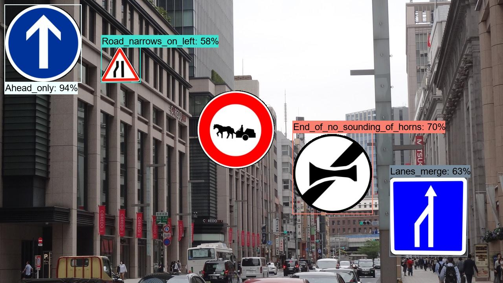 
<a  href="./realistic_test_dataset_outputs/fr_roadsigns_1030.jpg_objects.csv">roadsigns_3.jpg_objects.csv</a> 

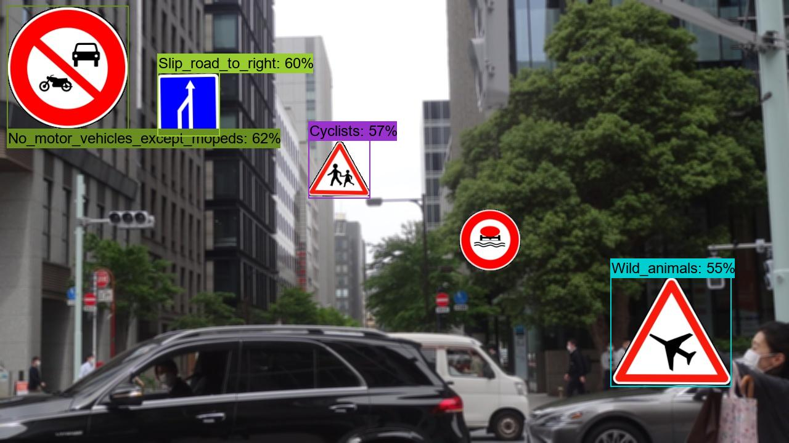 
<a  href="./realistic_test_dataset_outputs/fr_roadsigns_1040.jpg_objects.csv">roadsigns_4.jpg_objects.csv</a> 

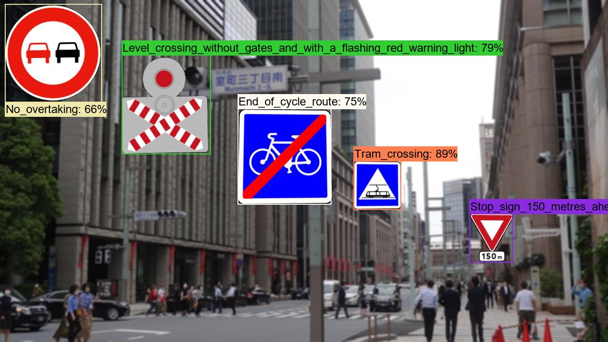 
<a  href=".realistic_test_dataset_outputs/fr_roadsigns_1050.jpg_objects.csv">roadsigns_5.jpg_objects.csv</a> 

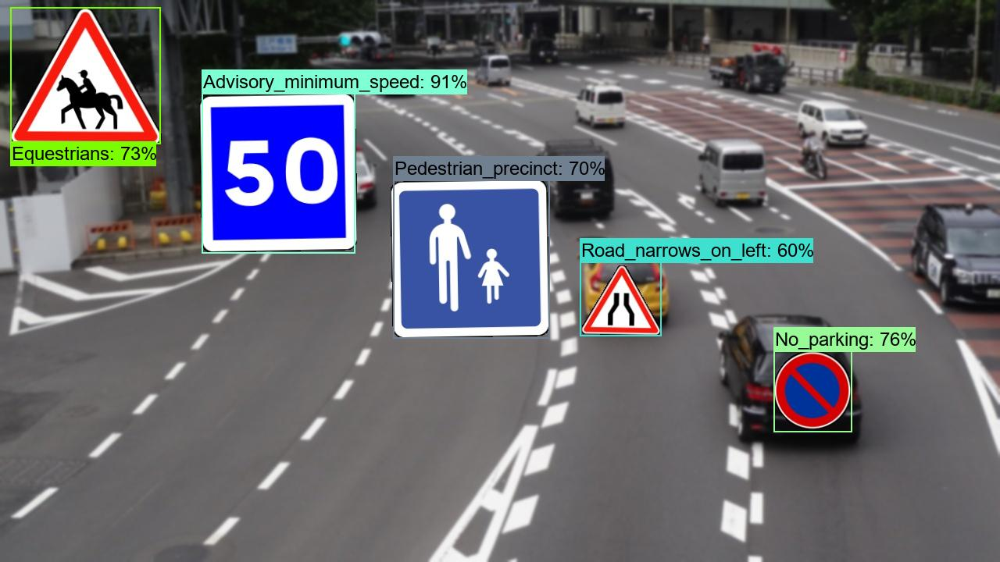 
<a  href="./realistic_test_dataset_outputs/fr_roadsigns_1060.jpg_objects.csv">roadsigns_6.jpg_objects.csv</a> 

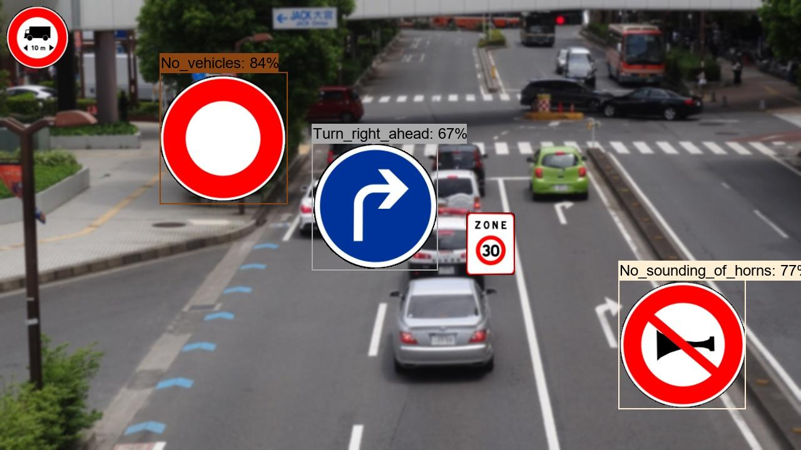 
<a  href="./realistic_test_dataset_outputs/fr_roadsigns_1070.jpg_objects.csv">roadsigns_7.jpg_objects.csv</a> 

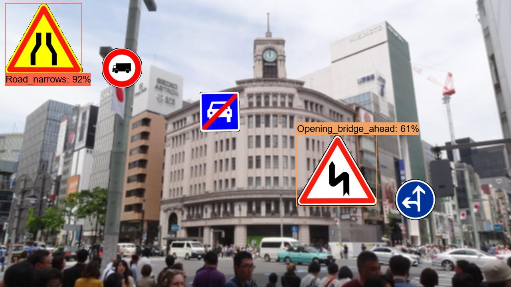 
<a  href="./realistic_test_dataset_outputs/fr_roadsigns_1080.jpg_objects.csv">roadsigns_8.jpg_objects.csv</a> 

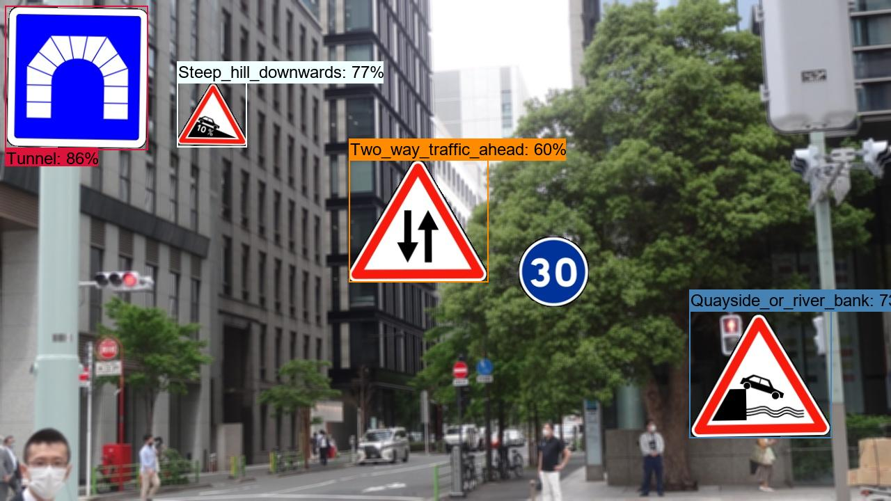 
<a  href="./realistic_test_dataset_outputs/fr_roadsigns_1090.jpg_objects.csv">roadsigns_9.jpg_objects.csv</a> 

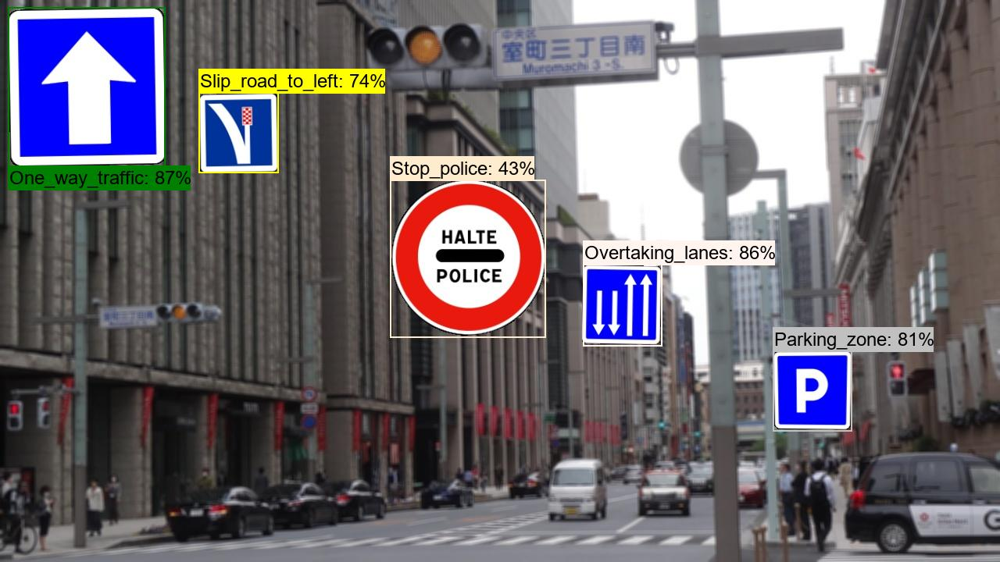 
<a  href="./realistic_test_dataset_outputs/fr_roadsigns_1099.jpg_objects.csv">roadsigns_10.jpg_objects.csv</a> 

<h3>6. COCO metrics of inference result</h3>
The 3_inference.bat computes also the COCO metrics(f, map, mar) to the <b>realistic_test_dataset</b> as shown below: 

<a href="./realistic_test_dataset_outputs/prediction_f_map_mar.csv">prediction_f_map_mar.csv</a>

 
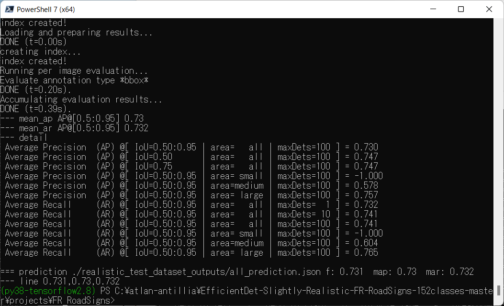 

