<h2>
IT-RoadSigns-120classes
</h2>
Please see also our fist experiment:
<a href="https://github.com/sarah-antillia/EfficientDet-Slightly-Realistic-IT-RoadSigns-120classes">EfficientDet-Slightly-Realistic-IT-RoadSigns-120classes</a>
 
<h3>1. Download TFRecord dataset</h3>
If you would like to train and evalute IT-RoadSigns EfficientDet Model by yourself,
please download TRecord_IT_RoadSigns 120classes dataset from 
<a href="https://drive.google.com/file/d/1bWmVEeIkULDxwQjGLS-ALlqOuAJcSarJ/view?usp=sharing">
IT_RoadSigns_120classes</a>
 
Please put the train and valid dataset in the downloaded zip file  
in ./projects/slightly_realistic_roadsigns/IT_RoadSigns_120classes folder.
 

<h3>2. Training RoadSigns Model by efficientdet pretrained-model</h3>
Move to <b>IT_RoadSigns_120classes</b> directory,
and run the following bat file to train Roadsigns Model by using the train and valid tfrecords.
<pre>
1_train.bat
</pre>
<pre>
rem 1_train.bat
python ../../../efficientdet/ModelTrainer.py ^
  --mode=train_and_eval ^
  --train_file_pattern=./train/*.tfrecord  ^
  --val_file_pattern=./valid/*.tfrecord ^
  --model_name=efficientdet-d0 ^
  --hparams="input_rand_hflip=False,image_size=512x512,num_classes=120,label_map=./label_map.yaml" ^
  --model_dir=./models ^
  --label_map_pbtxt=./label_map.pbtxt ^
  --eval_dir=./eval ^
  --ckpt=../../../efficientdet/efficientdet-d0  ^
  --train_batch_size=4 ^
  --early_stopping=map ^
  --patience=10 ^
  --eval_batch_size=1 ^
  --eval_samples=1000  ^
  --num_examples_per_epoch=2000 ^
  --num_epochs=100 
</pre>
In case of Linux or Windows/WSL2, please run the following shell script. 
<pre>
1_train.sh
</pre>
 
<b>label_map.yaml:</b>
<pre>
1: 'Axle_weight_limit_in_tonnes'
2: 'Bend_to_left'
3: 'Bend_to_right'
4: 'Bicycle_crossing_ahead'
5: 'Bridleway'
6: 'Bumps_in_the_road'
7: 'Cattle'
8: 'Children'
9: 'Crossroads_with_right_of_way_from_the_right'
10: 'Crossroads'
11: 'Customs'
12: 'Cycle_lane'
13: 'Dangerous_verges'
14: 'Derestriction'
15: 'Dip'
16: 'Double_bend_first_to_left'
17: 'Double_bend_first_to_right'
18: 'Drive_straight_or_turn_left'
19: 'Drive_straight_or_turn_right'
20: 'End_of_bridleway'
21: 'End_of_cycle_lane'
22: 'End_of_maximum_speed'
23: 'End_of_minimum_speed'
24: 'End_of_no_overtaking_by_heavy_goods_vehicles'
25: 'End_of_no_overtaking'
26: 'End_of_pedestrian_lane'
27: 'End_of_priority_road'
28: 'End_of_segregated_pedestrian_and_cycle_path'
29: 'End_of_shared_path'
30: 'EU_country_border'
31: 'Falling_rocks_from_left'
32: 'Falling_rocks_from_right'
33: 'Give_priority_to_vehicles_from_opposite_direction'
34: 'Give_way'
35: 'Horizontal_traffic_lights'
36: 'Junction_with_a_minor_side_road_from_left'
37: 'Junction_with_a_minor_side_road_from_right'
38: 'Keep_left'
39: 'Keep_right'
40: 'Left_turn_only_ahead'
41: 'Level_crossing_countdown_marker_100'
42: 'Level_crossing_countdown_marker_150'
43: 'Level_crossing_countdown_marker_50'
44: 'Level_crossing_with_barrier_or_gate_ahead'
45: 'Level_crossing_without_barrier_or_gate_ahead'
46: 'Loose_chippings'
47: 'Low_flying_aircraft'
48: 'Maximum_speed_50km'
49: 'Maximum_weight_in_tonnes'
50: 'Merging_traffic_from_left'
51: 'Merging_traffic_from_right'
52: 'Minimum_distance'
53: 'Minimum_speed'
54: 'Multiple_level_crossing'
55: 'No_animal_drawn_vehicles'
56: 'No_bicycles'
57: 'No_buses'
58: 'No_entry_for_vehicular_traffic'
59: 'No_handcarts'
60: 'No_large_goods_vehicles_over_weight_shown'
61: 'No_large_goods_vehicles'
62: 'No_motor_vehicles_with_four_or_more_wheels'
63: 'No_motorcycles'
64: 'No_overtaking_by_heavy_goods_vehicles'
65: 'No_overtaking'
66: 'No_parking_at_all_times'
67: 'No_parking'
68: 'No_pedestrians'
69: 'No_stopping'
70: 'No_tractors'
71: 'No_use_of_horns'
72: 'No_vehicles_carrying_dangerous_goods'
73: 'No_vehicles_carrying_explosives_or_flammable_goods'
74: 'No_vehicles_carrying_goods_which_could_pollute_water'
75: 'No_vehicles_over_height_shown'
76: 'No_vehicles_over_length_shown'
77: 'No_vehicles_over_width_shown'
78: 'No_vehicles_with_trailer'
79: 'One_way_traffic'
80: 'Opening_or_swing_bridge_ahead'
81: 'Other_danger'
82: 'Parking_ahead_in_the_direction_of_the_arrow'
83: 'Parking_place'
84: 'Parking_prohibited_at_certain_times_and_allowed_in_others'
85: 'Parking_space_reserved'
86: 'Pass_either_side'
87: 'Pedestrian_crossing_ahead'
88: 'Pedestrian_crossing'
89: 'Pedestrian_lane'
90: 'Priority_road'
91: 'Quayside_or_river_bank'
92: 'Restricted_vehicular_access'
93: 'Right_or_left_turn_only_ahead'
94: 'Right_turn_only_ahead'
95: 'Risk_of_fire'
96: 'Road_narrows_on_left'
97: 'Road_narrows_on_right'
98: 'Road_narrows'
99: 'Road_works'
100: 'Roundabout_ahead'
101: 'Roundabout'
102: 'Segregated_pedestrian_and_cycle_path'
103: 'Shared_path'
104: 'Side_winds'
105: 'Single_level_crossing'
106: 'Slippery_road'
107: 'Snow_chains_compulsory'
108: 'Steep_hill_downwards'
109: 'Steep_hill_upwards'
110: 'Stop_and_give_way'
111: 'Stop_pay_toll'
112: 'Stop_police_roadblock'
113: 'Traffic_has_priority_over_oncoming_vehicles'
114: 'Traffic_lights'
115: 'Trams_crossing_ahead'
116: 'Turn_left'
117: 'Turn_right'
118: 'Two_way_traffic'
119: 'Uneven_road'
120: 'Wild_animals'
</pre>
 
 
<b><a href="./eval/coco_metrics.csv">COCO metrics at epoch 100</a></b> 
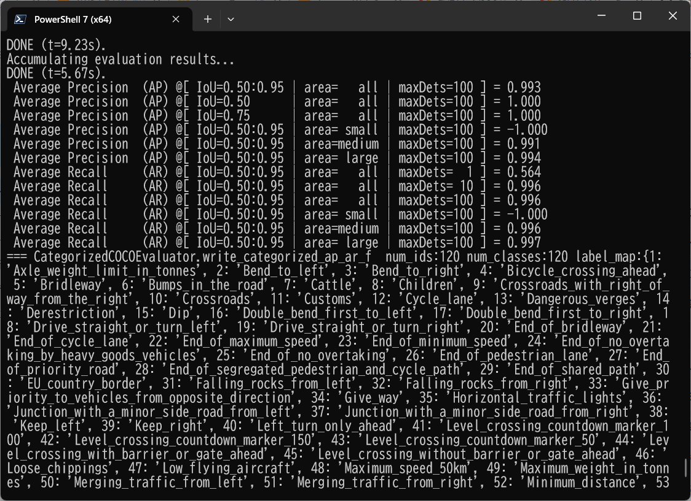
 

 
<b><a href="./eval/coco_metrics.csv">COCO meticss f and map</a></b> 
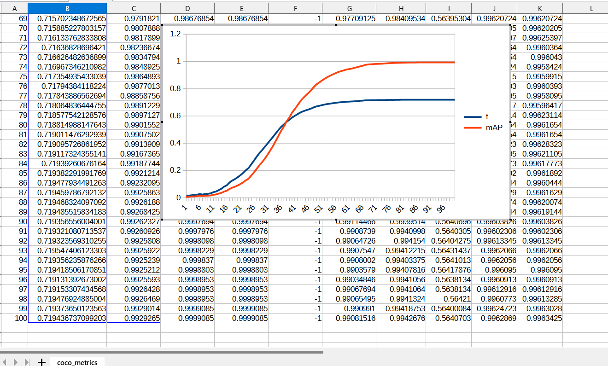
 
 
<b><a href="./eval/train_losses.csv">Train losses</a></b> 
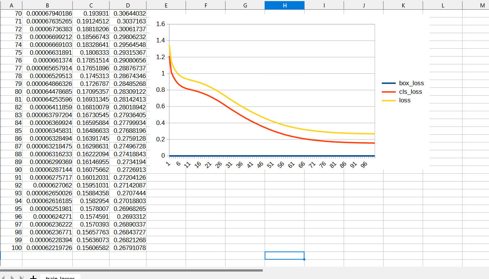
 
 

<b><a href="./eval/coco_ap_per_class.csv">COCO ap per class</a></b> 
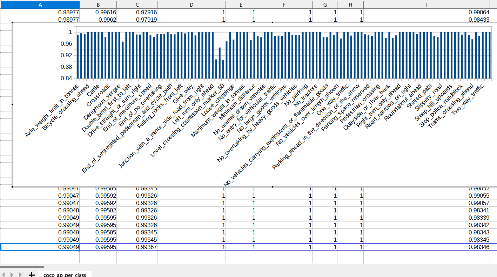
 

<h3>
3. Create a saved_model from the checkpoint
</h3>
  Please run the following bat file to create a saved_model from the checkpoint files in <b>./models</b> folder.  
<pre>
2_create_saved_model.bat
</pre>
<pre>
rem 2_create_saved_model.bat  
python ../../../efficientdet/SavedModelCreator.py ^
  --runmode=saved_model ^
  --model_name=efficientdet-d0 ^
  --ckpt_path=./models  ^
  --hparams="image_size=512x512,num_classes=120" ^
  --saved_model_dir=./saved_model
</pre>

In case of Linux or Windows/WSL2, please run the following shell script. 
<pre>
2_create_saved_model.sh
</pre>

 
<h3>
4. Inference RoadSigns by using the saved_model
</h3>
 Please run the following bat file to infer the roadsigns in images of test_dataset:
<pre>
3_inference.bat
</pre>
<pre>
rem 3_inference.bat
python ../../../efficientdet/SavedModelInferencer.py ^
  --runmode=saved_model_infer ^
  --model_name=efficientdet-d0 ^
  --saved_model_dir=./saved_model ^
  --min_score_thresh=0.4 ^
  --hparams="num_classes=120,label_map=./label_map.yaml" ^
  --input_image=./realistic_test_dataset/*.jpg ^
  --classes_file=./classes.txt ^
  --ground_truth_json=./realistic_test_dataset/annotation.json ^
  --output_image_dir=./realistic_test_dataset_outputs
</pre>
In case of Linux or Windows/WSL2, please run the following shell script. 
<pre>
3_inference.sh
</pre>
 
<h3>
5. Some Inference results of IT RoadSigns
</h3>
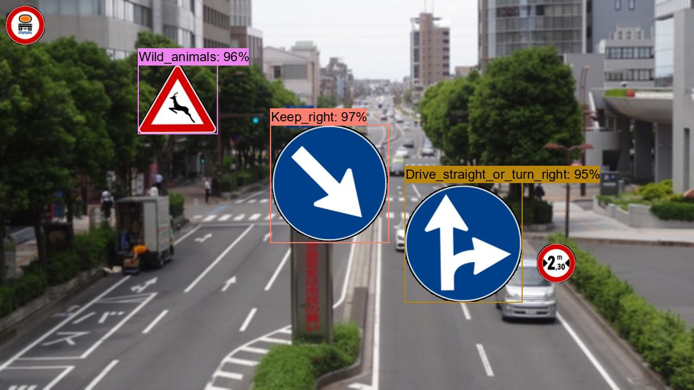 
<a href="./realistic_test_dataset_outputs/it_roadsigns_1001.jpg_objects.csv">roadsigns1001.jpg_objects.csv</a> 
 
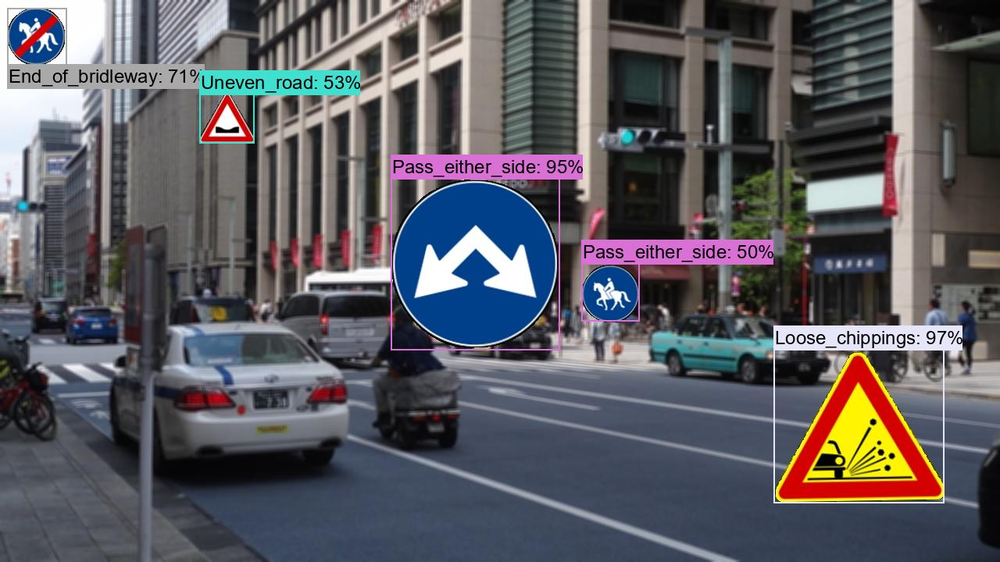 
<a  href="./realistic_test_dataset_outputs/it_roadsigns_1012.jpg_objects.csv">roadsigns1002.jpg_objects.csv</a> 
 
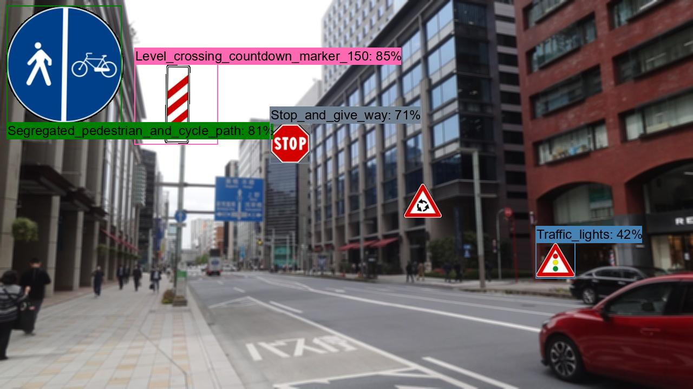 
<a  href="./realistic_test_dataset_outputs/it_roadsigns_1023.jpg_objects.csv">roadsigns1003.jpg_objects.csv</a> 
 
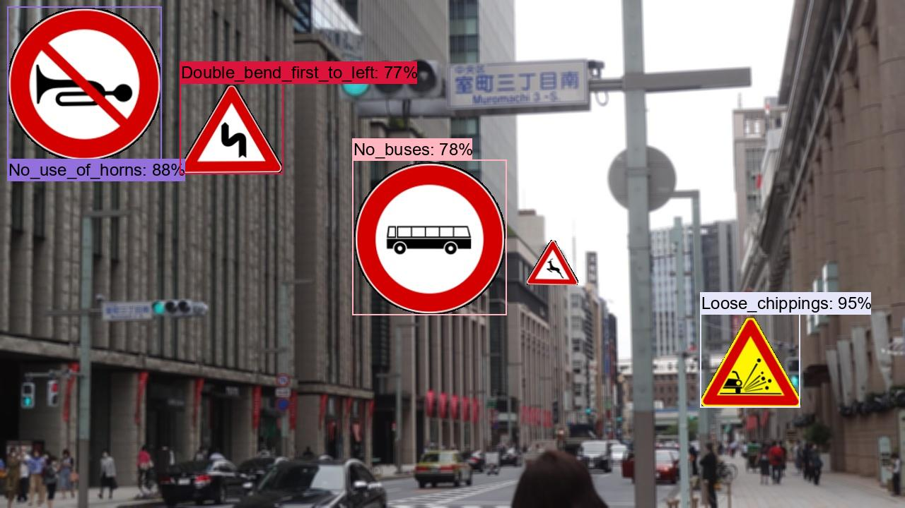 
<a  href="./realistic_test_dataset_outputs/it_roadsigns_1034.jpg_objects.csv">roadsigns1004.jpg_objects.csv</a> 
 
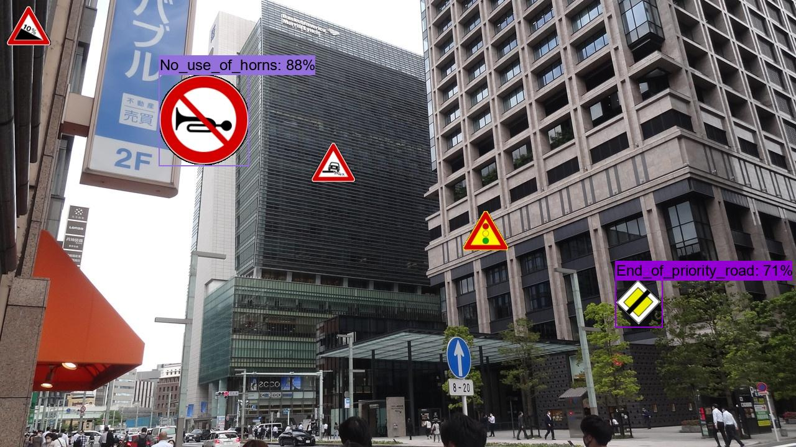 
<a  href="./realistic_test_dataset_outputs/it_roadsigns_1045.jpg_objects.csv">roadsigns1005.jpg_objects.csv</a> 
 
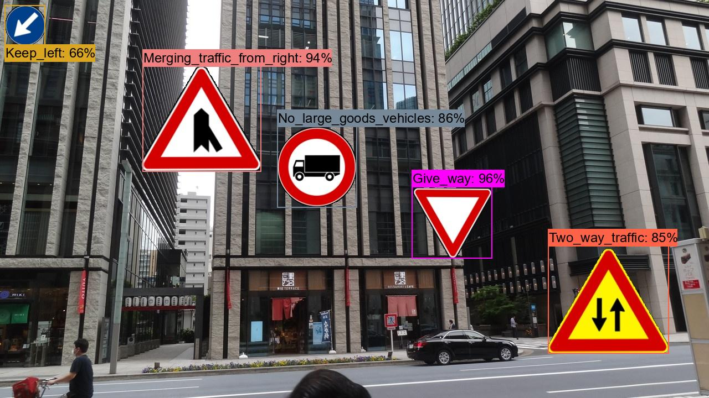 
<a  href="./realistic_test_dataset_outputs/it_roadsigns_1056.jpg_objects.csv">roadsigns1006.jpg_objects.csv</a> 
 
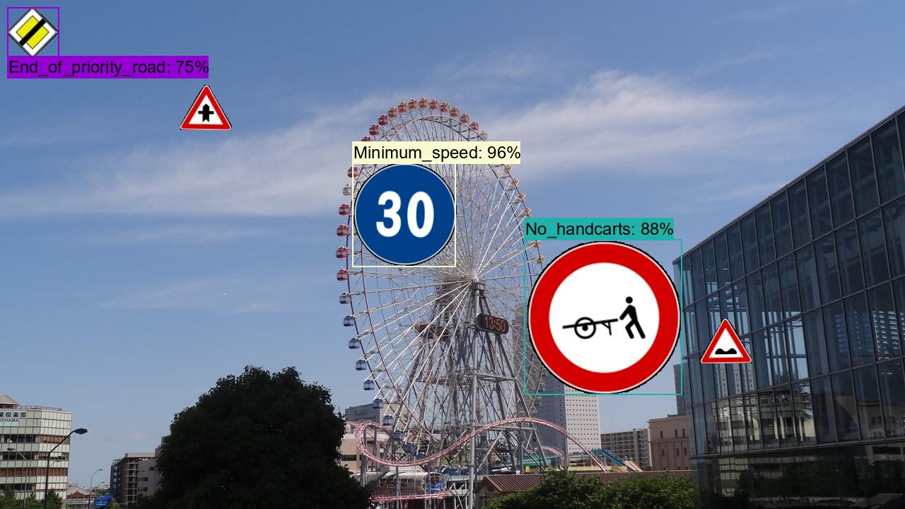 
<a  href="./realistic_test_dataset_outputs/it_roadsigns_1067.jpg_objects.csv">roadsigns1007.jpg_objects.csv</a> 
 
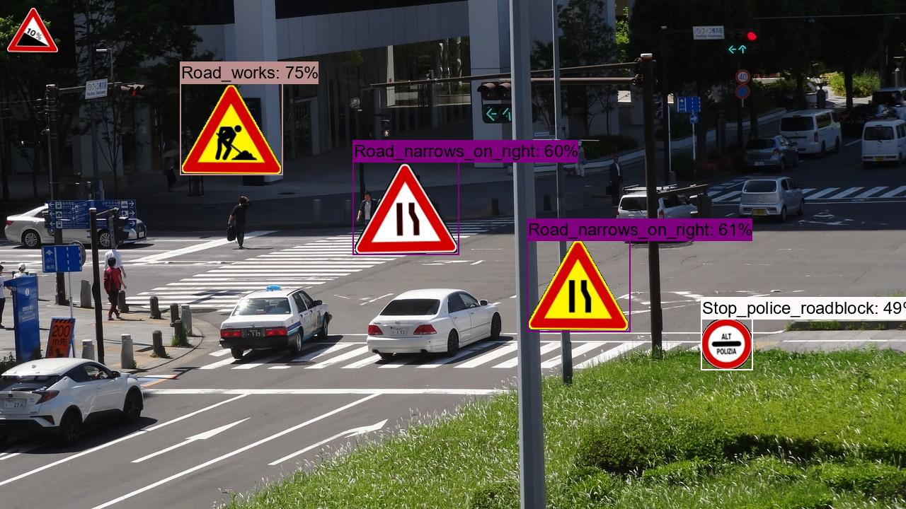 
<a  href="./realistic_test_dataset_outputs/it_roadsigns_1078.jpg_objects.csv">roadsigns1008.jpg_objects.csv</a> 
 
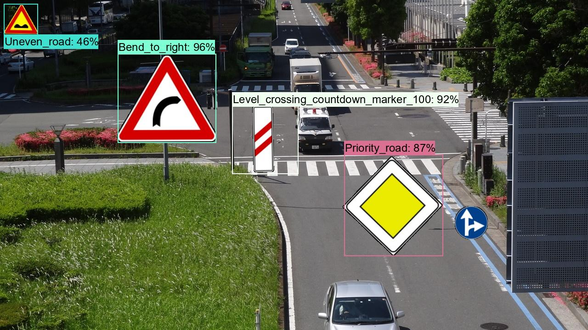 
<a  href="./realistic_test_dataset_outputs/it_roadsigns_1089.jpg_objects.csv">roadsigns1009.jpg_objects.csv</a> 
 
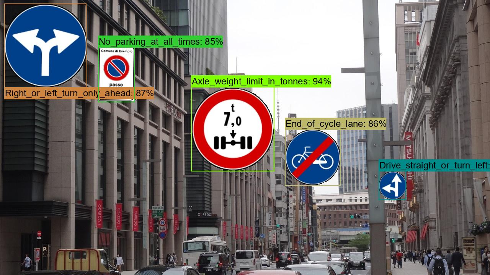 
<a  href="./realistic_test_dataset_outputs/it_roadsigns_1099.jpg_objects.csv">roadsigns1010.jpg_objects.csv</a> 
 

<h3>6. COCO metrics of inference result</h3>
The 3_inference.bat computes also the COCO metrics(f, map, mar) to the <b>realistic_test_dataset</b> as shown below: 
<a href="./realistic_test_dataset_outputs/prediction_f_map_mar.csv">prediction_f_map_mar.csv</a>

 
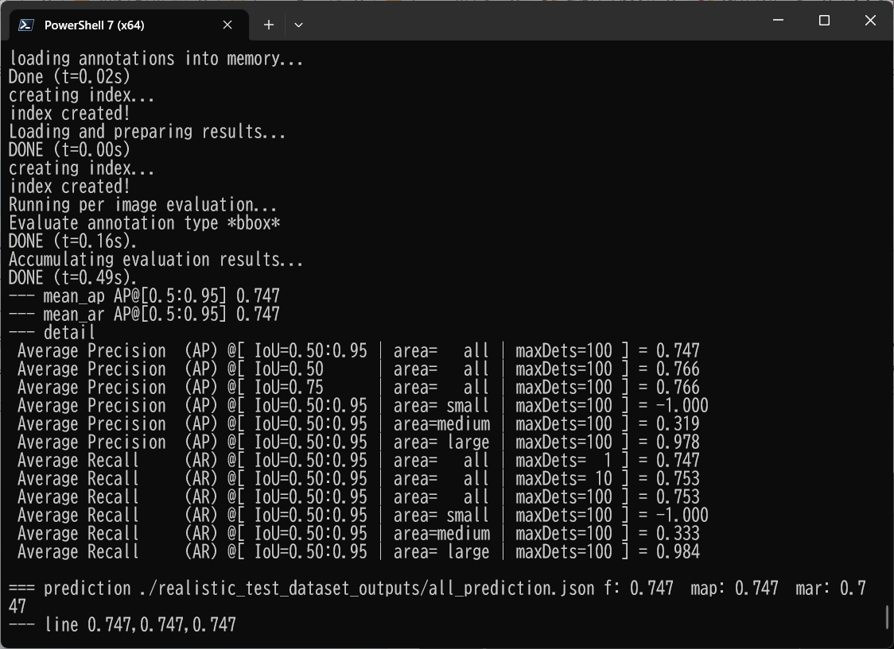 
