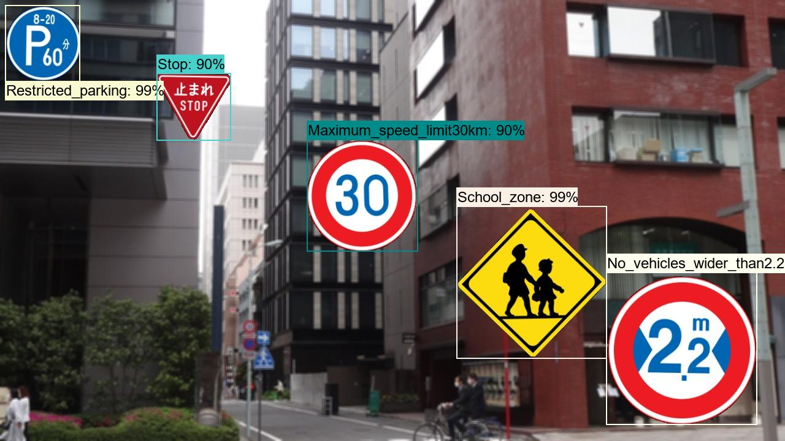
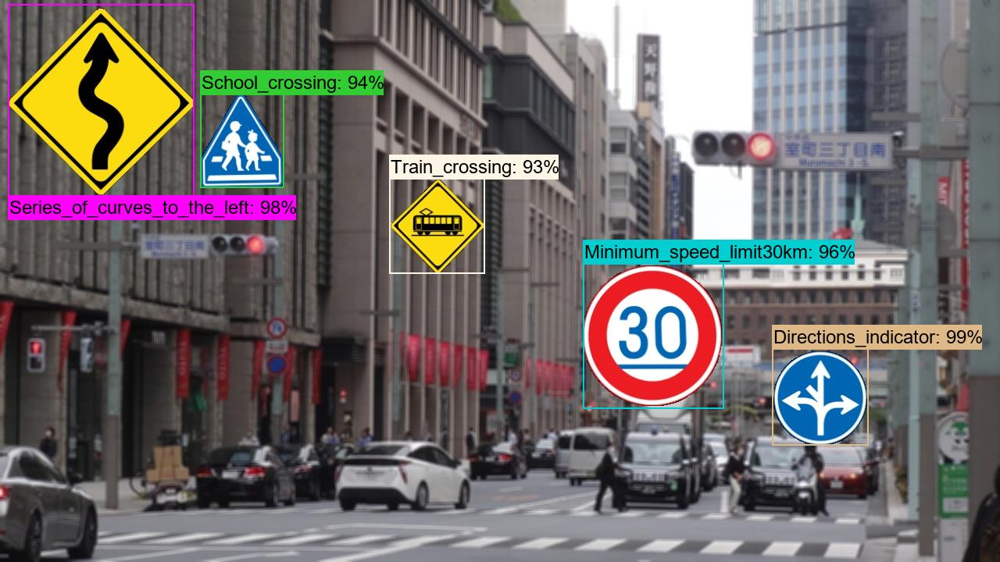
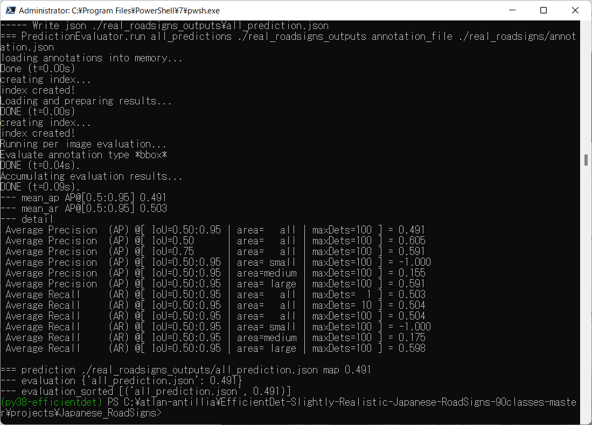

<h2>
EfficientDet-JP-RoadSigns-90classes
</h2>
Please see also our first experiment:
<a href="https://github.com/atlan-antillia/EfficientDet-Slightly-Realistic-Japanese-RoadSigns-90classes">
EfficientDet-Slightly-Realistic-Japanese-RoadSigns-90classes
</a>

 
<h3>1. Download TFRecord dataset</h3>
If you would like to train and evalute JP-RoadSigns EfficientDet Model by yourself,
please download the latest TFRecord_Japanese-RoadSigns-90classes_V7.1 dataset from  
<a href="https://drive.google.com/file/d/1eDDZaQsFCKfNSu_Ciuq5E4wA7ymDj2Ei/view?usp=sharing">TFRecord_Japanese-RoadSigns-90classes_V7.1.zip</a>

Please put the train and valid dataset in the downloaded zip file  
in <b>./projects/slightly_realistic_roadsigns/JP_RoadSigns_90classes</b> folder.

<h3>2. Train RoadSigns Model</h3>
Please move to <b>Japanese_RoadSigns_90classes</b> direcotry,
and run the following bat file to train Roadsigns Efficientdet Model by using the train and valid tfrecords.
<pre>
1_train.bat
</pre>
<pre>
rem 1_train.bat
python ../../../efficientdet/ModelTrainer.py ^
  --mode=train_and_eval ^
  --train_file_pattern=./train/*.tfrecord  ^
  --val_file_pattern=./valid/*.tfrecord ^
  --model_name=efficientdet-d0 ^
  --hparams="input_rand_hflip=False,image_size=512x512,num_classes=90,label_map=./label_map.yaml" ^
  --model_dir=./models ^
  --label_map_pbtxt=./label_map.pbtxt ^
  --eval_dir=./eval ^
  --ckpt=../../../efficientdet/efficientdet-d0  ^
  --train_batch_size=4 ^
  --early_stopping=map ^
  --patience=10 ^
  --eval_batch_size=1 ^
  --eval_samples=1000  ^
  --num_examples_per_epoch=2000 ^
  --num_epochs=100
</pre>

In case of Linux or Windows/WSL2, please run the following shell script instead of the above bat file. 
<pre>
1_train.sh
</pre>
 
 
<b>label_map.yaml:</b>
<pre>
1: 'Bicycles_and_pedestrians_only'
2: 'Bicycles_only'
3: 'Bumpy_road'
4: 'Buses_priority'
5: 'Center_line'
6: 'Closed_to_pedestrians'
7: 'Crossroads'
8: 'Dangerous_wind_gusts'
9: 'Directions_indicator'
10: 'End_of_restriction'
11: 'Falling_rocks'
12: 'Go_straight'
13: 'Keep_left'
14: 'Keep_right'
15: 'Left_curve'
16: 'Left_lane_ends'
17: 'Left_turn'
18: 'Maximum_speed_limit30km'
19: 'Maximum_speed_limit40km'
20: 'Maximum_speed_limit50km'
21: 'Maximum_speed_limit60km'
22: 'Maximum_speed_limit70km'
23: 'Maximum_speed_limit80km'
24: 'Maximum_speed_limit90km'
25: 'Merging_traffic_ahead'
26: 'Minimum_speed_limit30km'
27: 'Minimum_speed_limit50km'
28: 'No_bicycles'
29: 'No_buses'
30: 'No_entry_for_vehicles'
31: 'No_large_trucks'
32: 'No_motorless_vehicle_except_bicycle'
33: 'No_overtaking'
34: 'No_pedestrian_crossing'
35: 'No_right_turn_crossing'
36: 'No_stopping'
37: 'No_twoperson_motorcycles'
38: 'No_two_stage_right_turn_for_mopeds'
39: 'No_u_turns'
40: 'No_vehicles_carrying_dangerous_goods'
41: 'No_vehicles_except_motorcycles'
42: 'No_vehicles_higher_than3.3ms'
43: 'No_vehicles_weighing_over5.5ts'
44: 'No_vehicles_wider_than2.2ms'
45: 'No_waiting'
46: 'One_way'
47: 'One_way_to_the_left'
48: 'One_way_to_the_right'
49: 'Other_dangers'
50: 'Parking_allowed'
51: 'Pedesrtrian_crossing'
52: 'Pedestrians_only'
53: 'Restricted_parking'
54: 'Restricted_zone'
55: 'Restriction_begins'
56: 'Restriction_ends'
57: 'Right_curve'
58: 'Right_turn'
59: 'Roadworks'
60: 'Road_closed_to_all'
61: 'Road_closed_to_vehicles'
62: 'Road_narrows'
63: 'Rotary'
64: 'Roundabout'
65: 'Safety_zone'
66: 'School_crossing'
67: 'School_zone'
68: 'Series_of_curves_to_the_left'
69: 'Series_of_curves_to_the_right'
70: 'Slippery_road'
71: 'Slow_down'
72: 'Sound_horn'
73: 'Steep_ascent10%'
74: 'Steep_descent10%'
75: 'Stop'
76: 'Stopping_allowed'
77: 'Stop_line'
78: 'Straight_ahead_or_left_turn'
79: 'Straight_ahead_or_right_turn'
80: 'Traffic_light_ahead'
81: 'Train_crossing'
82: 'Turn_left'
83: 'Turn_left_or_right'
84: 'Turn_right'
85: 'Two_stage_right_turn_for_mopeds'
86: 'Two_way_traffic_ahead'
87: 'T_junction'
88: 'Vehicles_only'
89: 'Wild_animals_crossing'
90: 'Y_junction'
</pre>
 
<b>Console output COCO meticss f and map at epoch 66</a></b> 

 
 
<b><a href="./eval/coco_metrics.csv">COCO meticss f and map</a></b> 

 
 

<b><a href="./eval/train_losses.csv">Train losses</a></b> 

 
 

<b><a href="./eval/coco_ap_per_class.csv">COCO ap per class</a></b> 

 

<h3>3. Create a saved_model from the checkpoint
</h3>
 Please run the following bat file to create a saved_model from the checkpoint files in <b>./models</b> folder.  
<pre>
2_create_saved_model.bat
</pre>
<pre>
rem 2_create_saved_model.bat
python ../../../efficientdet/SavedModelCreator.py ^
  --runmode=saved_model ^
  --model_name=efficientdet-d0 ^
  --ckpt_path=./models  ^
  --hparams="image_size=512x512,num_classes=90" ^
  --saved_model_dir=./saved_model
</pre>
In case of Linux or Windows/WSL2, please run the following shell script instead of the above bat file. 
<pre>
2_create_saved_model.sh
</pre>

 
<h3>
4. Inference RoadSigns by using the saved_model
</h3>
 Please run the following bat file to infer the roadsigns in images of test_dataset:
<pre>
3_inference.bat
</pre>
<pre>
rem 3_inference.bat
python ../../../efficientdet/SavedModelInferencer.py ^
  --runmode=saved_model_infer ^
  --model_name=efficientdet-d0 ^
  --saved_model_dir=./saved_model ^
  --min_score_thresh=0.4 ^
  --hparams="num_classes=90,label_map=./label_map.yaml" ^
  --input_image=./realistic_test_dataset/*.jpg ^
  --classes_file=./classes.txt ^
  --ground_truth_json=./realistic_test_dataset/annotation.json ^
  --output_image_dir=./realistic_test_dataset_outputs
</pre>
In case of Linux or Windows/WSL2, please run the following shell script instead of the above bat file. 
<pre>
3_inference.sh
</pre>
 
<h3>
5. Some Inference results of Japanese RoadSigns
</h3>

 
<a href="./realistic_test_dataset_outputs/jp_roadsigns_1001.jpg_objects.csv">roadsigns1001.jpg_objects.csv</a> 
 
 
<a  href="./realistic_test_dataset_outputs/jp_roadsigns_1012.jpg_objects.csv">roadsigns1002.jpg_objects.csv</a> 
 
 
<a  href="./realistic_test_dataset_outputs/jp_roadsigns_1023.jpg_objects.csv">roadsigns1003.jpg_objects.csv</a> 
 
 
<a  href="./realistic_test_dataset_outputs/jp_roadsigns_1034.jpg_objects.csv">roadsigns1004.jpg_objects.csv</a> 
 
 
<a  href="./realistic_test_dataset_outputs/jp_roadsigns_1045.jpg_objects.csv">roadsigns1005.jpg_objects.csv</a> 
 
 
<a  href="./realistic_test_dataset_outputs/jp_roadsigns_1056.jpg_objects.csv">roadsigns1006.jpg_objects.csv</a> 
 
 
<a  href="./realistic_test_dataset_outputs/jp_roadsigns_1067.jpg_objects.csv">roadsigns1007.jpg_objects.csv</a> 
 
 
<a  href="./realistic_test_dataset_outputs/jp_roadsigns_1078.jpg_objects.csv">roadsigns1008.jpg_objects.csv</a> 
 
 
<a  href="./realistic_test_dataset_outputs/jp_roadsigns_1089.jpg_objects.csv">roadsigns1009.jpg_objects.csv</a> 
 
 
<a  href="./realistic_test_dataset_outputs/jp_roadsigns_1099.jpg_objects.csv">roadsigns1010.jpg_objects.csv</a> 
 

<h3>6. COCO metrics of inference result</h3>
The 3_inference.bat computes also the COCO metrics(f, map, mar) file to the realistic_test_dataset as shown below: 

<a href="./realistic_test_dataset_outputs/prediction_f_map_mar.csv">prediction_f_map_mar.csv</a>
 
Inference by a saved_model: 
 
 

<h3> 
7. Inference Real RoadSigns by using the saved_model
</h3>
 Please run the following bat file to infer the real roadsigns in images of test_dataset:
<pre>
4_real_inference.bat
</pre>
<pre>
rem 4_real_inference.bat
python ../../../efficientdet/SavedModelInferencer.py ^
  --runmode=saved_model_infer ^
  --model_name=efficientdet-d0 ^
  --saved_model_dir=./saved_model ^
  --min_score_thresh=0.4 ^
  --hparams="num_classes=90,label_map=./label_map.yaml" ^
  --input_image=./real_roadsigns/*.jpg ^
  --classes_file=./classes.txt ^
  --ground_truth_json=./real_roadsigns/annotation.json ^
  --output_image_dir=./real_roadsigns_outputs
</pre>
In case of Linux or Windows/WSL2, please run the following shell script instead of the above bat file. 
<pre>
4_real_inference.sh
</pre>
 

<h3>
8 Some Inference results of Real Japanese RoadSigns
</h3>

 
 
 
 
 
 
 
 
 
 
 
 
 
 
 
 
 
 
 
 
 
 

 
 

 
 

 
 

 
 
 
 
 
 

 
 

 
 

 
 

<h3>
9. COCO metrics of inference result of Real Japanese RoadSigns
</h3>

The 4_real_inference.bat computes also the COCO metrics(f, map, mar) file to the realistic_test_dataset as shown below: 

<a href="./real_roadsigns_outputs/prediction_map.csv">prediction_map_mar.csv</a>
 
Inference by a new saved_model (2022/07/08): 
 
 
