<h2>
EfficientDet-UK-RoadSigns-94classes
</h2>
Please see also our first experiment:
<a href="https://github.com/atlan-antillia/EfficientDet-Slightly-Realistic-UK-RoadSigns-94classes">
EfficientDet-Slightly-Realistic-UK-RoadSigns-94classes
</a>

<h3>1. Download TFRecord dataset</h3>
If you would like to train and evalute UK-RoadSigns EfficientDet Model by yourself,
please download TRecord_UK_RoadSigns 94classes dataset from 
<a href="https://drive.google.com/file/d/1yyOT8Sy7PJn4QrAmQGxt1LD5uMSB0D5c/view?usp=sharing">UK_RoadSigns_94classes (Updated:2022/07/05)</a>
 
Please put the train and valid dataset in the downloaded zip file  
in <b>./projects/slightly_realistic_roadsigns/UK_RoadSigns_94classes</b> folder.

<h3>2. Train RoadSigns Model</h3>
Please move to <b>UK_RoadSigns_94classes</b> directory, and run the following bat file to train roadsigns efficientdet model:
<pre>
1_train.bat
</pre> 
<pre>
rem 1_train.bat
python ../../../efficientdet/ModelTrainer.py ^
  --mode=train_and_eval ^
  --train_file_pattern=./train/*.tfrecord  ^
  --val_file_pattern=./valid/*.tfrecord ^
  --model_name=efficientdet-d0 ^
  --hparams="input_rand_hflip=False,image_size=512x512,num_classes=94,label_map=./label_map.yaml" ^
  --model_dir=./models ^
  --label_map_pbtxt=./label_map.pbtxt ^
  --eval_dir=./eval ^
  --ckpt=../../../efficientdet/efficientdet-d0  ^
  --train_batch_size=4 ^
  --early_stopping=map ^
  --patience=10 ^
  --eval_batch_size=1 ^
  --eval_samples=1000  ^
  --num_examples_per_epoch=2000 ^
  --num_epochs=160
</pre>
In case of Linux or Windows/WSL2, please run the following shell script instead of the above bat file. 
<pre>
1_train.sh
</pre>
 
 
<b>label_map.yaml</b>
<pre>
1: 'All_vehicles_prohibited'
2: 'Articulated_vehicles_prohibited'
3: 'Bend_to_right'
4: 'Buses_and_tramcars_only'
5: 'Buses_prohibited'
6: 'Children_going_to_or_from_school'
7: 'Crossroads'
8: 'Cyclists_and_pedestrians_only'
9: 'Double_bend_first_to_the_left'
10: 'End_of_20_miles_per_hour_zone'
11: 'End_of_30_miles_minimum_speed_limit'
12: 'End_of_dual_carriageway'
13: 'Entrance_20_miles_per_hour_speed_limit_zone'
14: 'Falling_or_fallen_rocks'
15: 'Fire_station_ahead'
16: 'Ford_warning'
17: 'Frail_pedestrians_likely_to_cross'
18: 'Give_way'
19: 'Horse_drawn_vehicles_prohibited'
20: 'Hump_bridge'
21: 'Ice_or_snowdrifts'
22: 'Junction_on_a_bend'
23: 'Keep_to_the_left'
24: 'Loose_chippings'
25: 'Low_flying_aircraft_or_sudden_aircraft_noise'
26: 'Low_flying_helicopters_or_sudden_helicopter_noise'
27: 'Maximum_speed_10'
28: 'Maximum_speed_20'
29: 'Maximum_speed_30'
30: 'Maximum_speed_40'
31: 'Maximum_speed_50'
32: 'Maximum_speed_60'
33: 'Minimum_speed_limit_30_miles_per_hour'
34: 'Mini_roundabout'
35: 'Motor_vehicles_except_solo_motorcycles_prohibited'
36: 'Motor_vehicles_prohibited'
37: 'National_speed_limit_applies'
38: 'No_entry_for_vehicular_traffic'
39: 'No_left_turn'
40: 'No_overtaking'
41: 'No_right_turn'
42: 'No_stopping'
43: 'No_u_turns_for_vehicular_traffic'
44: 'No_waiting_or_no_parking'
45: 'One_way_traffic'
46: 'Opening_or_swing_bridge'
47: 'Other_dangers'
48: 'Parking_place'
49: 'Part_time_traffic_signals_ahead'
50: 'Pedal_cycles_only'
51: 'Pedestrians_ahead'
52: 'Pedestrians_prohibited'
53: 'Priority_must_be_given_to_vehicles_from_the_opposite_direction'
54: 'Ridden_or_accompanied_horses_prohibited'
55: 'Riding_of_pedal_cycles_prohibited'
56: 'Riverbank_or_quayside'
57: 'Road_narrows_on_both_sides'
58: 'Road_narrows_on_the_right'
59: 'Road_works'
60: 'Roundabout'
61: 'Side_road'
62: 'Side_winds'
63: 'Slippery_road'
64: 'Slow_moving_military_vehicles_likely_to_be_in_or_crossing_the_road'
65: 'Slow_moving_vehicles'
66: 'Soft_verges'
67: 'Solo_motorcycles_prohibited'
68: 'Speed_camera'
69: 'Staggered_junction'
70: 'Steep_ascent'
71: 'Steep_descent'
72: 'Stop'
73: 'Stop_children_crossing_ahead'
74: 'Stop_or_give_way_ahead'
75: 'Stop_police_ahead'
76: 'Towed_caravans_prohibited'
77: 'Traffic_merges_from_the_left'
78: 'Traffic_merges_onto_the_main_carriageway'
79: 'Traffic_queues_likely_ahead'
80: 'Traffic_signals_ahead'
81: 'Tramcars_only'
82: 'Tramway'
83: 'Try_your_brakes'
84: 'Tunnel'
85: 'Turn_ahead_in_the_direction'
86: 'Turn_left'
87: 'Two_way_traffic'
88: 'Two_way_traffic_on_route_crossing_ahead'
89: 'T_junction'
90: 'Uneven_road'
91: 'Vehicles_carrying_explosives_prohibited'
92: 'Water_course_alongside_road'
93: 'Wild_animals'
94: 'Zebra_crossing'
</pre>

 
<b>Training console output at epoch 62</b>
 
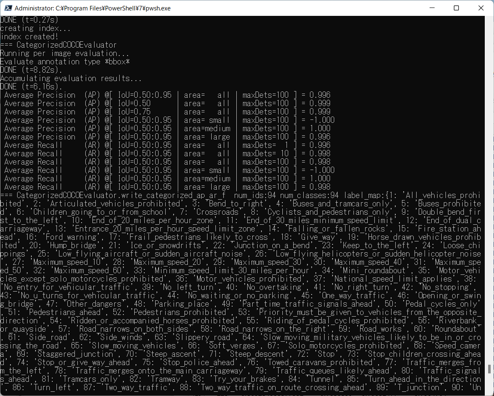
 
 
<b><a href="./eval/coco_metrics.csv">COCO meticss</a></b> 
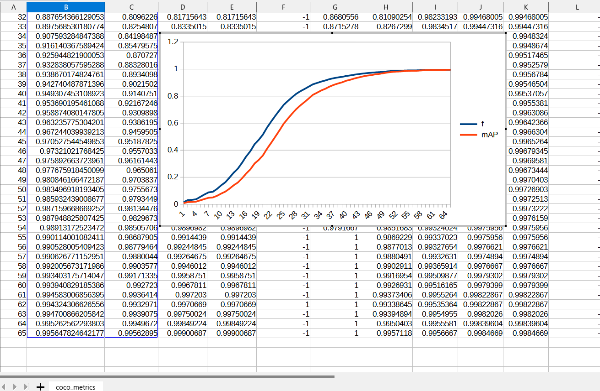
 
 
<b><a href="./eval/train_losses.csv">Train losses</a></b> 
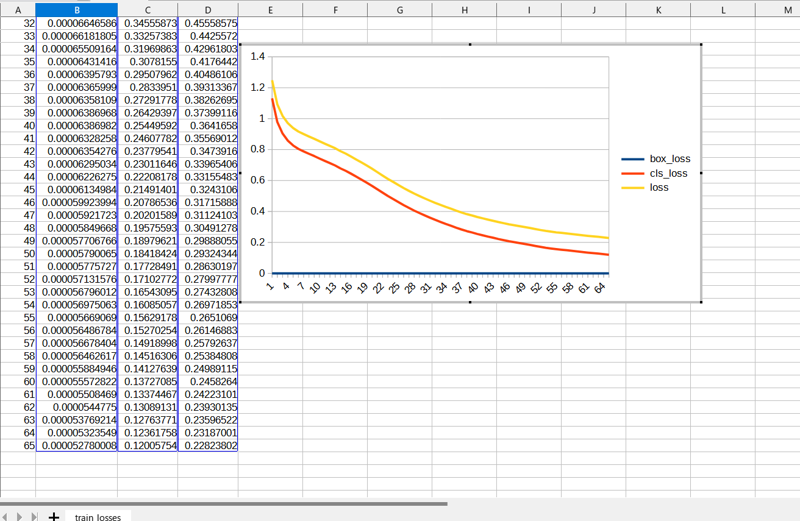
 
 

<b><a href="./eval/coco_ap_per_class.csv">COCO ap per class</a></b> 
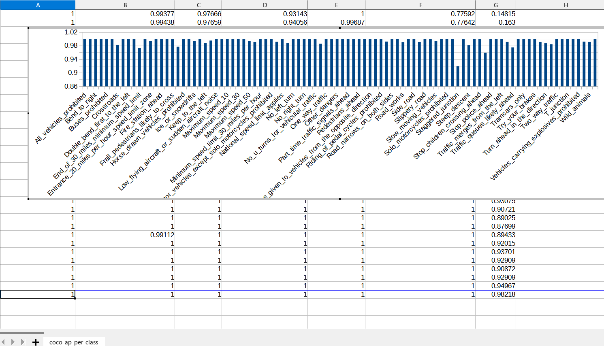
 
 
<h3>
3. Create a saved_model from the checkpoint
</h3>
 Please run the following bat file to create a saved_model from the checkpoint files in <b>./models</b> folder.  
<pre>
2_create_saved_model.bat
</pre>
<pre>
rem 2_create_saved_model.bat
python ../../../efficientdet/SavedModelCreator.py ^
  --runmode=saved_model ^
  --model_name=efficientdet-d0 ^
  --ckpt_path=./models  ^
  --hparams="image_size=512x512,num_classes=94" ^
  --saved_model_dir=./saved_model
</pre>
In case of Linux or Windows/WSL2, please run the following shell script instead of the above bat file. 
<pre>
2_create_saved_model.sh
</pre>
 
 
<h3>
4. Inference RoadSigns by using the saved_model
</h3>
 Please run the following bat file to infer the roadsigns by using the saved_model:
<pre>
</pre>
<pre>
rem 3_inference.bat
python ../../../efficientdet/SavedModelInferencer.py ^
  --runmode=saved_model_infer ^
  --model_name=efficientdet-d0 ^
  --saved_model_dir=./saved_model ^
  --min_score_thresh=0.4 ^
  --hparams="label_map=./label_map.yaml" ^
  --input_image=./realistic_test_dataset/*.jpg ^
  --classes_file=./classes.txt ^
  --ground_truth_json=./realistic_test_dataset/annotation.json ^
  --output_image_dir=./realistic_test_dataset_outputs
</pre>
In case of Linux or Windows/WSL2, please run the following shell script instead of the above bat file. 
<pre>
3_inference.sh
</pre>
 
<h3>
5. Some inference results of UK RoadSigns
</h3>

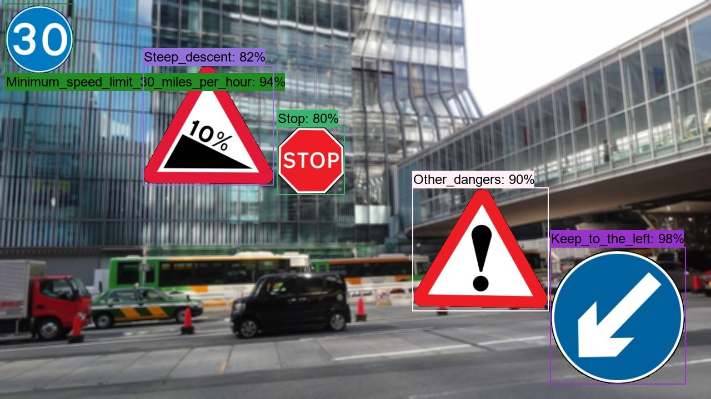 
<a href="./realistic_test_dataset_outputs/uk_roadsigns_1000.jpg_objects.csv">roadsigns_1.jpg_objects.csv</a> 

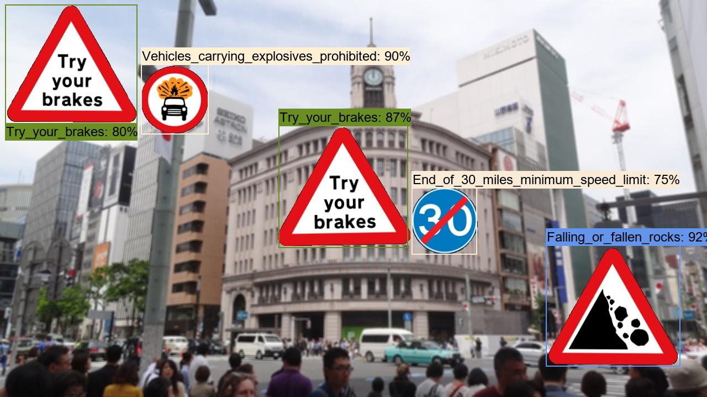 
<a  href="./realistic_test_dataset_outputs/uk_roadsigns_1020.jpg_objects.csv">roadsigns_2.jpg_objects.csv</a> 

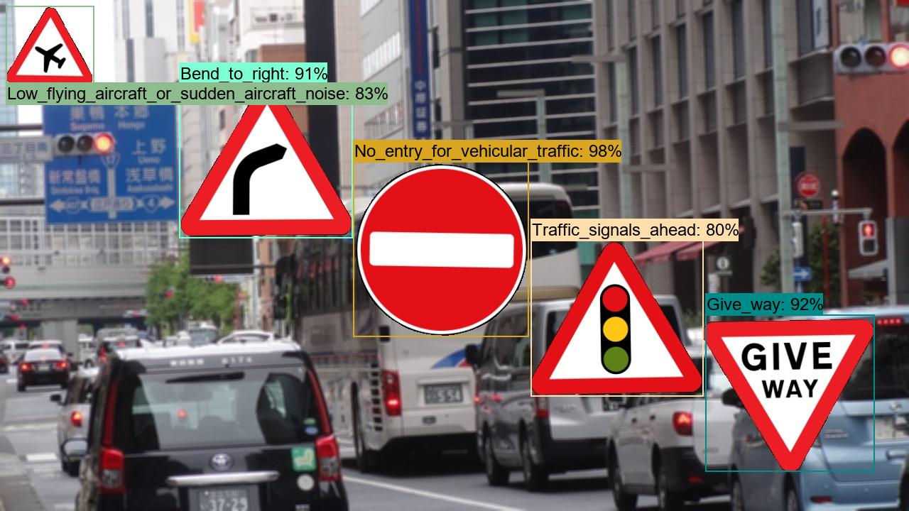 
<a  href="./realistic_test_dataset_outputs/uk_roadsigns_1030.jpg_objects.csv">roadsigns_3.jpg_objects.csv</a> 

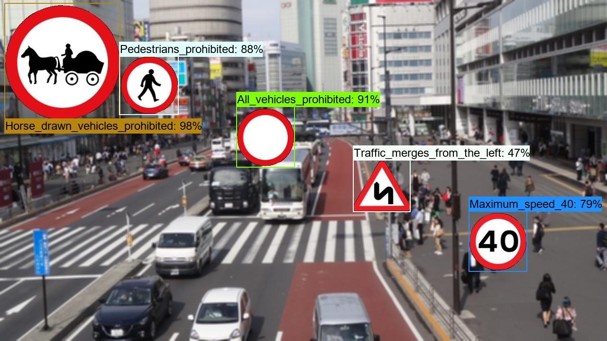 
<a  href="./realistic_test_dataset_outputs/uk_roadsigns_1040.jpg_objects.csv">roadsigns_4.jpg_objects.csv</a> 

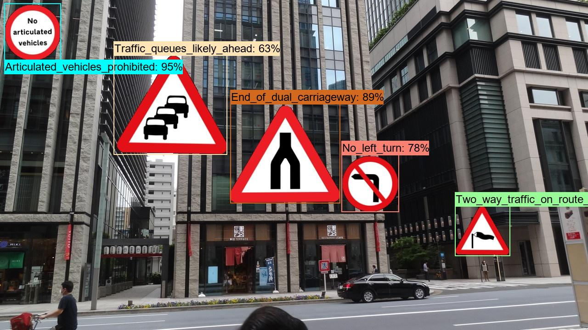 
<a  href="./realistic_test_dataset_outputs/uk_roadsigns_1050.jpg_objects.csv">roadsigns_5.jpg_objects.csv</a> 

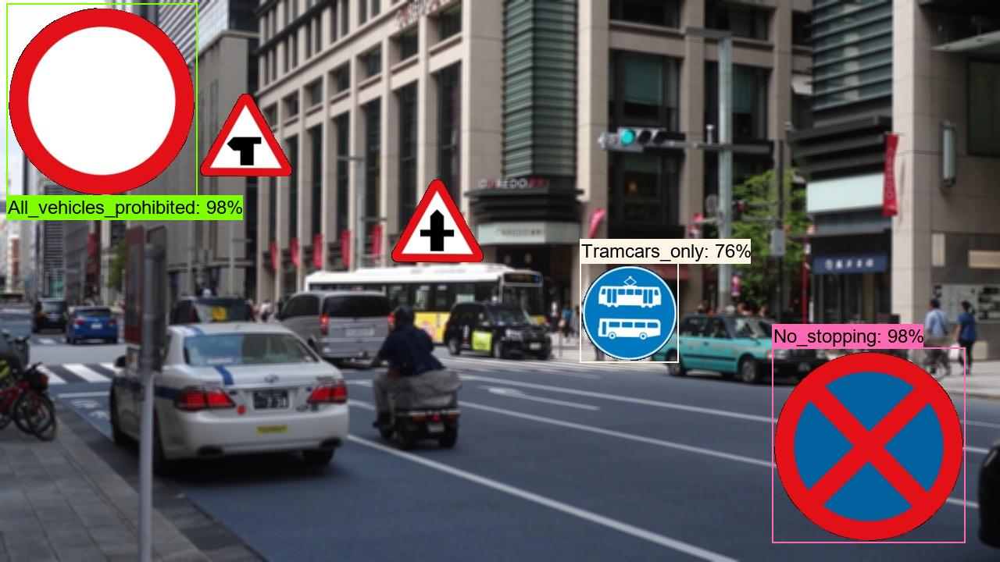 
<a  href="./realistic_test_dataset_outputs/uk_roadsigns_1060.jpg_objects.csv">roadsigns_6.jpg_objects.csv</a> 

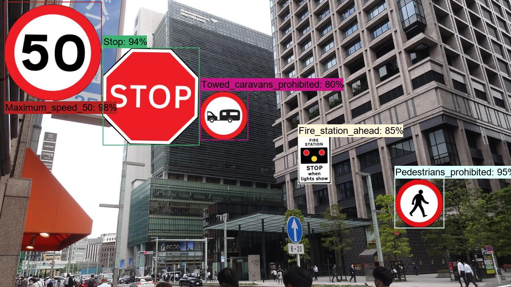 
<a  href="./realistic_test_dataset_outputs/uk_roadsigns_1070.jpg_objects.csv">roadsigns_7.jpg_objects.csv</a> 

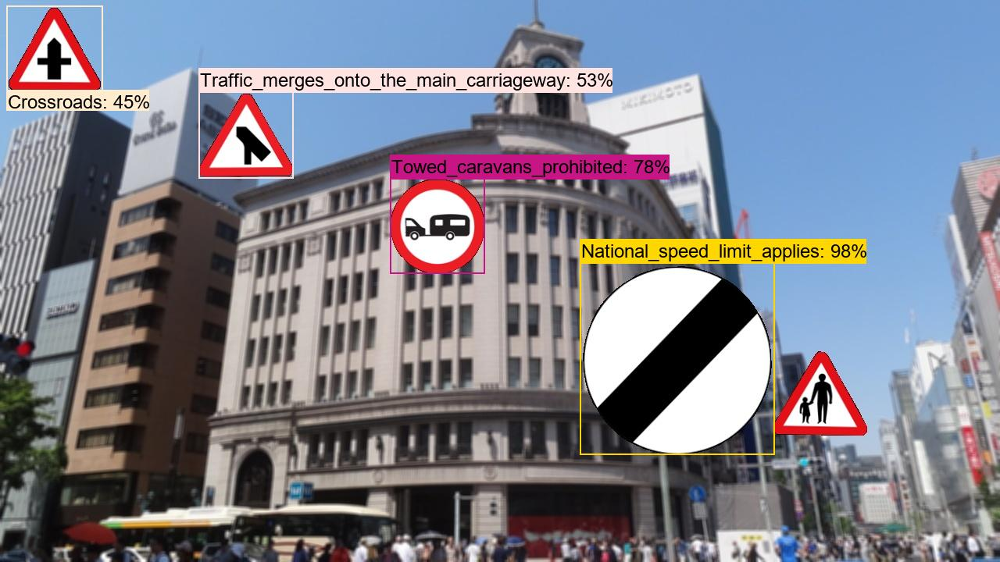 
<a  href="./realistic_test_dataset_outputs/uk_roadsigns_1080.jpg_objects.csv">roadsigns_8.jpg_objects.csv</a> 

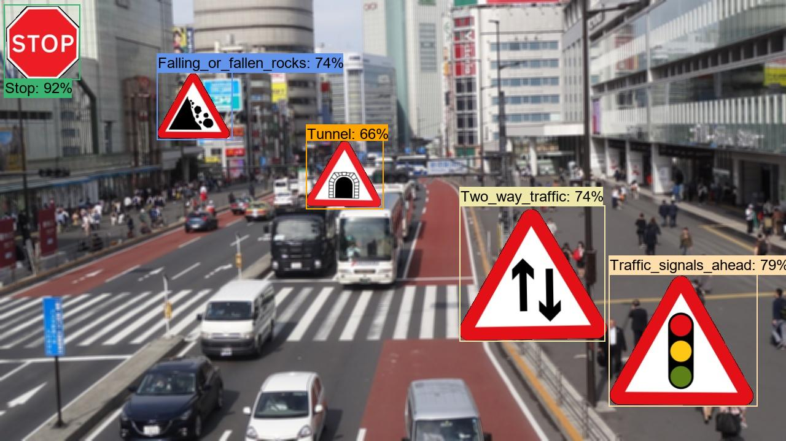 
<a  href="./realistic_test_dataset_outputs/uk_roadsigns_1090.jpg_objects.csv">roadsigns_9.jpg_objects.csv</a> 

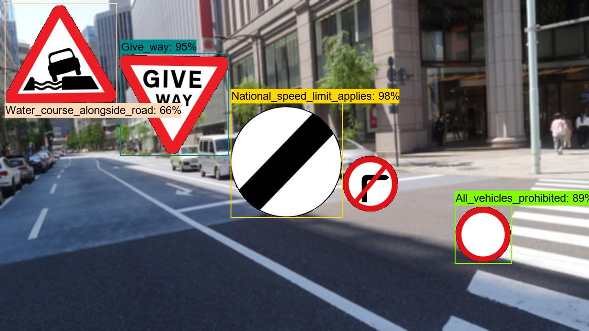 
<a  href="./realistic_test_dataset_outputs/uk_roadsigns_1099.jpg_objects.csv">roadsigns_10.jpg_objects.csv</a> 

<h3>6. COCO metrics of inference result</h3>
The 3_inference.bat computes also the COCO metrics(f, map, mar) to the <b>realistic_test_dataset</b> as shown below: 

<a href="./realistic_test_dataset_outputs/prediction_f_map_mar.csv">prediction_f_map_mar.csv</a>

 
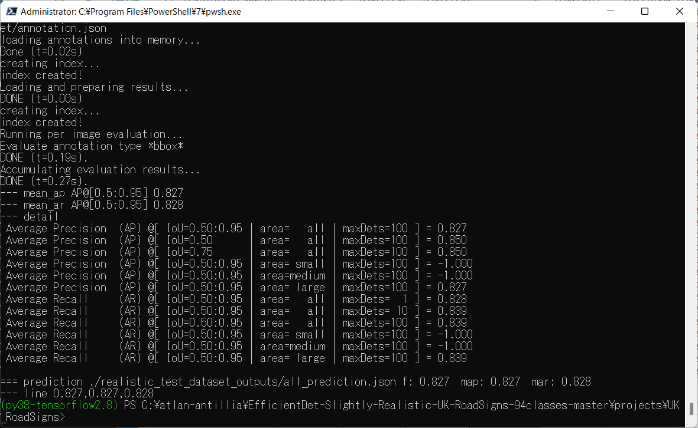 

